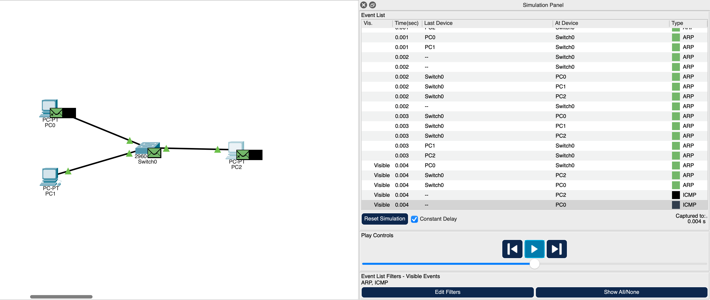

## Basic LAN IP configuration lab

## Objective 
Configure devices manually on the same LAN using static IP addressing, verify the connectivity through a Layer 2 switch.

**Tools Used**
- Cisco Packet Tracer
- ICMP (ping)
- TCP/IP configuration

**Network Topology**
3 PCs connected to a single switch, common copper straight-through cables.

## Key Concepts Practiced

1) IPv4 addressing
2) Subnet masks
3) Layer 2 switching
4) Basic connectivity testing
5) Network troubleshooting basics

**Relevance**
LAN communication is important for:

- Understanding lateral movement
- Network segmentation design
- Traffic monitoring
- Incident investigation
- Attack surface mapping

**Packet Flow Observations**
- Observed ARP requests before ICMP communication.
- Switch learned MAC addresses during communication.
- ICMP traffic only occurred after ARP resolution.
