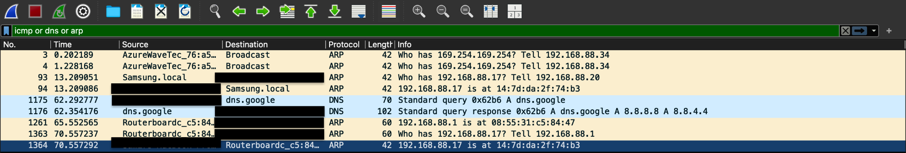

# Wireshark Basic Traffic Analysis

## Objective

Analyze and capture basic home-network traffic using Wireshark to identify common protocols such as ARP, and DNS.

## Tools Used

- Wireshark
- macOS Terminal
- Ping utility

## Lab Setup

Wireshark capture performed on the network interface while I used ping commands from terminal to generate traffic.

**Traffic Generation**

Commands used:

ping 8.8.8.8
ping google.com

**Protocols Observed**

Protocols identified:

Primary:
- ARP
- DNS

## Packet Behavior Observed

DNS request occurs before communication when using domain names.
Wireshark shows DNS uses UDP protocol 17 and UDP port 53
DNS response TTL displayed 121
ARP requests observed for local network communication.

## Filters Used

dns
arp

## Security Relevance

Understanding packet movement and behavior is important for:

- Network monitoring
- Intrusion detection
- Incident investigation
- Threat detection

## Key Takeaways

Wireshark provides visibility into real network traffic.
Wireshark provides key insights into packets recieved and sent.
Most communication follows a predictable pattern based on protocol.
Understanding normal traffic helps identify abnormal behavior.

## Packet Capture Evidence

Image 1 shows Wireshark topology with personal data blocked.
