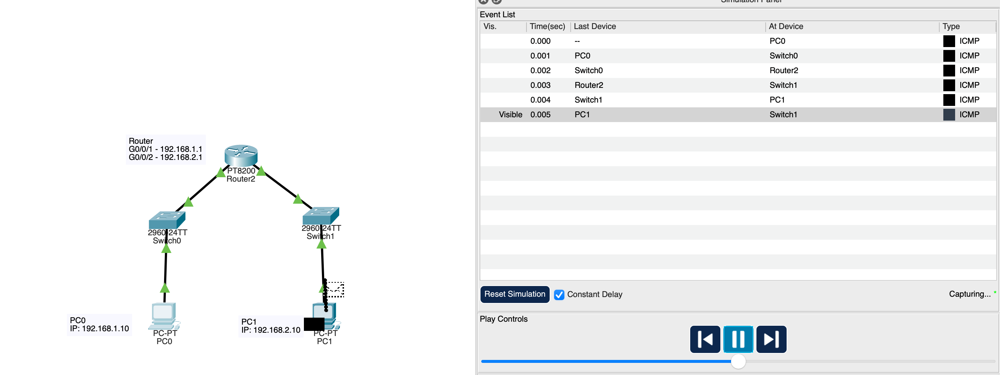

# Router Inter-Network Communication Lab

## Objective

The goal of this lab was to understand how a router allows communication between two different networks and how the default gateway enables devices to reach remote subnets.

## Tools Used

- Cisco Packet Tracer
- Router CLI
- ICMP ping testing

## Network Topology

Image 1: Two networks connected through a router

## Network Configuration

Two separate networks were created and connected through a router.

- Network 1:
- 192.168.1.0 /24

- Network 2:
- 192.168.2.0 /24

**PC0 configuration:**

- IP Address: 192.168.1.10  
- Subnet Mask: 255.255.255.0  
- Default Gateway: 192.168.1.1  

**PC1 configuration:**

- IP Address: 192.168.2.10  
- Subnet Mask: 255.255.255.0  
- Default Gateway: 192.168.2.1  

**Router interfaces:**

- Interface G0/0/1:
- 192.168.1.1

- Interface G0/0/2:
- 192.168.2.1

## Routing Behavior Observed

- Devices in different subnets cannot communicate directly without a router.

- When PC1 attempted to communicate with PC2, it first checked whether the destination was in the same subnet. Since it was not, the PC forwarded the traffic to the default gateway. When you remove the default gateway, the ping request timed out.

- The PC does not attempt to learn the MAC address of the remote device. Instead it learns the MAC address of the router and sends the traffic there.

## Verification

- Connectivity was verified using ping tests between PC1 and PC2.

- Successful communication confirmed that routing between the networks was functioning correctly.

First ping failed.

Next three pings succeeded.

This confirmed that ARP resolution occurred before ICMP communication was fully established.

## Failure Testing

- The default gateway was removed from PC1 to observe the effect.

Result:

- PC1 could no longer reach PC2. Ping timed outæ

Reason:

- Without a default gateway, the PC had no route to networks outside its local subnet.

- After restoring the default gateway, connectivity was restored.

## Troubleshooting Performed

- During the lab the router entered ROMMON mode. I was unable to access config.

- Issue observed:

- Router failed to boot into normal IOS mode.

- Resolution steps:

- Entered CLI and typed:

- confreg 0x2102

- Then; rommon 02> reset

**Result:**

Router successfully booted normally and config functionality was restored.

## Security Relevance

Understanding routing is important for cybersecurity because:

- Routers control traffic between networks
- Network segmentation helps limit attack spread
- Gateways are critical control points
- Traffic inspection often occurs at routing devices

## Key Takeaways

- Routers allow communication between different networks.

- Default gateways are required for remote communication.

- Devices communicate with the router rather than the final destination when traffic leaves the local subnet.

- Troubleshooting network devices is an important practical skill.
