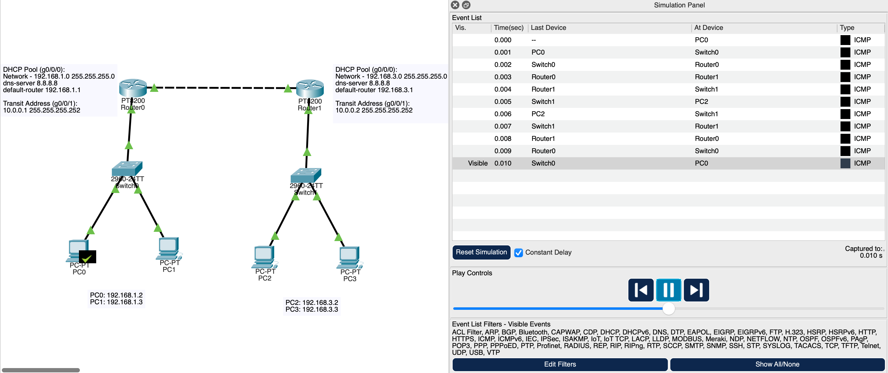
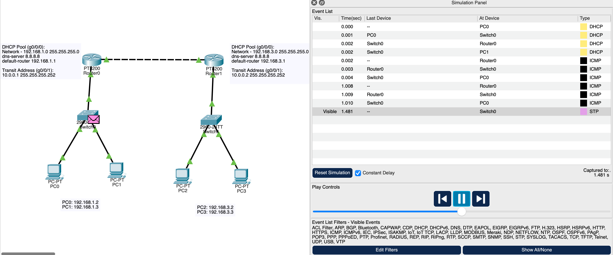

# Static Routing + DHCP Lab

## Objective

My goal for this lab was to build two separate LAN networks connected by two routers, using DHCP for automatic addressing and static routing to allow communication between networks.

This lab covered key topics:
- Default gateway behavior
- DHCP configuration
- Static routing concepts
- Router transit networks
- Basic troubleshooting process

## Network Design

**Network 1:**
- 192.168.1.0/24  
- Gateway: 192.168.1.1

**Network 2:**
- 192.168.3.0/24  
- Gateway: 192.168.3.1

Transit network between routers:
10.0.0.0/30  

Router0 transit IP:
10.0.0.1   255.255.255.252

Router1 transit IP:
10.0.0.2   255.255.255.252

## DHCP Configuration

Router0 provides DHCP for Network 1:

**Pool:**
- 192.168.1.0/24

**Default gateway:**
- 192.168.1.1

**DNS:**
- 8.8.8.8

Router1 provides DHCP for Network 2:

**Pool:**
192.168.3.0/24

**Default gateway:**
- 192.168.3.1

**DNS:**
- 8.8.8.8

## Static Routing Configuration Commands

Router0 route:

ip route 192.168.3.0 255.255.255.0 10.0.0.2

Router1 route:

ip route 192.168.1.0 255.255.255.0 10.0.0.1

## Verification Testing

Tests performed:

PC0 to PC2 ping successful  
PC1 to PC3 ping successful  

Router0 → Router1 transit ping successful.

Simulation mode confirmed packet flow as shown in image below.

## Key Networking Concepts Demonstrated

Hosts send traffic to default gateway when destination is outside their subnet.

Routers forward traffic based on routing tables.

Static routes define next hop routers.

Router to router communication requires a physical transit network.

## Tools Used

Cisco Packet Tracer  
Simulation Mode  
CLI configuration  
ICMP testing  

## Topology

# Lessons Learned

## Building networks incrementally is important

Initially I attempted to configure multiple networks at once which made troubleshooting difficult. I learned it is better to build:

LAN → verify  
Transit → verify  
Routing → verify

## Physical connections must exist before routing works

I initially configured static routes before connecting the routers physically. This caused routing failures because routers must be physically connected before routes can function.

## Static routing requires next hop routers, not destination networks

I initially tried to route directly to the destination network gateway instead of the transit router IP. I learned the next hop must always be directly reachable.

## ARP can cause unexpected connectivity issues

During earlier troubleshooting, clearing ARP tables fixed connectivity issues even when configurations appeared correct.

## DHCP troubleshooting requires isolating variables

When DHCP failed previously I learned to verify:

Interface status  
Subnet matching  
Pool configuration  
Available addresses  
PC DHCP state  

## Troubleshooting approach learned

I learned to troubleshoot in layers:

Layer 1:
Check cables

Layer 2:
Check switch connectivity

Layer 3:
Check IP addressing

Routing:
Check routing tables

## Key realization

Routing is not about knowing every network. Routers only know:

Directly connected networks  
Static routes  
Dynamic routes  

Everything else is unknown.

## Skills improved

Basic router configuration  
DHCP setup  
Static routing  
Subnet design  
Packet flow analysis  
Structured troubleshooting

## Images

