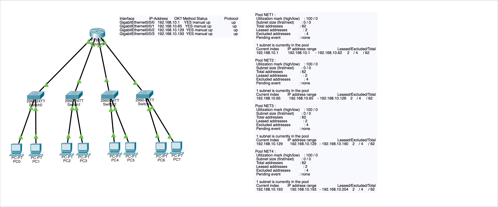
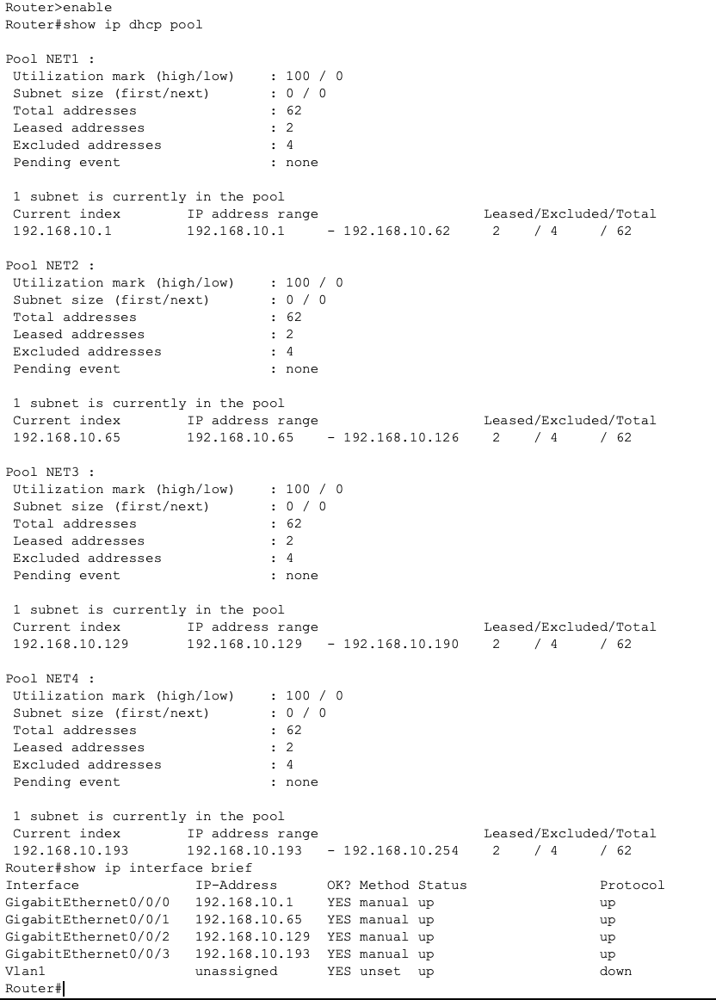
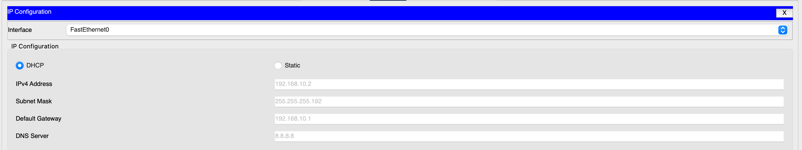

# Subnetting and DHCP Network Design Lab

## Objective

The goal of this lab was to subnet a /24 network into 4 smaller networks and configure DHCP services for each subnet.

This lab focused on:

- CIDR subnetting
- Network design planning
- DHCP pool configuration
- Gateway placement
- Broadcast domain separation
- Troubleshooting DHCP configuration issues

## Network Design Decisions

I choose a /26 mask to stimulate a small enterprise network:

/26 provides 62 usable hosts which would be sufficient for a smaller enterprise with different departments. 

2 bits were borrowed from the host portion:

Original:
/24

New:
/26

Result:

4 total subnets.

DHCP was used to simulate enterprise IP addressing.

## Topology

## DHCP Design

Each subnet received its own DHCP pool.

Example NET1:

Network:
192.168.10.0 255.255.255.192

Gateway:
192.168.10.1

DNS:
8.8.8.8

Excluded addresses were used to reserve gateway addresses.

## DHCP & Interface Verification

Image shows:

- Correct subnet ranges
- Correct exclusions
- Active leases
- All operational router interfaces

## Host Verification

PCs successfully received:

IP address  
Subnet mask  
Default gateway  

## Verification Testing

Tests performed:

PC → Gateway ping successful

PC → same subnet PC successful

Router → PCs successful

## Commands Used

Router verification:

- show ip interface brief  
- show ip dhcp pool  
- show ip dhcp binding  

Host verification:

- ipconfig  
- ping  

## Key Concepts Demonstrated

Subnet design affects DHCP configuration.

Each subnet requires its own gateway.

Broadcast addresses cannot be assigned to hosts.

DHCP pools must match subnet ranges exactly.

Routers maintain separate broadcast domains.

Routers may need additional modules for subnetting.

## Future Improvements

VLAN segmentation instead of physical switches.

Inter subnet routing.

## Key Takeaway

Subnetting directly affects routing, DHCP design, and network scalability. Small configuration mistakes can break entire network services.
