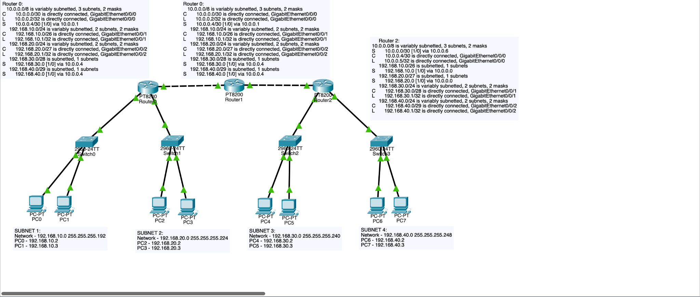
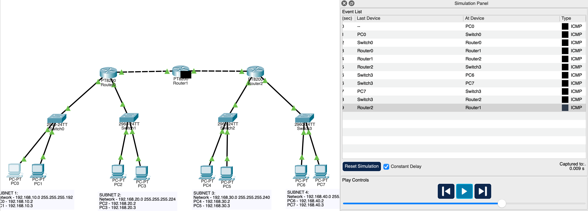

# 3 Router Static Routing VLSM Lab

## Objective

Create a multi router network using VLSM subnetting and static routing. The goal was to achieve full connectivity between four unique LAN networks connected through three routers; practicing subnet sizing and routing logic.

## Technologies Used

- Static Routing
- VLSM (Variable Length Subnet Masking)
- Cisco Packet Tracer
- Cisco IOS CLI
- ICMP testing
- Network troubleshooting methodology

### LAN Subnets

Subnet 1:
192.168.10.0/26  
Usable hosts: 62

Subnet 2:
192.168.20.0/27  
Usable hosts: 30

Subnet 3:
192.168.30.0/28  
Usable hosts: 14

Subnet 4:
192.168.40.0/29  
Usable hosts: 6

### Transit Networks

Router0 to Router1:
10.0.0.0/30

Router1 to Router2:
10.0.0.4/30

/30 was selected because only two usable IPs are required for point-to-point router links.

## Topology

## Configuration Summary

The following configurations were implemented:

Router configuration:
- Interface IP addressing
- Static routing entries
- Interface activation

End device configuration:
- Static IP addressing
- Default gateway assignment

Verification:
- Routing table checks
- End-to-end ping testing
- Interface status verification

Full device configurations are displayed in configs.txt.

## Verification

Connectivity was verified through successful ICMP testing between end devices across all networks.

## Troubleshooting Process

During configuration several packet drops occurred due to static routing configuration issues.

Troubleshooting approach:

1 Verified interface status
2 Verified routing tables
3 Tested router to router connectivity
4 Tested hop by hop connectivity
5 Corrected static route next hop addresses

## Lessons Learned

- Static routing requires both forward and return routes.
- Each router only knows directly connected networks unless routes are configured.
- /30 networks are ideal for router transit links.
- Routing problems need to be debugged hop by hop to find the exact error.
- Network design planning reduces configuration errors.
- Infrastructure connectivity must be verified before endpoint testing.

## Skills Practiced

- Network design
- VLSM subnet planning
- Static routing configuration
- Multi router routing logic
- Troubleshooting methodology
