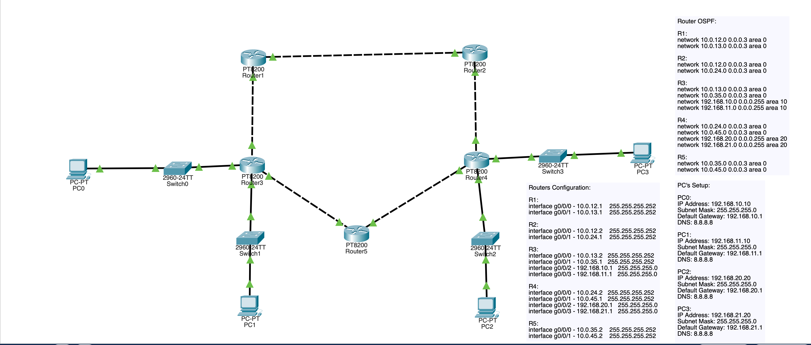
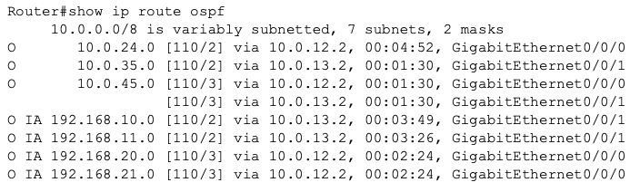
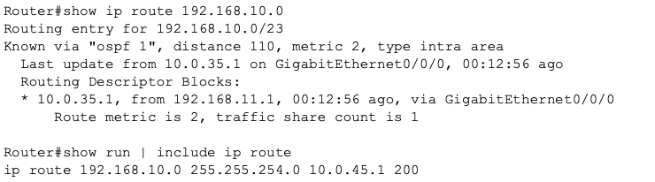
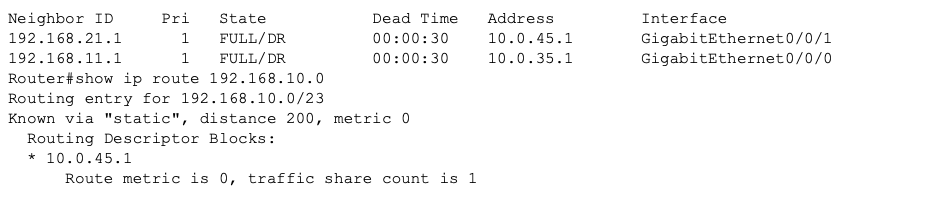
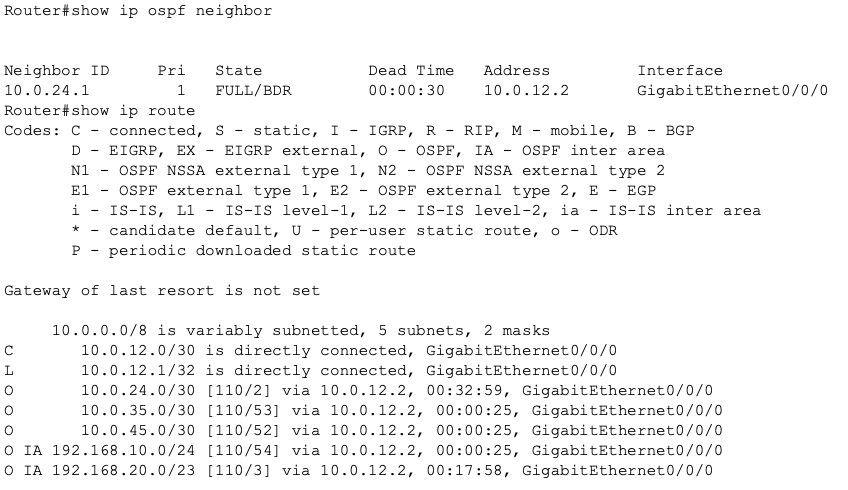
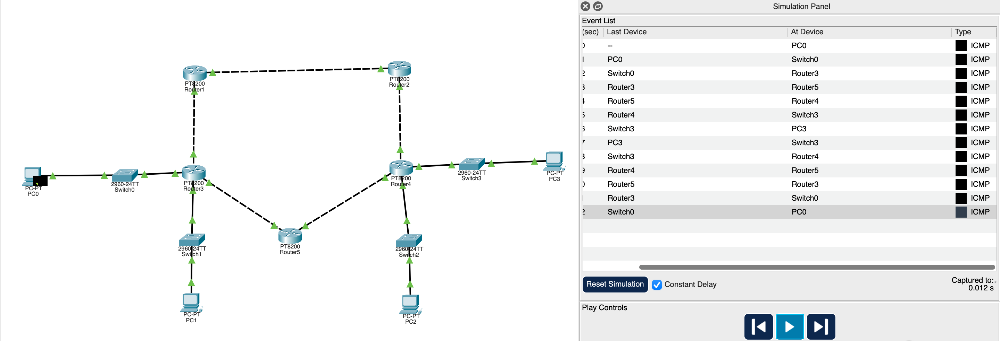

## OSPF Multi-Area Enterprise Routing Lab

# Project Overview

This lab was designed to simulates a small enterprise network implementing multiple OSPF techniques including: multi area design with redundancy, route summarization, cost optimization, and failure recovery mechanisms.

My objective was to demonstrate not only OSPF configuration, but also routing behavior under design decisions and failure scenarios. This project also combined all previous OSPF labs.

# Technologies demonstrated:

- OSPF multi-area design
- Area Border Router (ABR)
- Route summarization
- OSPF cost manipulation
- Floating static route failover
- Passive interface security
- Failure simulation testing
- End-to-end connectivity validation
- Network Topology

# Topology contains:

5 routers
4 LAN networks
Redundant transit paths
Multi-area OSPF design

# Areas:

Area 0:
Core backbone

Area 10:
Left LAN segment

Area 20:
Right LAN segment

# Addressing Plan

R1	g0/0/0	10.0.12.1/30
R1	g0/0/1	10.0.13.1/30

R2  g0/0/0  10.0.12.2/30 
R2  g0/0/1  10.0.24.1/30

R3  g0/0/0  10.0.13.2/30 
R3  g0/0/1  10.0.35.1/30 
R3  g0/0/2  192.168.10.1/24 
R3  g0/0/3  192.168.11.1/24 

R4  g0/0/0  10.0.24.2/30 
R4  g0/0/1  10.0.45.1/30 
R4  g0/0/2  192.168.20.1/24 
R4  g0/0/3  192.168.21.1/24 

R5  g0/0/0  10.0.35.2/30 
R5  g0/0/1  10.0.45.2/30 

# Design Decisions
Multi area design

Areas were used to simulate enterprise segmentation:

Area 0 -> backbone transit
Area 10 -> left branch
Area 20 -> right branch

**Benefits:**

- Reduces LSDB size
- Improves scalability
- Improves convergence performance

# Route summarization

ABRs summarize LAN routes:

Routes:

192.168.10.0
192.168.11.0

Summarized as:

192.168.10.0/23

- Image shows routes before summarization

- Image shows routes after summarization

**Benefits:**

- Reduces routing table size
- Reduces LSA flooding
- Improves stability

# OSPF Cost Engineering

Cost increased on secondary path:

interface g0/0/1
 ip ospf cost 50

- Image showing cost change

# Purpose:

- Influence path selection
- Force preferred routing path
- Simulate traffic engineering

**Result:**

Traffic preferred lower cost path.

# Passive interfaces

LAN interfaces set passive:

R3 + R4:
passive-interface g0/0/2
passive-interface g0/0/3

**Benefits:**

- Improves security
- Prevents rogue adjacency
- Reduces unnecessary hello traffic

# Floating static route

Backup route configured:

R5:
ip route 192.168.10.0 255.255.254.0 10.0.45.1 200

- Image showing floating static route

**Purpose:**

Provide failover path.

# Administrative distance:

OSPF = 110
Floating static = 200

Static activates only when OSPF fails.

R3 interface was configured to shutdown to test floating static route.

- Image showing floating static route activated

# Verification Steps

Commands used:

show ip ospf neighbor

show ip route ospf

show ip ospf interface

show ip interface brief

ping

# Failure Testing

**Transit link failure testing proof:**

**End-to-End Connectivity**

Ping verified between:

PC0 → PC3
PC1 → PC2

This confirmed routing functionality across multiple areas.

# Key Learning Outcomes

This lab improved understanding of:

- OSPF design behavior
- ABR functionality
- Traffic engineering
- Route failover logic
- Network failure behavior
- Enterprise routing design principles