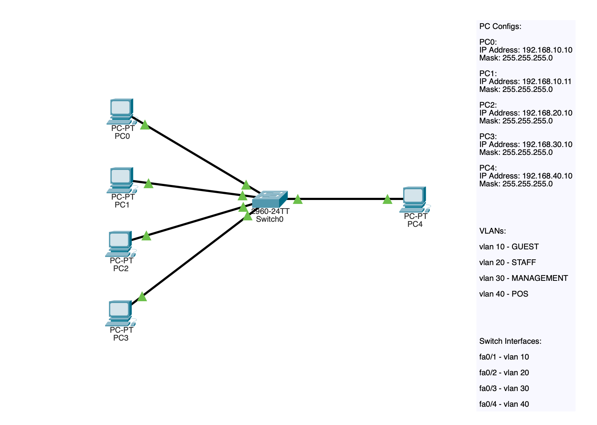
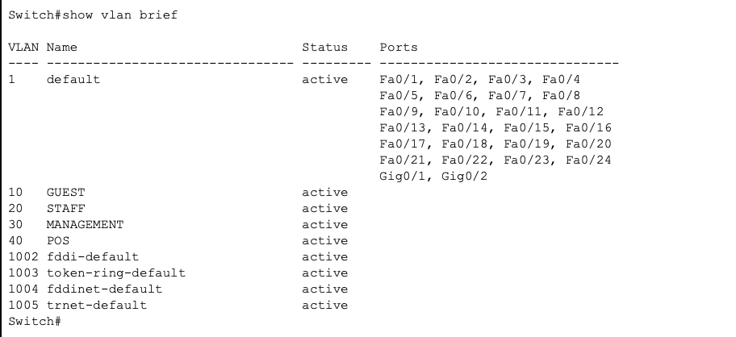
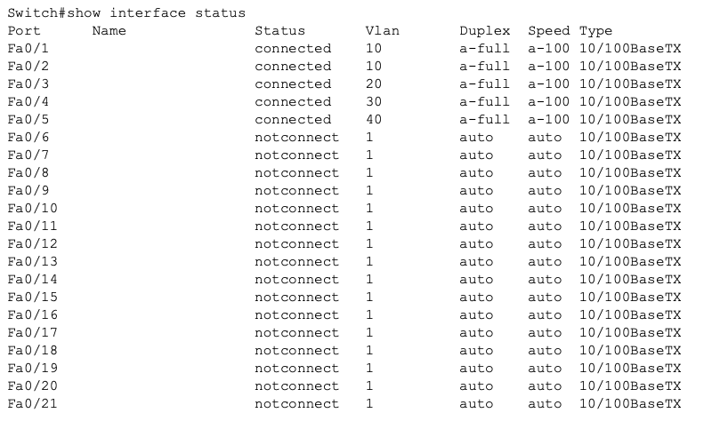
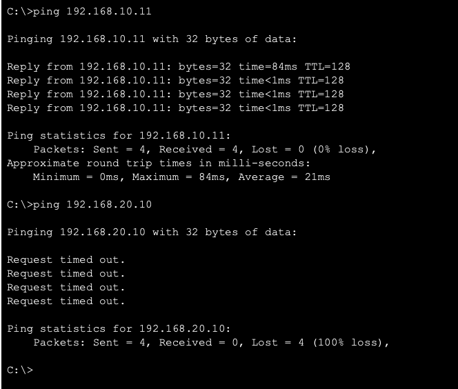

## VLAN Enterprise Segmentation Lab
# Project Overview

This lab demonstrates VLAN based network segmentation using a single Layer 2 switch to isolate different enterprise departments. The objective was to simulate a small enterprise network where different departments must be separated for security, performance, and management purposes.

The project focuses not only on VLAN configuration but also on validating network behavior through testing and verification commands.

# Technologies demonstrated:

• VLAN creation
• Access port configuration
• Broadcast domain segmentation
• Connectivity testing methodology

# Network Design Objective

The network was designed to simulate a realistic small scale business segmentation model, similar to what would be implemented in environments such as hotels, offices, or retail businesses.

# Simulated Departments separated:

Guest network
Staff network
Management network
PoS System

# Key design goals:

• Prevent communication between departments
• Reduce broadcast traffic
• Improve network security posture
• Prepare for future inter VLAN routing implementation

# Topology

_Image: VLAN Enterprise segmentation topology_

# Network contains:

1 Layer 2 switch
5 hosts
4 VLANs

# VLAN Design Architecture

10 - GUEST - Guest devices - 192.168.10.0/24
20 - STAFF - Employees - 192.168.20.0/24
30 - MANAGEMENT - Management - 192.168.30.0/24
40 - POS - Payment systems - 192.168.40.0/24

# Device Assignment

PC0	- VLAN 10 - Guest device
PC1	- VLAN 10 - Guest device
PC2	- VLAN 20 - Staff workstation
PC3	- VLAN 30 - Management workstation
PC4	- VLAN 40 - POS system

# IP Addressing Plan

PC0	192.168.10.10	/24
PC1	192.168.10.11	/24
PC2	192.168.20.10	/24
PC3	192.168.30.10	/24
PC4	192.168.40.10	/24

# Configuration Process

**VLAN Configuration**

VLANs were created and named according to department function:

vlan 10
name GUEST

vlan 20
name STAFF

vlan 30
name MANAGEMENT

vlan 40
name POS

Verification:

show vlan brief

_Image: VLAN Configuration Confirmation_

**Access Port Assignment**

Ports were assigned according to department mapping:

interface fa0/1
 switchport mode access
 switchport access vlan 10

interface fa0/2
 switchport mode access
 switchport access vlan 10

interface fa0/3
 switchport mode access
 switchport access vlan 20

interface fa0/4
 switchport mode access
 switchport access vlan 30

interface fa0/5
 switchport mode access
 switchport access vlan 40

Verification:

show interface status

_Image: VLAN Interface Status_

# Connectivity Testing

**Same VLAN communication**

Test:

PC0 to PC1
<192.168.10.10># ping 192.168.10.11

Result:

Ping successful.

Reason:

Devices share same VLAN and broadcast domain.

**Different VLAN communication**

Test:

PC0 to PC2
<192.168.10.10># ping 192.168.20.10

Result:

Request timed out.

Reason:

No Layer 3 routing exists between VLANs.

This demonstrates proper segmentation.

_Image: Ping Connectivity Tests_

# Key Technical Concepts Demonstrated

**Broadcast Domains:**

Each VLAN creates a separate broadcast domain.

This reduces unnecessary traffic.

**Security Segmentation:**

Without VLANs:

All devices could communicate.

With VLANs:

Traffic restricted.

Example prevented risks:

Guest accessing POS
Guest accessing management
Staff accessing payment systems

# Design Decisions

Why was VLAN segmentation was used?

VLANs are standard enterprise practice.

Benefits:

1 Security isolation
2 Performance optimization
3 Operational organization

Why these VLAN IDs were chosen

Simple numbering:

10 Guest
20 Staff
30 Management
40 POS

Improves readability and scalability.

# Troubleshooting Notes

Issue: MAC Table not displaying devices.

Cause:

MAC Table learning requires traffic.

Generating pings ensured MAC table populated.

# Key Lessons Learned

VLANs isolate broadcast domains.

Devices require Layer 3 routing to communicate across VLANs.

Switch MAC tables confirm segmentation behavior.

Verification is as important as configuration.

Enterprise networks rely heavily on VLAN segmentation.

# Skills Demonstrated

- Layer 2 switching
- Network segmentation
- Verification methodology
- Documentation discipline
- Enterprise design thinking

# Why This Lab Matters for Cybersecurity

VLANs are critical because segmentation is a primary security control.

Used to:

- Separate guests from internal systems
- Protect payment networks
- Isolate sensitive infrastructure

Poor segmentation is a common breach cause.

# Personal Takeaways

This lab reinforced the importance of network segmentation as a security control. Understanding how VLAN can isolate traffic improves understanding of network attack surfaces and containment defense strategies.

# Verification Commands Used

show vlan brief
show mac address-table
show interface status
ping

# Future improvements will include:

- Inter-VLAN routing
- ACL segmentation
- DHCP scopes per VLAN
- Wireless VLAN mapping

