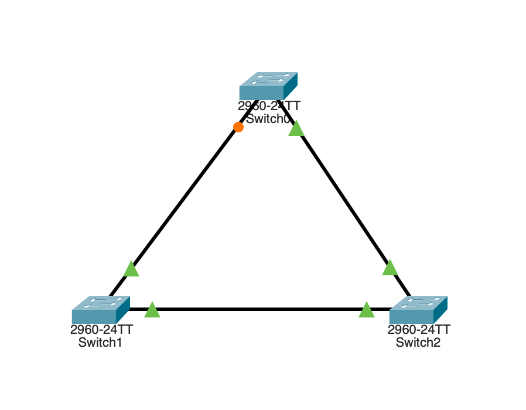
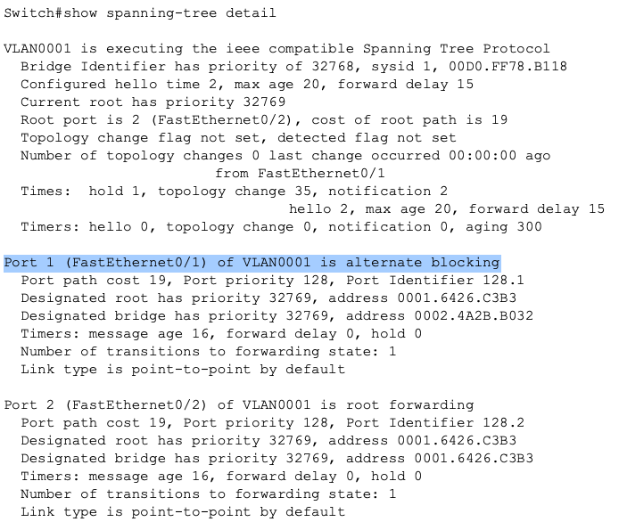
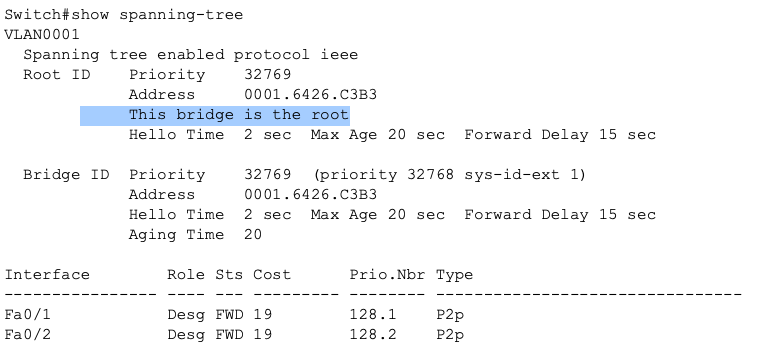
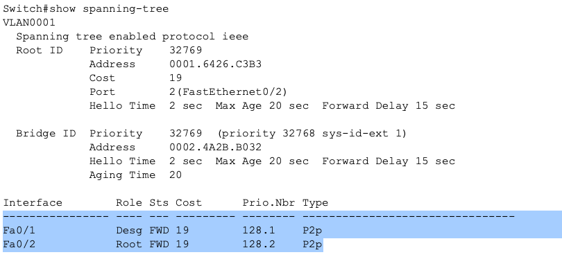

## STP-01 Loop Prevention Lab
# Objective

This lab demonstrates how Spanning Tree Protocol prevents Layer 2 loops by blocking redundant paths while maintaining network redundancy.

# Concepts demonstrated:

• Root bridge election
• Port roles
• Blocking behavior
• Loop prevention
• STP convergence

# Topology

_Image 1: Simple Switch Triangle Topology_

Three switches connected in a triangle topology to simulate redundant paths.

# STP Behavior Observed

STP automatically elected a root bridge based on lowest Bridge ID.

One redundant path was placed into a blocking state to prevent a Layer 2 loop.
This also maintained redundancy.

**Verification:**

_Image 2: Switch0 STP Blocking Interface_

# Root Bridge Selection

Root bridge was selected based on:

Lowest priority (default 32768)
Lowest MAC address

Due to priorities being identical across all switches, MAC address was the deciding factor.

**Verification:**

_Image 3: Switch2 Root Designation_

# Port Roles Observed

Root switch:
All designated forwarding ports.

Non-root switches:

- One root port
- One designated port
- Possibly one alternate blocking port

Verification:

_Image 4: Switch 1 Port Roles_

# Key Learning Points

1) Redundant links create potential Layer 2 loops.

2) STP prevents loops by logically blocking redundant paths.

3) STP does not remove, but controls redundancy.

4) Understanding STP behavior is essential for enterprise network stability.

# Skills Demonstrated

- Layer 2 redundancy design
- STP verification
- Network topology analysis
- Basic network troubleshooting

# Summary

This lab demonstrates how STP maintains network stability by selecting a root bridge and blocking redundant paths to prevent broadcast loops.