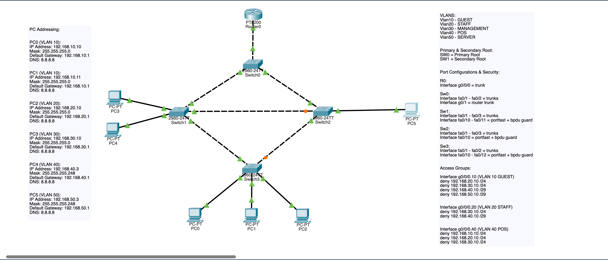
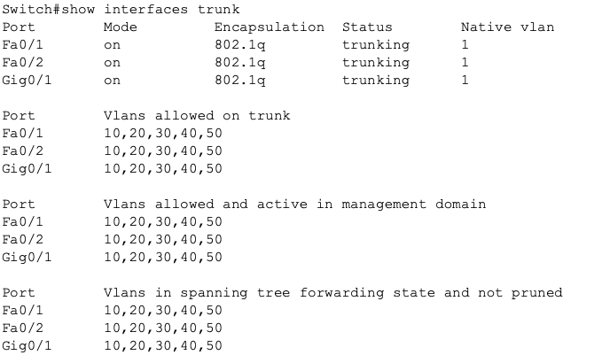
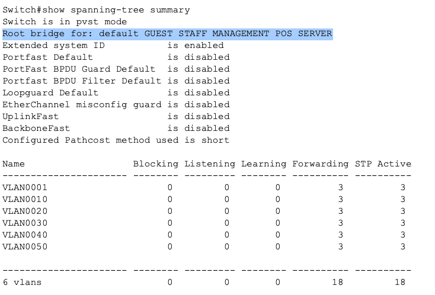
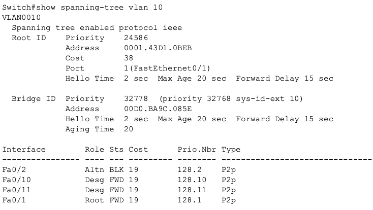
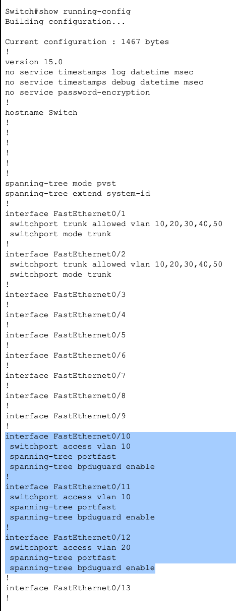
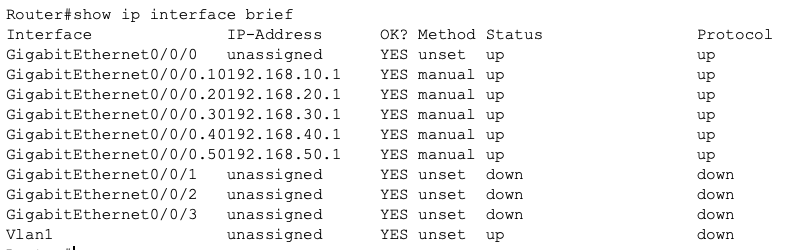
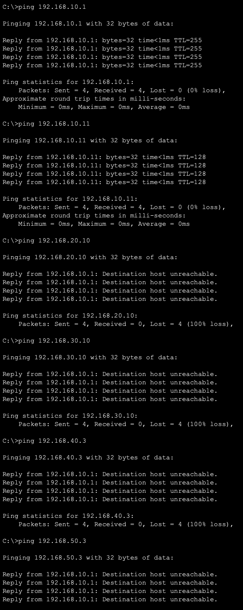
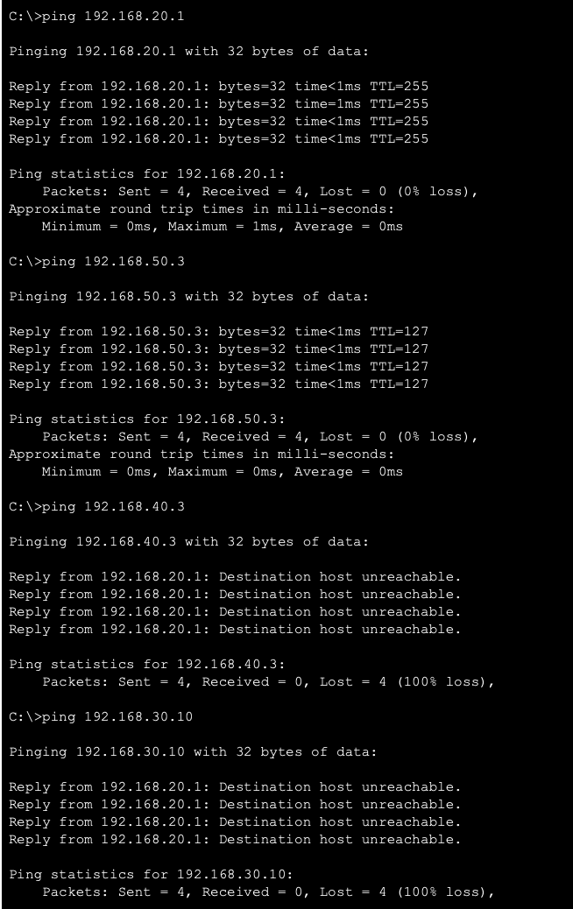
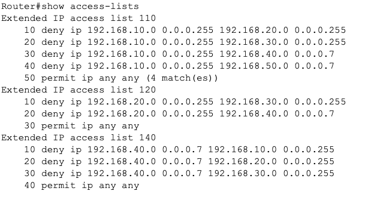

## VLAN + STP Security Mini Flagship
# Enterprise Segmentation and Layer 2 Security Design

**Project Overview**

This project simulates a small enterprise network implementing VLAN segmentation, STP topology control, inter VLAN routing, and ACL based traffic restrictions. The objective was to combine Layer 2 design, Layer 3 routing, and security controls on both layers into a single functional architecture rather than isolated configuration exercises.

The network was designed to reflect segmentation requirements in a small enterprise network, such as guest isolation, POS protection, and management access control while maintaining redundancy through STP.

# Network Design Goals

The design focused on four primary objectives:

**Segmentation**

Separate business functions into independent broadcast domains.

**Security enforcement**

Restrict communication paths based on business requirements, and best industry practice.

**Redundancy without loops**

Provide multiple Layer 2 paths while maintaining predictable traffic flow.

**Access layer hardening**

Protect edge ports from rogue switches and topology manipulation.

**Topology demonstrates:**

- Redundant Layer 2 paths
- Controlled STP blocking
- Trunk VLAN propagation
- Centralized routing

_Image 1: STP + VLAN Enterprise Segmentation Design_

**VLAN Architecture**

10 - GUEST - 192.168.10.0/24
20 - STAFF - 192.168.20.0/24
30 - MANAGEMENT - 192.168.30.0/24
40 - POS - 192.168.40.0/29
50 - SERVER - 192.168.50.0/29

# Subnet Design Decisions

POS and Server VLANs were intentionally sized as /29 networks to:

- Reduce broadcast domain size
- Limit unnecessary host capacity
- Reflect realistic infrastructure sizing
- Demonstrate subnet planning rather than default /24 usage

These VLANs only require a few devices, making larger ranges unnecessary, and ensures greater control.

This mirrors real enterprise design where infrastructure VLANs are typically small and tightly controlled.

# Layer 2 Design

**Trunking:**

All switch to switch connections operate as 802.1Q trunks to allow VLAN traffic.

Verified using:

show interfaces trunk

Design ensures:

1) VLAN consistency across switches
2) Same VLAN communication across topology
3) Engineered broadcast domains

_Image 2: Switch 0 Layer 2 Trunk Design_

# Spanning Tree Design

**Root Bridge Control:**

Primary root configured on the core switch to control forwarding decisions.

This ensures predictable traffic paths and avoids random STP elections.

Verified using:

show spanning-tree summary
show spanning-tree vlan 10

_Image 3: Switch 0 Primary Root Manipulation_

_Image 4: Switch 3 VLAN 10 Command_

# STP Behavior

Redundant links exist between switches but STP blocks secondary paths to prevent loops.

Observed behavior:

1) Root ports forwarding
2) Designated ports forwarding
3) Alternate ports blocking

This confirms correct loop prevention.

# Access Layer Security

Access interfaces were secured using:

PortFast

This allows endpoints to bypass STP convergence delays.

BPDU Guard

This protects against rogue switches attempting to influence topology.

Configuration applied to endpoint interfaces:

spanning-tree portfast
spanning-tree bpduguard enable

This reflects enterprise best practice for layer 2 security.

_Image 5: Layer 2 Port Security Implementation_

# Layer 3 Design

Each VLAN assigned a gateway interface:

Example:

interface g0/0.10
encapsulation dot1Q 10
ip address 192.168.10.1 255.255.255.0

Verified using:

show ip interface brief

_Image 6: Router Interface Assignment_

This allows control of communication between VLANs using ACL enforcement.

# Security Policy Design

Traffic restrictions were implemented using ACLs applied on VLAN interfaces.

This allows filtering at the routing, rather than relying on Layer 2 controls.

**Security Policy Summary**
Guest VLAN restrictions:

Guests should not be allowed access to:

- Staff network
- Management network
- POS systems
- Servers

Guest VLAN only allowed external or permitted traffic.

Verified via failed ping tests.

_Image 7: PC0 (VLAN 10) Ping Results_

# Staff VLAN restrictions

Staff devices blocked from:

POS network
Management network

Staff allowed access to server resources where appropriate. This demonstrates least privilege best standards.

POS VLAN restrictions

POS devices restricted to server communication only.

Blocked from:

Guest
Staff
Management

This reflects payment system isolation requirements common in PCI environments.

_Image 8: PC2 (VLAN 20) Ping Results_

# ACL Verification

ACL rules verified using:

show access-lists

Traffic behavior validated through ping testing.

_Image 8: Access Lists Configuration_

# Verification Commands Used

**Layer 2 verification:**
- show vlan brief
- show interfaces trunk
- show spanning-tree
- show spanning-tree vlan 10

**Layer 3 verification**
- show ip interface brief
- show ip route
- Security verification
- show access-lists

**Functional validation:**

Ping testing between VLANs.

# Key Concepts Demonstrated

This project demonstrates practical understanding of:

1) VLAN segmentation
2) 802.1Q trunking
3) PVST spanning tree operation
4) Root bridge manipulation
5) STP loop prevention
6) PortFast usage
7) BPDU Guard protection
8) Subnet design decisions
9) Extended ACL implementation
10) Enterprise segmentation strategy

# Design Lessons Learned

Combining multiple networking concepts is significantly more challenging than configuring isolated features. Knowing individual configurations and concepts does not account for the interaction possibilities between them.

# Key takeaways:

- Segmentation requires coordination between Layer 2 and Layer 3.

- Security policy is easiest to enforce at routing boundaries.

- STP topology decisions directly influence traffic paths.

- Subnet sizing should reflect actual needs rather than defaults.

- Network design is about intentional architecture, not just configuration.

