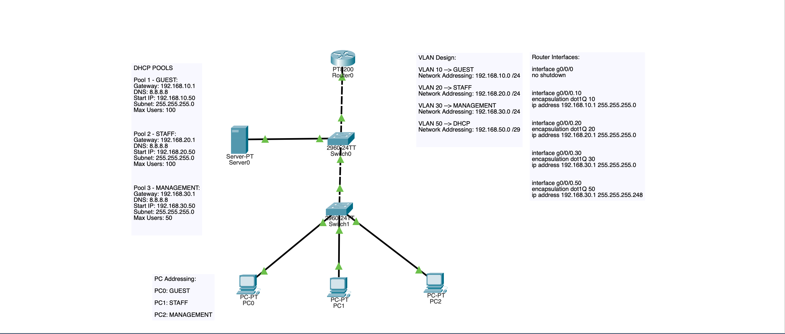
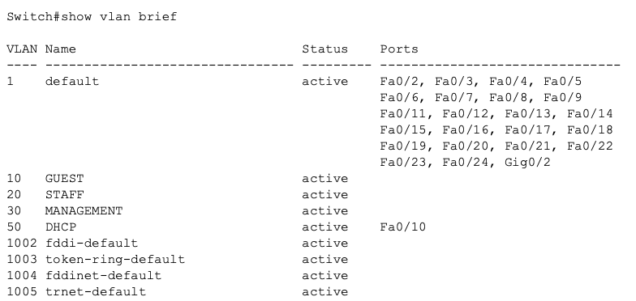
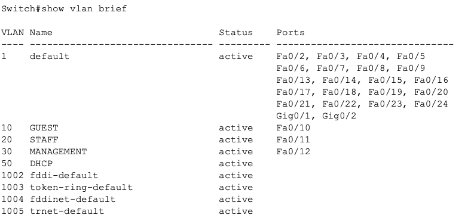
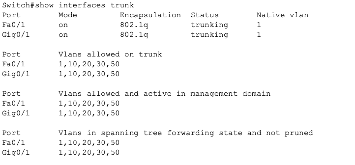
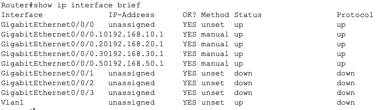
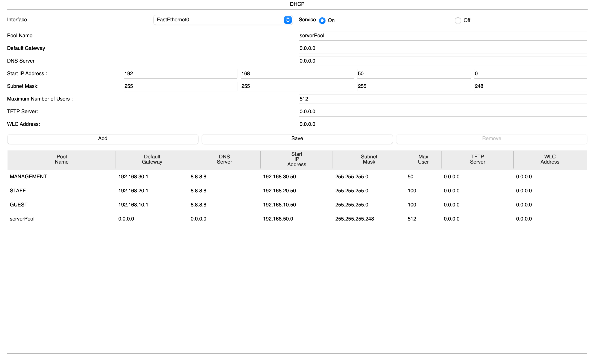
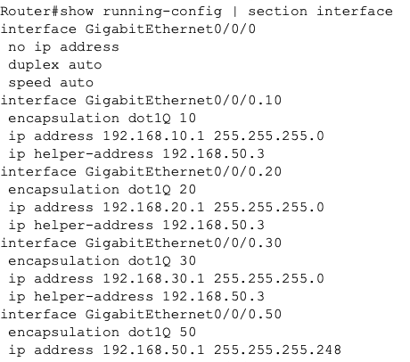
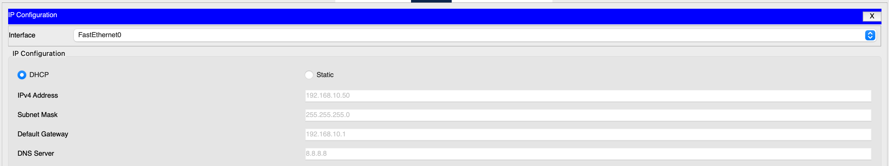
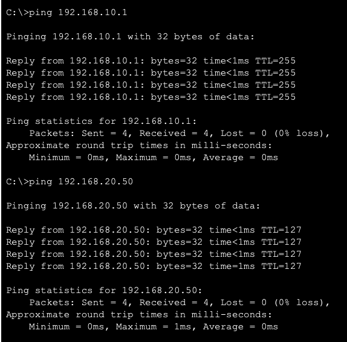

## DHCP Relay Architecture Lab

# Project Overview

This lab demonstrates enterprise DHCP architecture by using DHCP relay to provide address assignment across multiple VLANs. The objective was to understand how enterprise networks centralize infrastructure services instead of deploying DHCP servers in every broadcast domain.

**The lab integrates:**

- VLAN segmentation
- Inter-VLAN Routing
- Central DHCP server
- DHCP relay configuration
- Service validation

# Network Design Objectives

The network was built to demonstrate:

- Centralized service server placement
- Layer 3 broadcast handling
- DHCP relay operation
- VLAN address allocation
- Enterprise architecture

# Topology Overview

Architecture follows a simple enterprise model:

Router provides:
- Inter-VLAN routing
- DHCP relay

Core switch provides:
- VLAN transport
- Segmentation

Access switch provides:
- Endpoint connectivity

DHCP server located in dedicated infrastructure VLAN, using /29.

_Image 1: DHCP Central Server Enterprise Design_

# VLAN Design

VLAN 10:
GUEST
192.168.10.0/24

VLAN 20:
STAFF
192.168.20.0/24

VLAN 30:
MANAGEMENT
192.168.30.0/24

VLAN 50:
DHCP SERVER
192.168.50.0/29

# Addressing Strategy

**Infrastructure addresses reserved:**

Gateway = .1
Infrastructure = .2–.20
Static devices = .21–.49
DHCP range = .50+

This reflects realistic enterprise IP address planning.

**DHCP server:**

192.168.50.3

Gateway:

192.168.50.1

# Layer 2 Configuration

VLANs created and configured on both switches:

10 - GUEST
20 - STAFF
30 - MANAGEMENT
50 - DHCP

Trunk links configured between switches and router.

Verified using:

show vlan brief
show interfaces trunk

_Image 2: Switch 0 VLAN Configuration_

_Image 3: Switch 1 VLAN Configuration_

_Image 4: Switch 0 Trunk Configuration_

# Layer 3 Configuration

Router subinterfaces implemented for:

VLAN10
VLAN20
VLAN30
VLAN50

Example:
interface g0/0/0.10
 encapsulation dot1Q 10
 ip address 192.168.10.1 255.255.255.0

**Verified using:**

show ip interface brief

_Image 5: Router Subinterfaces_

# DHCP Service Design

DHCP server located in VLAN50.

Server configured with static IP:

192.168.50.3

DHCP pools created for:

- Guest VLAN
- Staff VLAN
- Management VLAN

Each pool includes:

1) Default gateway
2) DNS server
3) Address range
4) Subnet mask
5) Maximum User Amount

_Image 6: DHCP Server Pools_

# DHCP Relay Implementation

Without DHCP relay/helper, DHCP requests failed because routers does not forward broadcast traffic. 

Relay added on router VLAN interfaces:

interface g0/0/0.10
 ip helper address 192.168.50.3

interface g0/0/0.20
 ip helper address 192.168.50.3

interface g0/0/0.30
 ip helper address 192.168.50.3

Relay converts DHCP broadcast traffic to unicast directed at DHCP Server.

**Verified using:**

show running-config

_Image 7: DHCP Relay Configuration_

# Functional Verification

DHCP Assignment:

PC's successfully received:

- IP address
- Subnet mask
- Gateway
- DNS

_Image 8: DHCP Proof_

# Reachability

PC0 Gateway Ping:

192.168.10.1

PC0 Inter-VLAN routing Ping:

PC0 successfully reached devices in other VLANs.

_Image 9: PC0 Ping Confirmations_

# Commands Used For Verification

**Switch Validation:**

show vlan brief
show interfaces trunk

**Router Validation:**

show ip interface brief
show running-config

**Client Validation:**

Ping Testing
DHCP Lease Confirmation

# Key Concepts Demonstrated

This lab demonstrates:

- DHCP relay
- Broadcast vs routed traffic
- Centralized enterprise services
- Enterprise VLAN segmentation
- DHCP architecture reasoning

# Design Lessons Learned

1) DHCP servers do not need to exist in every VLAN.
2) Relay allows centralization of services.
3) Routers block broadcasts by default.
4) Helper address enables service communication.
5) Centralization of services improves monitoring, logging and scalability of networks.