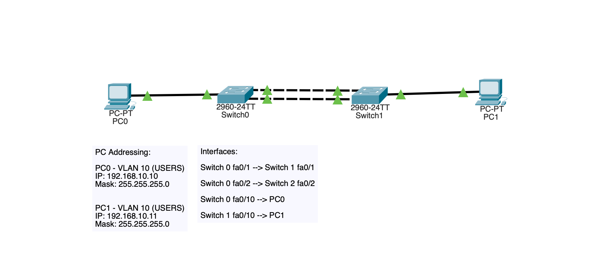
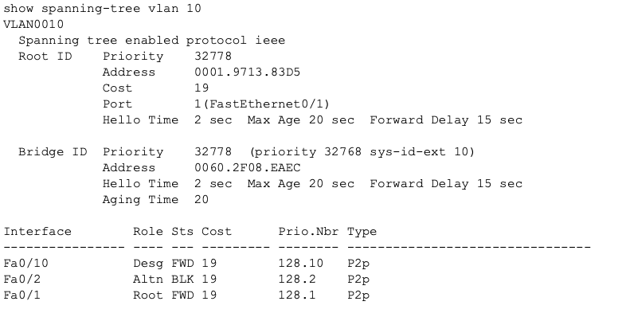
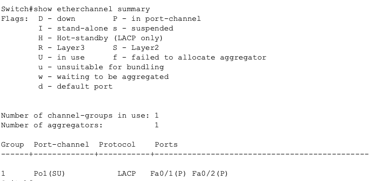
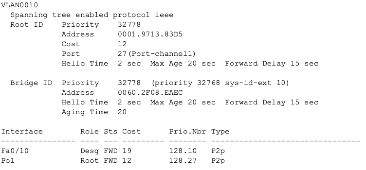
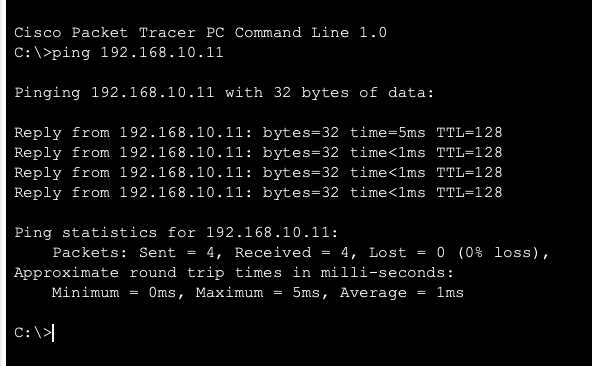

## LACP EtherChannel Fundamentals

# Objective

This lab demonstrates how LACP bundles multiple physical links into a single logical EtherChannel to improve bandwidth utilization and maintain redundancy without causing STP to block one of the links.

**Concepts demonstrated:**
1) EtherChannel formation
2) LACP negotiation
3) Port-channel configuration
4) STP interaction with aggregated links
5) Redundancy and bandwidth design

# Topology

Two switches were connected with two parallel trunk links and one end host on each side.

Without EtherChannel, STP blocked one of the redundant links.

With EtherChannel, both links were bundled into a single logical path.

_Image 1: LACP Small Topology_

# VLAN Design

VLAN 10:
USERS
192.168.10.0/24

Both PCs were placed in VLAN 10 to verify connectivity across the switch pair.

# Behavior Before EtherChannel

Initially, both switch-to-switch links were configured as trunks without EtherChannel.

STP treated them as redundant Layer 2 paths and blocked one of them to prevent a loop.

**Verification:**

_Image 2: STP Port Behavior Before_

This demonstrates how normal parallel switch links have limitations. 

# LACP Configuration

Both trunk interfaces were added to Port-Channel1 using LACP active mode.

Example:
interface range fa0/1 - 2
 channel group 1 mode active

The logical interface was then configured as a trunk:
interface port-channel 1
 switchport mode trunk

# Verification

EtherChannel formation was verified using:

show etherchannel summary

_Image 3: Etherchannel Formation_

STP behavior re-examined after bundling:

show spanning-tree vlan 10

_Image 4: STP Port Behavior After_

Connectivity validated using ping between hosts.

_Image 5: PC0 --> PC1 Ping Confirmation_

# Key Learning Points

Without EtherChannel, STP blocks one of multiple parallel links.

With EtherChannel, multiple physical links are treated as one logical link.

This allows redundancy and bandwidth to exist together.

LACP is used to negotiate and validate the bundled links.

All interfaces in the channel must have matching switchport settings.

# Skills Demonstrated
1) LACP configuration
2) EtherChannel verification
3) STP behavior analysis
4) Redundancy design
5) Layer 2 architecture understanding

# Summary

This lab demonstrates why EtherChannel is preferred over simple parallel switch links in enterprise networks. It allows multiple physical links to operate as one logical connection, avoiding unnecessary STP blocking while improving link utilization.