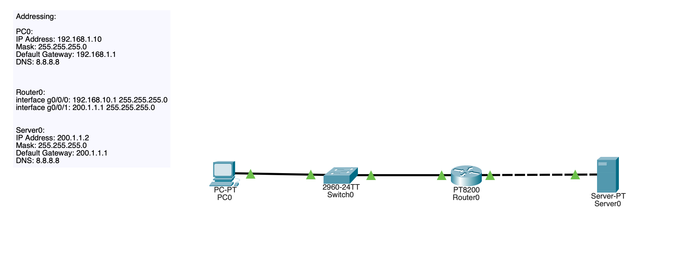
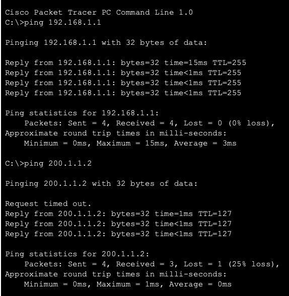
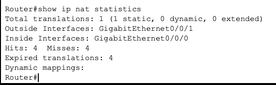
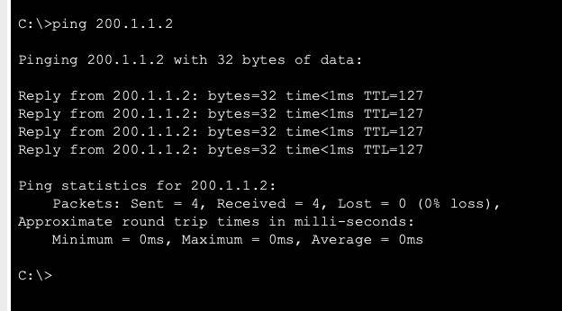
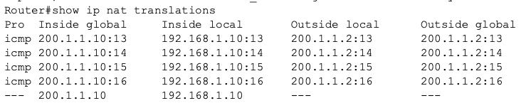

## NAT-01 Static NAT 

# Objective

This lab demonstrates how static NAT allows a private internal host to communicate with an external network by translating its address to a public IP.

Concepts demonstrated:
- NAT inside vs outside interfaces
- Static address translation
- Routing dependency
- Translation verification

# Topology

A simple topology was built with one internal PC, a switch for layer 2 forwarding, a router performing NAT, and one external server that represents the internet.

_Image 1: Small Static NAT Topology_

# Addressing Design

**Inside network**

PC0 Address: 192.168.1.10
Router0 Address: 192.168.1.1

**Outside Network:**

Router0 Address: 200.1.1.1
Server0 Address: 200.1.1.2

# Initial behavior

Before NAT was configured, the PC could not communicate with the server because private IP addresses are not routable externally.

_Image 2: PC0 Unable to Ping External Server Representing Internet_

# NAT configuration

**Router configured with:**

Inside interface:

ip nap inside

Outside interface:

ip nat outside

Static Mapping:

ip nat inside source static 192.168.1.10 200.1.1.10

_Image 3: Static NAT Route Configured_

# Verification  

Translation confirmed using:

show ip nat translations

Connectivity verified using ping:

_Image 4: PC0 Able to Ping External Server Representing Internet_

_Image 5: NAT Translations Configured Correctly_

# Key learning points

1) Private networks require NAT for external communication.

2) Routers rewrite packet headers during translation. (Seen in PDU under packet stimulation mode)

3) Inside and outside roles must be defined.

4) Routing still must exist for NAT to function.

# Skills demonstrated
- NAT configuration
- Packet flow understanding
- Routing fundamentals
- Translation verification

# Summary

This lab demonstrates the basic principles and fundamental purpose of NAT in allowing private networks to access external resources. Static NAT provides individual mapping between internal and public addresses.
