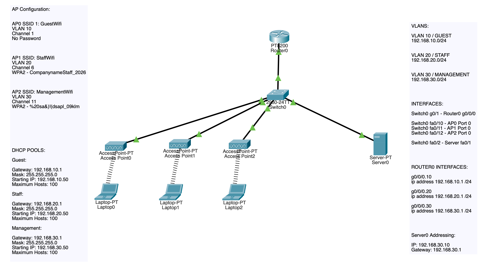
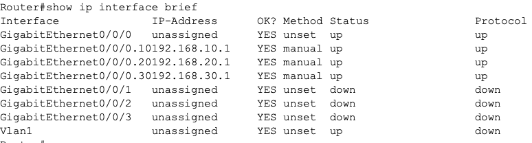
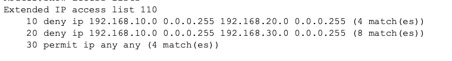
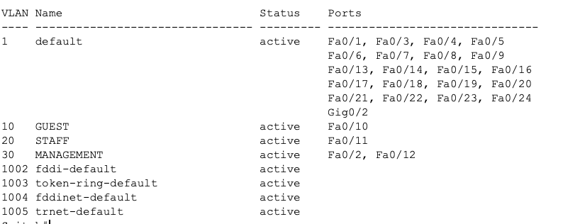
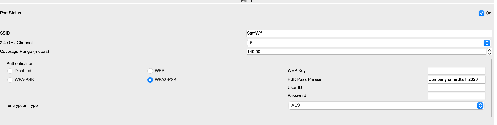
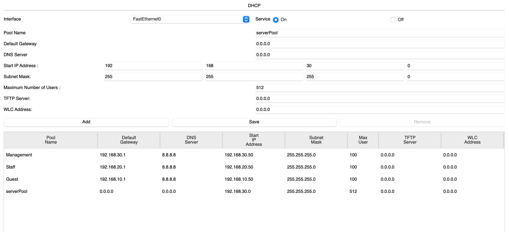
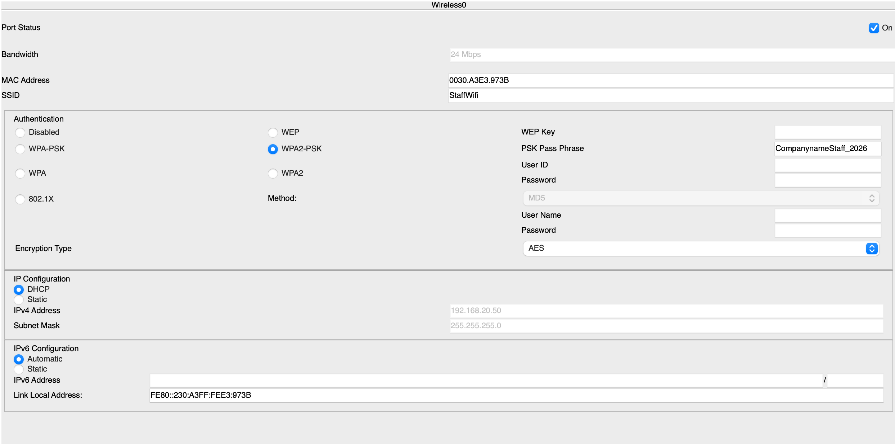
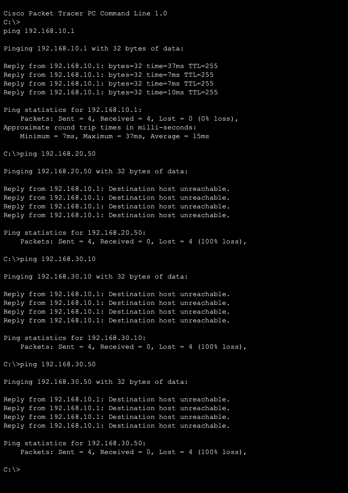

## Wireless Enterprise Segmented Wireless Architecture
# Objective

This lab demonstrates a small enterprise wireless design using multiple SSIDs configured to separate VLANs, a centralized DHCP server, inter-VLAN routing, and ACL-based guest isolation.

The goal was to simulate a realistic wireless network where different user groups have different levels of access:

Guest users were placed in an isolated VLAN.
Staff users were placed in an internal VLAN
Management users were placed in an administrative VLAN.

This demonstrates basic security policy enforcement into one working architecture.

# Project Overview

The network was designed around three wireless access points, each serving a specific SSID and VLAN:

SSIDs:
GuestWifi - VLAN 10
StaffWifi - VLAN 20	
ManagementWifi - VLAN 30

The end users in each wireless network receives IP addresses from a the centralized DHCP server, while the router provides inter-VLAN routing. ACLs were applied to restrict guest users from reaching internal networks.

# Network Topology

The topology consists of:

- 1 router
- 1 switch
- 3 access points
- 3 wireless laptops
- 1 DHCP server

_Image 1: Wireless Enterprise Network Design_

# VLAN Design

VLANS:
10 - GUEST - 192.168.10.0/24
20 - STAFF - 192.168.20.0/24
30 - MANAGEMENT - 192.168.30.0/24

Design choice:

VLAN 10, the Guest VLAN was isolated for external, limited access users.
VLAN 20, the Staff VLAN was for ordinary internal staff use.
VLAN 30, the Management VLAN was designed for administrative access to devices and the DHCP server.

# IP Addressing and Gateway Design

**Router gateways:**

Subinterfaces:
g0/0/0.10 (VLAN10)	
192.168.10.1/24

g0/0/0.20 (VLAN20)
192.168.20.1/24

g0/0/0.30 (VLAN30)
192.168.30.1/24

**DHCP server**

Server0:
IP Address: 192.168.30.10
Subnet Mask: 255.255.255.0
Gateway: 192.168.30.1
DNS: 8.8.8.8

The DHCP server was intentionally placed in the management VLAN so that infrastructure services are only accessible to administrators. 

# Wireless Design Decisions

Three APs had to be used instead of one due to the Packet Tracer AP model. This model only supports one SSID per AP. In a real enterprise configuring three SSID's on one AP would be possible.

Each SSID was assigned a non-overlapping channel to avoid interference.

AP0:
SSID: GuestWifi	
VLAN: 10	
CHANNEL: 1
SECURITY: Open

AP1
SSID: StaffWifi	
VLAN: 20	
CHANNEL: 6	
SECURITY: WPA2-PSK

AP2	
SSID: ManagementWifi
VLAN: 30	
CHANNEL: 11	
SECURITY: WPA2-PSK

This follows the industry standard 2.4 GHz non-overlapping channel pattern.

# DHCP Design

A centralized DHCP server provided addressing for all three wireless networks.

DHCP pools:

Guest:	
Gateway: 192.168.10.1	
Addressing Start: 192.168.10.50	
Mask: 255.255.255.0

Staff	
Gateway: 192.168.20.1	
Addressing Start: 192.168.20.50	
Mask: 255.255.255.0

Management	
Gateway: 192.168.30.1	
Addressing Start: 192.168.30.50	
Mask: 255.255.255.0

# Router Design

The router provides Layer 3 gateways for all VLANs using subinterfaces.

This allows:

- DHCP relay support
- Inter-VLAN communication where permitted
- ACL enforcement at the routing boundary

Verified using:

show ip interface brief

_Image 2: Router Subinterfaces_

# Security Policy

Guest users should not be able to access staff or management networks.

ACL 110 was applied inbound on VLAN 10:

deny VLAN 10 --> VLAN 20
deny VLAN 10 --> VLAN 30
permit all other traffic

This enforces realistic guest isolation policy.

Verified using:

show access-lists

_Image 3: Access List Isolating Guest VLAN_

# Verification Performed
**VLAN verification**

Confirmed correct port to VLAN connection on the switch.

show vlan brief

_Image 4: Switch VLAN & Port Association Verification_

**Wireless verification**

Confirmed SSID and security settings on access points.

_Image 5: AP1 SSID Configuration Verification_

**DHCP verification**

Confirmed DHCP pools exist on the server.

_Image 6: Server0 DHCP Pools Configuration Verification_

**Client addressing verification**

Confirmed wireless end points received IP addresses from the correct subnet.

_Image 7: Laptop1 DHCP Addressing Verification_

**Guest isolation verification**

Confirmed guest laptop could:

Reach its own gateway and failed when trying to reach other VLAN end devices.

_Image 8: Laptop0 Ping Isolation Assessment_

# Key Learning Points

1) Enterprise wireless designs depend on segmentation, not only connectivity.
2) SSID to VLAN mapping is a core wireless principle.
3) Centralized DHCP using a server scales better than individual VLAN's local DHCP.
4) ACLs are simple; but effective control for network isolation.
5) Channel planning matters in wireless deployments.
   

# Skills Demonstrated

- VLAN design
- Wireless network segmentation
- SSID planning
- 2.4 GHz channel planning
- DHCP pool design
- ACL based isolation
- Verification using operational commands