# SME Secure Branch Network Flagship Project

## Overview

This project simulates a small enterprise branch network with segmented wired and wireless access, centralized infrastructure services, dynamic routing, Layer 2 redundancy, security policy enforcement, and simulated internet access.

The goal was to combine the main networking concepts studied during Network+ preparation into a coherent small-enterprise design, rather than a series of isolated feature labs.

Core technologies implemented:

- VLAN segmentation with VLSM
- Inter-VLAN routing
- OSPF dynamic routing 
- Redundant router links
- STP with defined root/secondary roles
- PortFast and BPDU Guard on edge ports
- Centralized DHCP server with DHCP relay/helper
- Internal security policy using ACL's
- PAT overload for outbound internet access
- Wired and wireless client groups
- Internal services network with dedicated server VLAN

## Topology

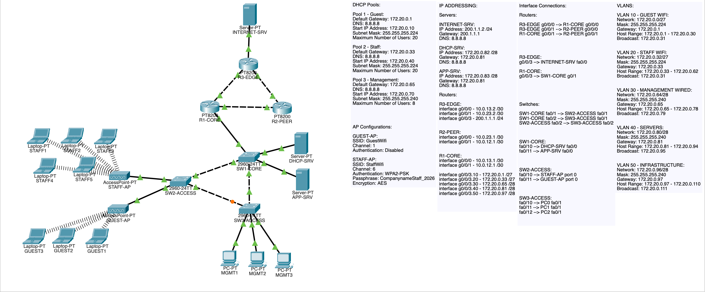

## Design Goals

1. Separate guest, staff, management, server, and infrastructure traffic  
2. Provide internal routing redundancy with OSPF and multiple routed paths  
3. Centralize DHCP instead of distributing it per segment  
4. Enforce realistic security access restrictions between user groups  
5. Simulate internet access through an edge NAT/PAT router  

## VLAN and VLSM Design

A single internal block; 172.20.0.0/24 was subnetted using VLSM.

10 - GUEST - Guest wireless users - 172.20.0.0/27 - 172.20.0.1 
20 - STAFF - Staff wireless users - 172.20.0.32/27 - 172.20.0.33 
30 - MANAGEMENT - Wired management devices - 172.20.0.64/28 - 172.20.0.65 
40 - SERVERS - DHCP and internal application servers - 172.20.0.80/28 - 172.20.0.81 
50 - INFRASTRUCTURE - Reserved infrastructure segment - 172.20.0.96/28 - 172.20.0.97

This addressing plan was chosen to reflect realistic subnet sizing instead of assigning a /24 to every VLAN.

## Routed Core Design

The routed layer uses three point-to-point transit networks:

R1-CORE <--> R3-EDGE - 10.0.13.0/30
R2-PEER <--> R3-EDGE - 10.0.23.0/30
R1-CORE <--> R2-PEER - 10.0.12.0/30

OSPF area 0 was used across the routed triangle to provide dynamic internal route exchange and path redundancy.

### Routing roles

- R1-CORE advertises the internal VLAN networks
- R2-PEER provides routing redundancy
- R3-EDGE connects the enterprise network to the simulated internet segment

The internet segment uses:

- R3-EDGE = 200.1.1.1/24
- INTERNET-SRV = 200.1.1.2/24

A static default route was used on R1-CORE toward R3-EDGE for internet exit. This was done as a Packet Tracer workaround, after OSPF default route origination did not function consistently.

### OSPF verification

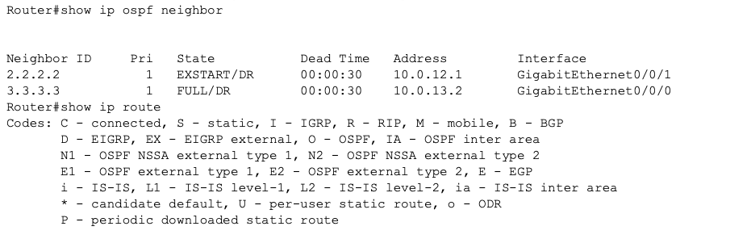

## Switching Design

### Core switch
SW1-CORE functions as the central switching point for:

- uplink to R1-CORE
- trunks to both access switches
- server connectivity

### Access switches
- SW2-ACCESS serves the guest and staff APs
- SW3-ACCESS serves the wired management clients

### Trunking
802.1Q trunks were configured between:

- SW1-CORE <--> SW2-ACCESS
- SW1-CORE <--> SW3-ACCESS
- SW2-ACCESS <--> SW3-ACCESS
- SW1-CORE <--> R1-CORE

Allowed VLANs on trunks:

- 10
- 20
- 30
- 40
- 50

### Switching verification

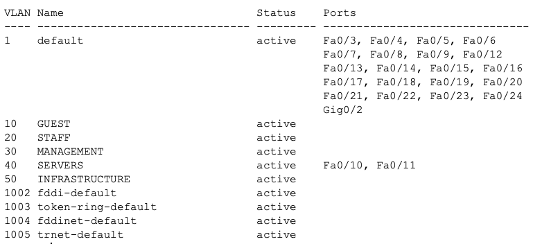

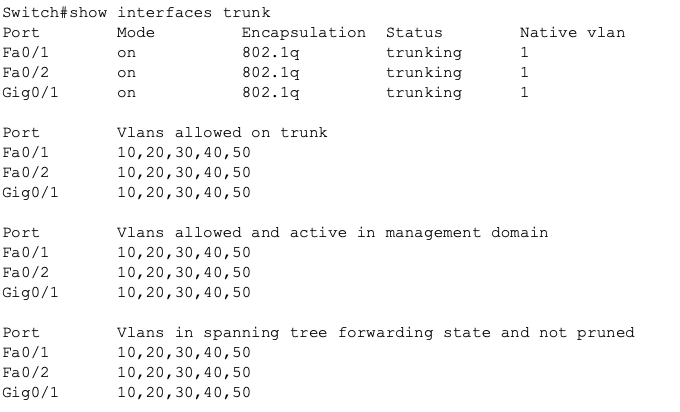

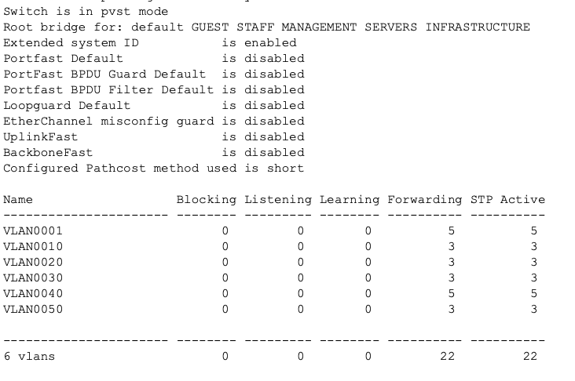

## STP Design

PVST was used.

- SW1-CORE was configured as **root primary**
- SW2-ACCESS was configured as **root secondary**

This ensured predictable Layer 2 behavior and prevented unstable/undesired root election.

### Edge protections

PortFast and BPDU Guard were enabled on:

- Wireless AP ports
- Server ports
- Management client ports

These protections were intentionally limited to edge-facing interfaces and not applied to trunk ports.

## Wireless Design

Packet Tracer AP limitations led to a dual AP design instead of a single AP with several SSID's trunked enterprise AP model.

### Access points

#### GUEST-AP
- SSID: GuestWifi
- VLAN: 10
- Channel: 1
- Authentication: disabled

#### STAFF-AP
- SSID: StaffWifi
- VLAN: 20
- Channel: 6
- Authentication: WPA2-PSK
- Passphrase: CompanynameStaff_2026
- Encryption: AES

This provided wireless segmentation by user type while preserving clarity in the topology.

## DHCP Design

A centralized DHCP server was placed in the server VLAN.

### DHCP-SRV
- IP: 172.20.0.82/28
- Gateway: 172.20.0.81

### Pools

1) Guest - 172.20.0.10 - 172.20.0.1 - 255.255.255.224
2) Staff - 172.20.0.40 - 172.20.0.33 - 255.255.255.224
3) Management - 172.20.0.70 - 172.20.0.65 - 255.255.255.240

DHCP relay was configured on R1-CORE subinterfaces for VLANs 10, 20, and 30 using:

 ip helper-address 172.20.0.82

### DHCP verification

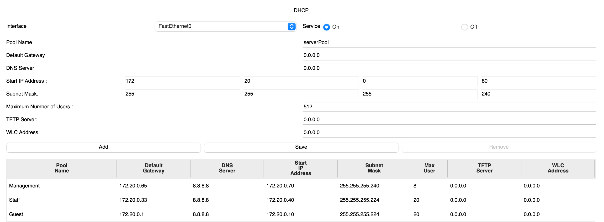

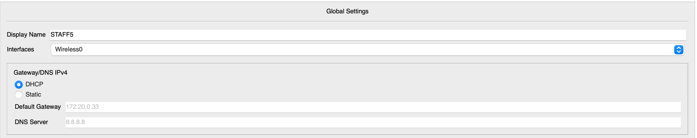

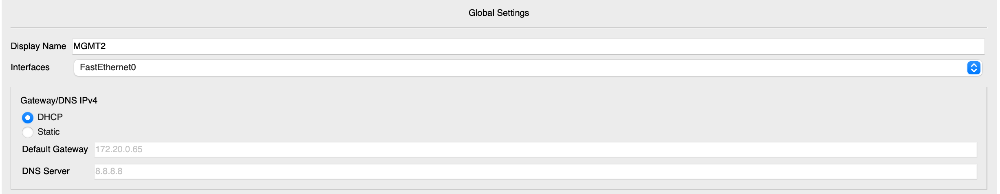

## Server Design

### DHCP-SRV
- IP: 172.20.0.82/28
- Role: centralized DHCP

### APP-SRV
- IP: 172.20.0.83/28
- Role: internal enterprise application/resource server

### INTERNET-SRV
- IP: 200.1.1.2/24
- Role: simulated internet destination beyond the enterprise edge

## Security Policy

ACLs were applied inbound on user VLAN subinterfaces on R1-CORE.

### Guest policy
Guest users were denied access to:

- Staff VLAN
- Management VLAN
- Server VLAN
- Infrastructure VLAN

Guest access to non-internal destinations remained unrestricted, enabling internet access later through PAT.

### Staff policy
Staff users were denied access to the management VLAN while retaining access to the internal server VLAN.

### Management policy
Management devices were left unrestricted.

### ACL verification

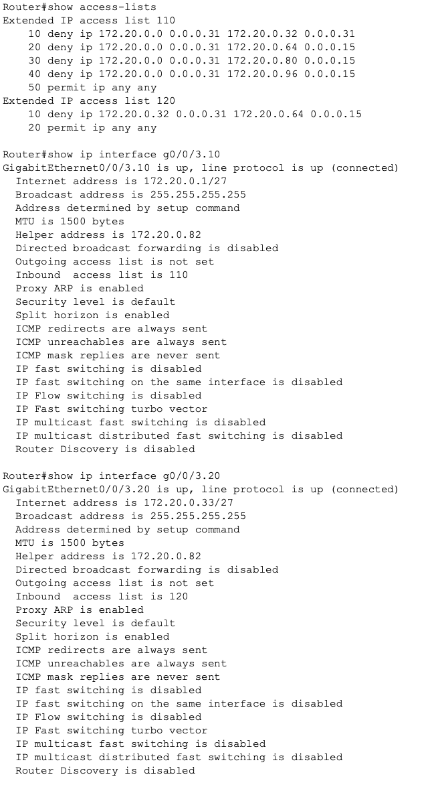

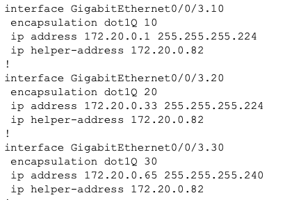

## Connectivity Verification

### Before ACL enforcement
Guest and staff could reach internal resources before restrictions were applied.

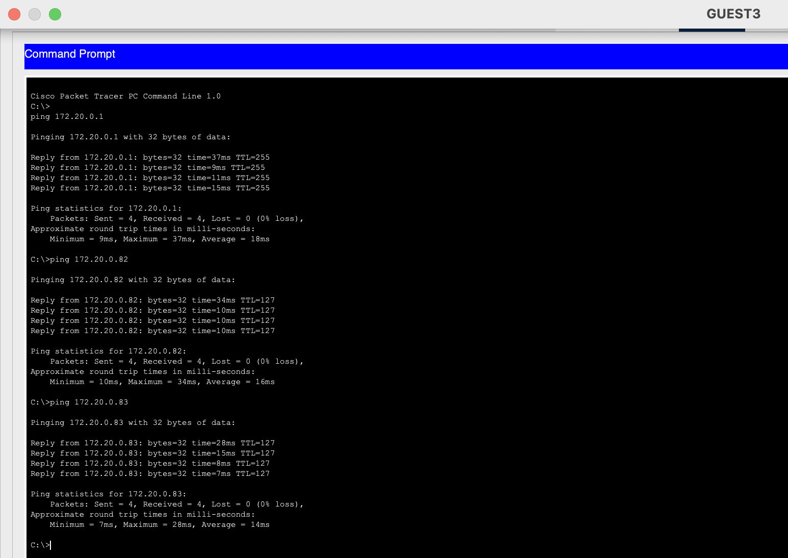

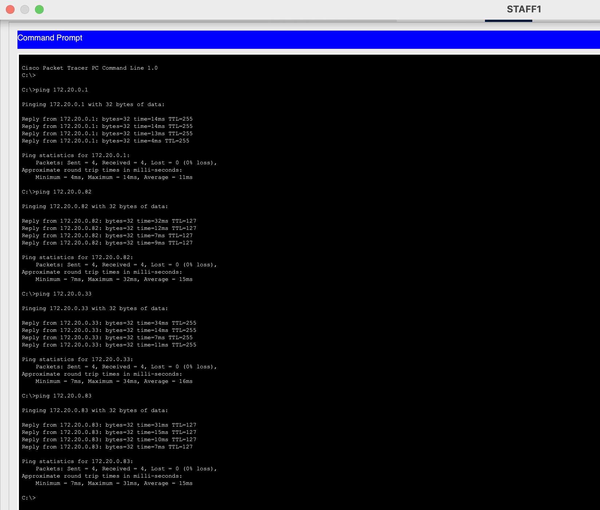

### After ACL enforcement
Guest retained access to its own gateway but lost access to internal VLANs and servers.

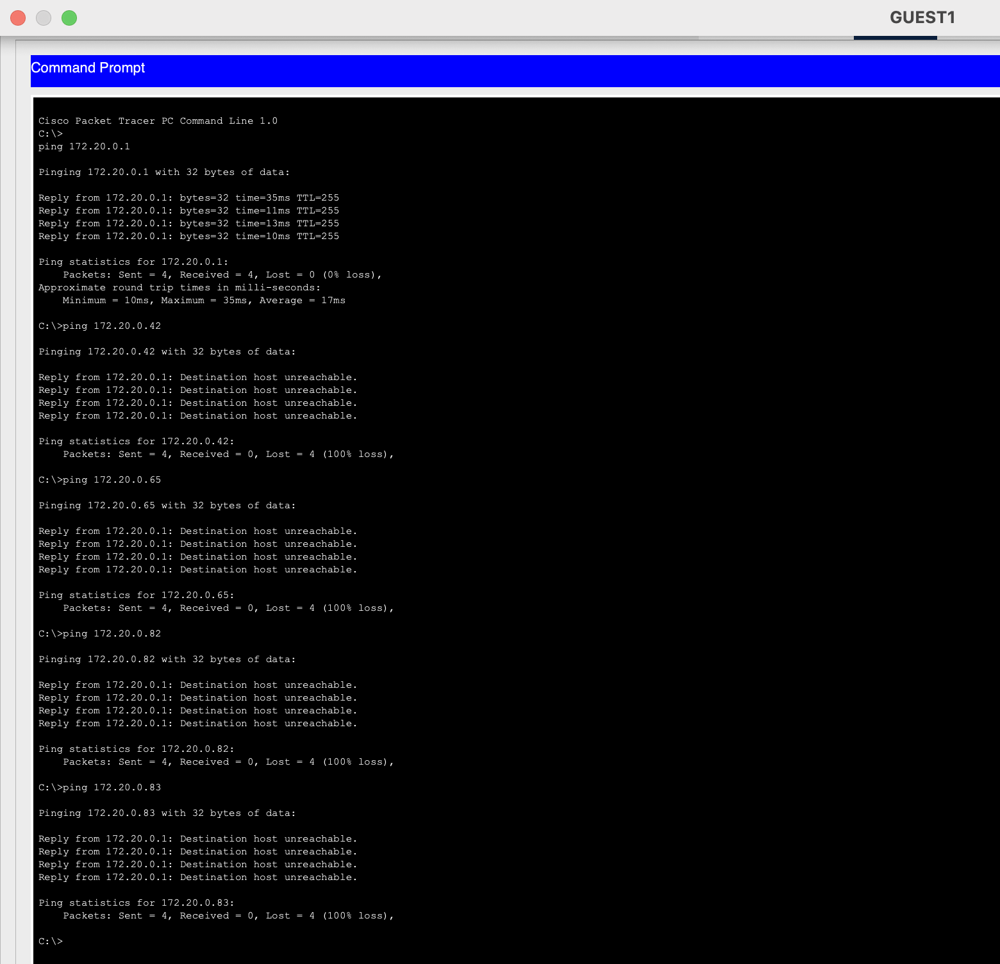

Staff retained access to internal servers but lost access to management.

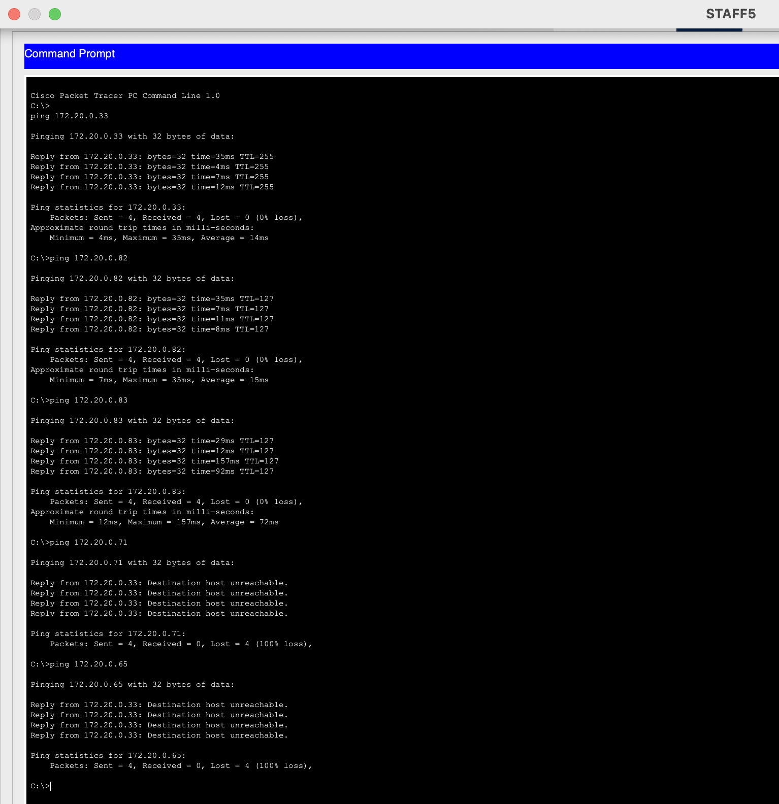

Management retained broad internal access.

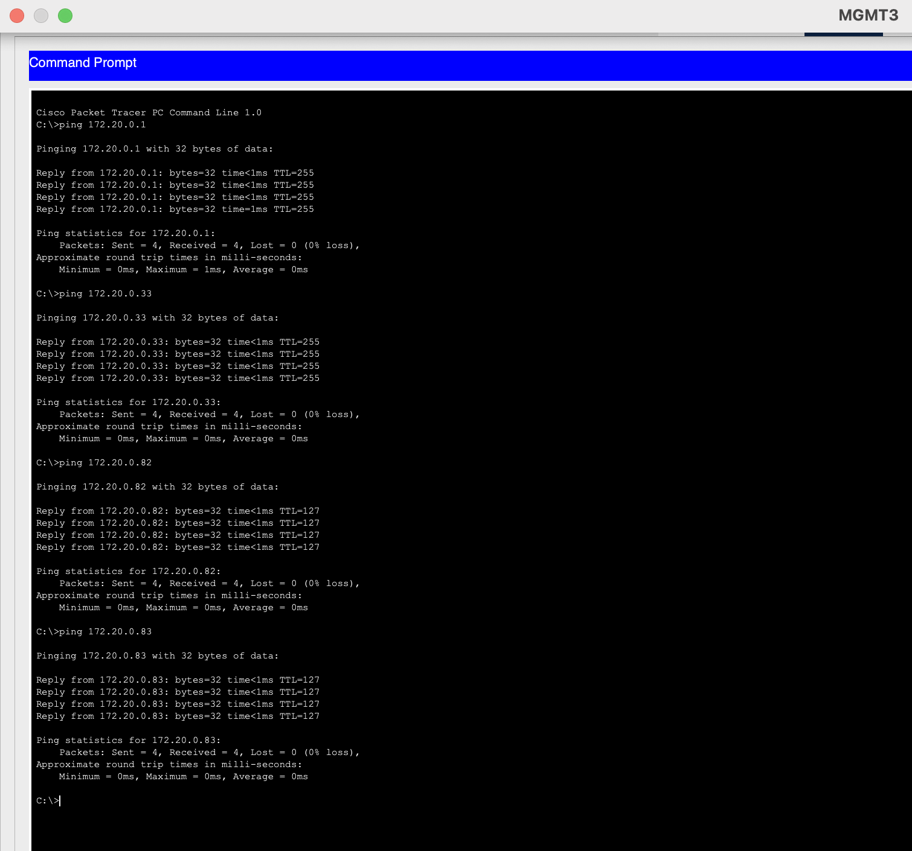

## NAT / PAT Design

PAT overload was implemented on R3-EDGE.

### Inside interfaces
- toward R1-CORE
- toward R2-PEER

### Outside interface
- toward INTERNET-SRV

ACL 1 matched the internal enterprise address space:

 access-list 1 permit 172.20.0.0 0.0.0.255

PAT used the outside interface address on R3-EDGE:

 ip nat inside source list 1 interface GigabitEthernet0/0/3 overload

This allowed internal clients to reach the simulated internet through a single translated public address.

### NAT / internet verification

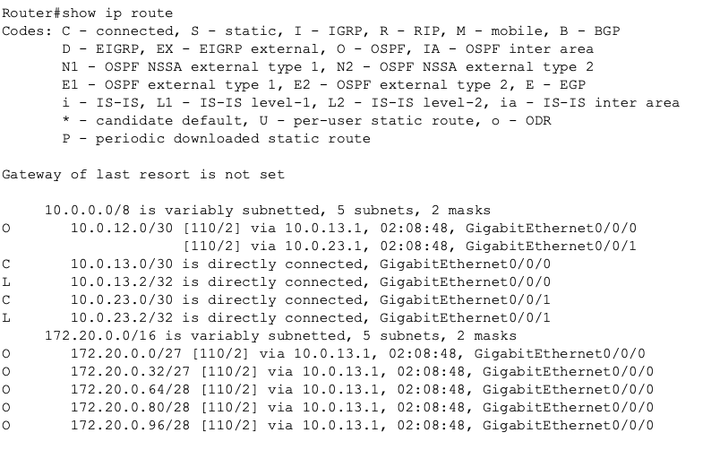

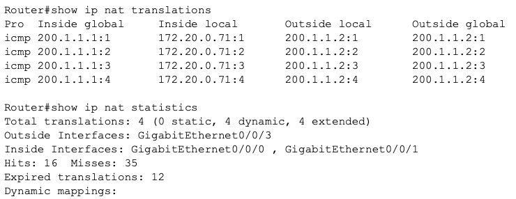

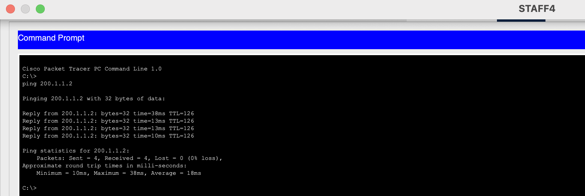

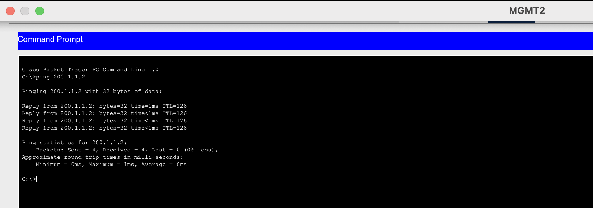

## Key Design Decisions

### Why OSPF instead of static routing everywhere
OSPF was chosen because the project includes multiple routers and redundant router paths. It reflects scalable internal routing, rather than full static route administration.

### Why static default route on R1
A static default route from R1-CORE to R3-EDGE was used because Packet Tracer’s OSPF default origination behavior did not operate consistently. Internal routing still remained dynamic via OSPF.

### Why separate guest and staff APs
Packet Tracer APs are limited compared to real enterprise wireless AP's, and is unable to be configured with multiple SSIDs simultaneously. Separate APs provided a clean and verifiable way to demonstrate wireless segmentation.

### Why servers are centralized on SW1-CORE
Central services belong near the switching core, not at the edge. This makes the design cleaner and more realistic.

### Why VLSM was used
The project demonstrates intentionally avoiding wasting address space. Guest and staff received /27 networks, while smaller management and server segments used /28s.

## Skills Demonstrated

- Enterprise VLAN segmentation
- VLSM subnet planning
- Inter-VLAN routing
- OSPF deployment and verification
- STP root design
- PortFast / BPDU Guard security
- Central DHCP with relay
- ACL-based segmentation
- PAT overload at the internet edge
- Integrated wired and wireless architecture

## Final Outcome

This project brings together the major infrastructure concepts covered during Network+ study into one integrated enterprise style network.

It demonstrates not only the ability to configure technologies individually, but also the ability to design, secure, verify, and troubleshoot a complete small enterprise network architecture.