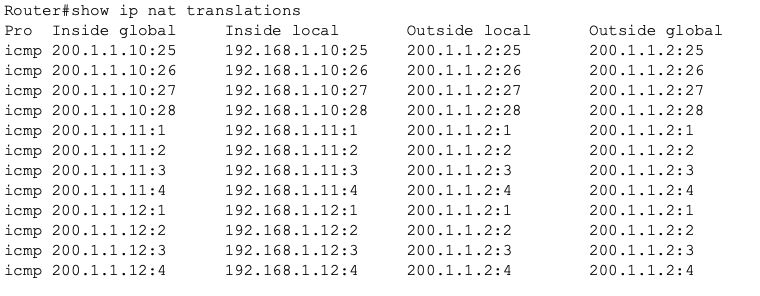
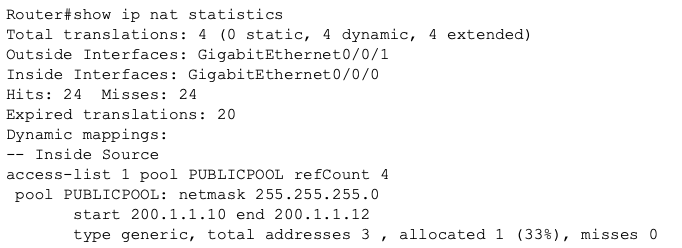

## NAT-02 Dynamic NAT Pool Translation
# Objective

This lab demonstrates how Dynamic NAT translates multiple private hosts to a pool of public IP addresses. Unlike Static NAT, Dynamic NAT assigns addresses from a pool on a first come first serve basis.

# Concepts demonstrated:

- NAT inside vs outside interfaces
- Dynamic NAT pool
- Address allocation 
- NAT table verification

# Topology

The topology consists of three end hosts connected to a router performing NAT, with a external server representing the internet.

Internal network:
192.168.1.0/24

External network:
200.1.1.0/24

_Image 1: Dynamic NAT Topology Design_

# Addressing Design

**Inside Network:**

PC0 - 192.168.1.10/24
PC1 - 192.168.1.11/24
PC2 - 192.168.1.12/24
Router - 192.168.1.1/24

**Outside Network:**

Router - 200.1.1.1/24
Server - 200.1.1.2/24

# NAT Pool Design

Public pool created:

200.1.1.10 – 200.1.1.12

This allows three internal hosts to receive public addresses dynamically.

# Configuration Overview

ACL inside hosts:

access-list 1 permit 192.168.1.0 0.0.0.255

NAT pool:

ip nat pool PUBLICPOOL 200.1.1.10 200.1.1.12 netmask 255.255.255.0

Dynamic NAT binding:

ip nat inside source list 1 pool PUBLICPOOL

# Verification

NAT translations verified with:

show ip nat translations

Output confirmed:

192.168.1.10 --> 200.1.1.10
192.168.1.11 --> 200.1.1.11
192.168.1.12 --> 200.1.1.12

_Image 2: Dynamic NAT Translation Table_

# NAT Statistics

Verification performed with:

show ip nat statistics

Confirmed:

- Address pool usage
- Translation hits
- Translation expiration behavior

_Image 3: Dynamic NAT Statistics_

# Key Learning Points

1) Dynamic NAT assigns public IPs from a defined pool.

2) Each internal host receives a temporary public address.

3) Pool size limits number of simultaneous translations.

4) This limitation explains why PAT is used in most real networks.

# Skills Demonstrated
1) Dynamic NAT configuration
2) ACL usage in NAT
3) Translation verification
4) NAT pool design
5) Understanding NAT limitations

# Summary

Dynamic NAT provides automated address translation from a pool of public IPs but is limited by pool size. This lab demonstrates why Dynamic NAT is rarely used compared to PAT in modern enterprise environments.

