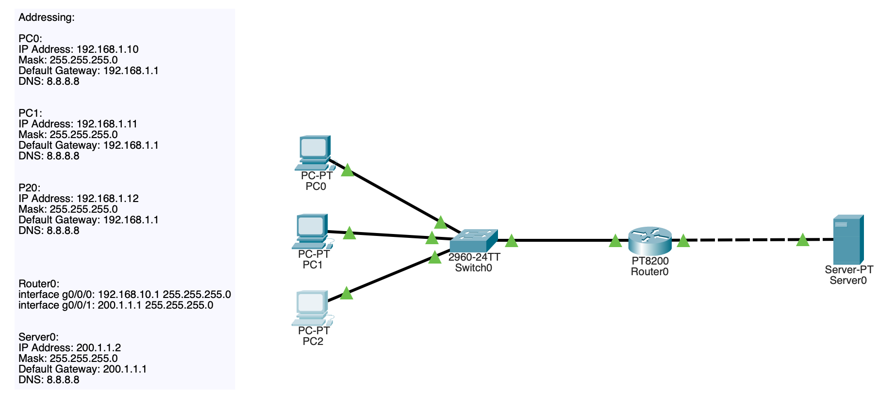
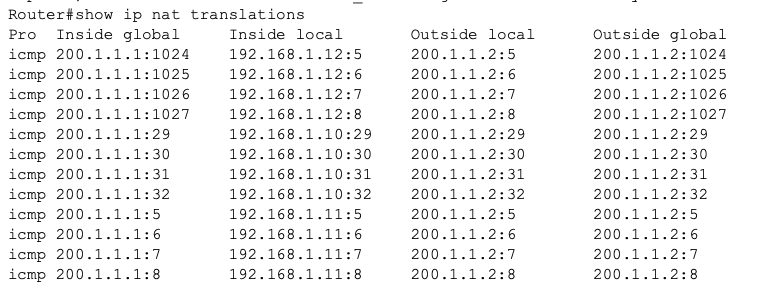
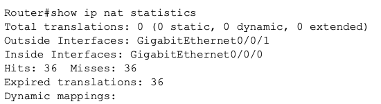

## NAT-03 PAT (Port Address Translation)
# Objective

This lab demonstrates PAT (Port Address Translation), which allows multiple internal hosts to share a single public IP address using port numbers to distinguish between them.

PAT is the most common NAT implementation in enterprise and home networks.

# Concepts demonstrated:

- PAT translation behavior
- Overload NAT configuration
- Port-based translation
- NAT table verification
- Comparison with Dynamic NAT

# Topology

Same topology as Dynamic NAT lab was reused to demonstrate how PAT improves scalability.

Internal hosts communicate with external server through a single public IP.

_Image 1: PAT Simple Topology_

# PAT Concept

Unlike Dynamic NAT:

Dynamic NAT:

192.168.1.10 --> 200.1.1.10
192.168.1.11 --> 200.1.1.11

PAT:

192.168.1.10 --> 200.1.1.1:1027
192.168.1.11 --> 200.1.1.1:1025

Multiple hosts share one address using different ports.

# Configuration

Dynamic NAT removed:

no ip nat inside source list 1 pool PUBLICPOOL

PAT configured:

ip nat inside source list 1 interface g0/1 overload

The Change:

Inside hosts matching ACL share router outside interface IP.

# Verification

Verified using:

show ip nat translations

Output confirmed:

Multiple internal hosts sharing:

200.1.1.1

With unique ports.

_Image 2: PAT Translation Table_

# NAT Statistics

Checked:

show ip nat statistics

Observed:

- Translation hits
- Expired entries
- Active translations

_Image 3: PAT Statistics_

# Key Learning Points

PAT allows thousands of hosts to share a single public IP.

Translation occurs using port numbers.

This is the most scalable NAT method.

Used in:

- Home routers
- Enterprise firewalls
- ISP edge networks
- Cloud environments
- Engineering Insight

Dynamic NAT is limited by pool size.

PAT solves this by using ports instead of addresses.

This explains why Dynamic NAT is rarely used in enterprise networks.

# Skills Demonstrated
- PAT configuration
- NAT overload usage
- Translation table analysis
- Understanding NAT scaling
- Enterprise network design concepts

# Summary

PAT enables scalable internet access by allowing many internal hosts to share a single public IP address through port translation. This lab demonstrates the most common NAT implementation used in modern networks.
