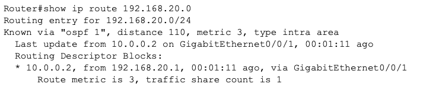
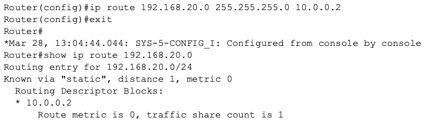
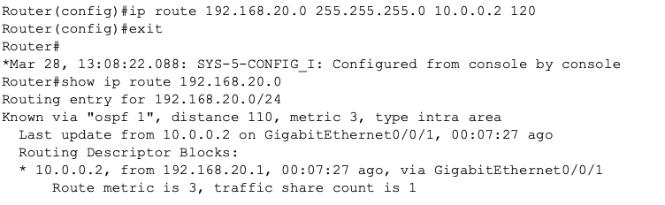
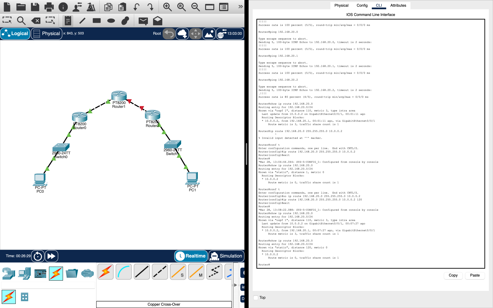

# OSPF Administrative Distance Lab

## Objective

Understand how routers select routes when multiple routing sources exist.

## Key Concept

Administrative distance is what determines which routing protocol is preferred.

## Verification

OSPF route observed:

Static route added:

Floating static configured:

Failover tested:

## Route Selection Behavior

OSPF route initially selected.

Static route added and prioritized due to lower administrative distance.

Static route converted to floating static by increasing administrative distance.

OSPF now lower administrative distance, regained priority.

When OSPF path removed, floating static activated.

## Results

Static route overrode OSPF due to lower Administrative Distance.

Floating static acted as backup.

Failover occurred when OSPF path removed.

## Lessons Learned

Administrative distance controls protocol priority.

Static routes can act as backup.

OSPF dynamically adjusts to failures.

Floating static routes only provide backup connectivity when dynamic routing fails.

## Skills Practiced

- Routing protocol interaction
- Redundancy design
- Failover testing
- Route analysis