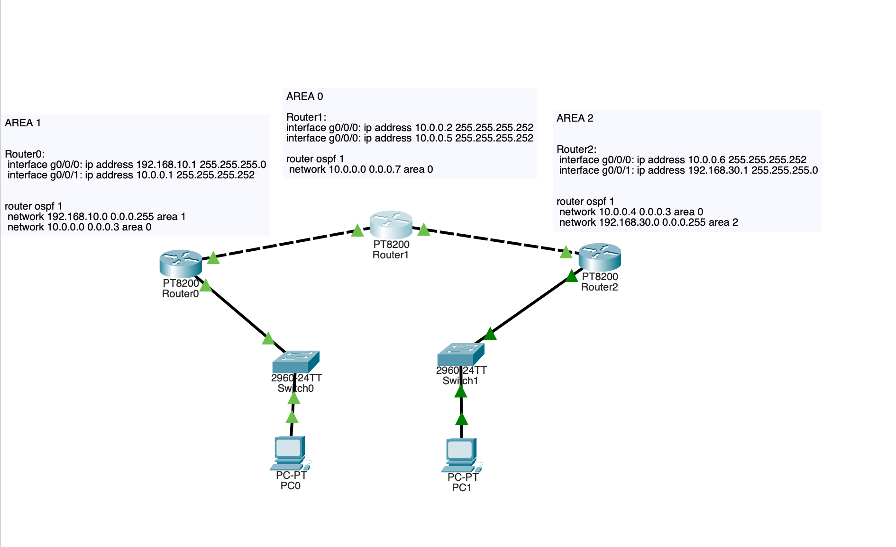
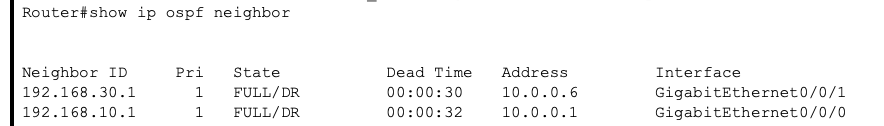
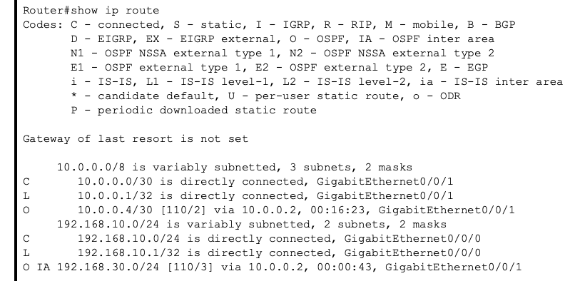
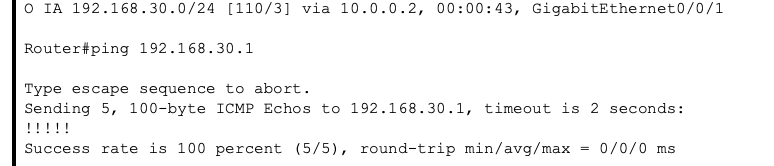
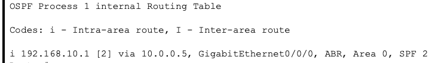

# OSPF Multi-Area Design Lab

## Objective

The objective of this lab was to understand how OSPF scales using multiple areas and how Area Border Routers (ABRs) allow communication between different areas.

This lab focuses on:

• OSPF area hierarchy  
• Backbone area (Area 0)  
• ABR behavior  
• Inter area routing  
• Route verification  

## Network Design

Area layout:

Area 1 -> Area 0 -> Area 2

Router roles:

Router0 -> Area 1 router  
Router1 -> ABR (Area 0 backbone router)  
Router2 -> Area 2 router  

Router1 connects both areas and functions as the Area Border Router.

## Topology

### Transit networks

R0-R1:

10.0.0.0/30

R0 = 10.0.0.1  
R1 = 10.0.0.2  

R1-R2:

10.0.0.4/30

R1 = 10.0.0.5  
R2 = 10.0.0.6  

### LAN networks

R0 LAN:

192.168.10.0/24

Gateway:
192.168.10.1

R2 LAN:

192.168.30.0/24

Gateway:
192.168.30.1

## OSPF Area Assignment

Router0:

LAN -> Area 1  
Transit -> Area 0  

Router1:

Transit links -> Area 0  

Router2:

Transit -> Area 0  
LAN -> Area 2  

This design ensures all areas connect through Area 0 as required by OSPF design rules.

## Configuration Summary

Configuration from Routers:

R0:
router ospf 1
 network 192.168.10.0 0.0.0.255 area 1
 network 10.0.0.0 0.0.0.3 area 0

R1:
router ospf 1
 network 10.0.0.0 0.0.0.7 area 0

R2:
router ospf 1
 network 10.0.0.4 0.0.0.3 area 0
 network 192.168.30.0 0.0.0.255 area 2

## OSPF Neighbor Verification

Neighbor relationships were verified using:

show ip ospf neighbor

This confirmed adjacency formation between routers in Area 0.

## Route Verification

Routes from Area 2 appeared in Area 1 routing tables.

Command used:

show ip route

Observed:

O IA routes.

This confirms successful inter-area routing through the ABR.

---

## Connectivity Testing

Connectivity was verified using ICMP testing.

Router0 successfully reached Router2 LAN:

ping 192.168.30.1

This confirms routing across multiple OSPF areas.

---

## ABR Verification

Router1 functions as the Area Border Router.

Verification command:

show ip ospf border-routers

This confirms Router1 connects multiple OSPF areas.

---

## Results

Successful communication between Area 1 and Area 2 was achieved through the backbone area.

Key observations:

Routes between areas appear as O IA

ABR successfully forwarded routes

OSPF hierarchy functioned correctly

---

## Lessons Learned

OSPF requires Area 0 for multi area routing.

All areas must connect to Area 0.

Area Border Routers exchange routes between areas.

Inter-area routes appear as O IA in routing tables.

Multi-area design improves scalability.

---

## Key Concepts Learned

OSPF hierarchy design

Backbone area importance

ABR role in routing

Inter area route behavior

OSPF scalability principles

---

## Skills Practiced

Multi-area OSPF configuration

ABR routing validation

OSPF troubleshooting

Network architecture thinking

Routing verification techniques

---

## Troubleshooting Notes

Issue:

Routes initially did not appear.

Cause:

Incorrect area assignment.

Fix:

Corrected OSPF network statements.

Lesson:

Area mismatches prevent route exchange.

Always verify area configuration when troubleshooting multi area OSPF.

---

## Engineering Insight

This lab demonstrates how OSPF uses hierarchical design to improve scalability and reduce routing overhead in large networks.

Understanding area design is essential for enterprise network architecture.
 