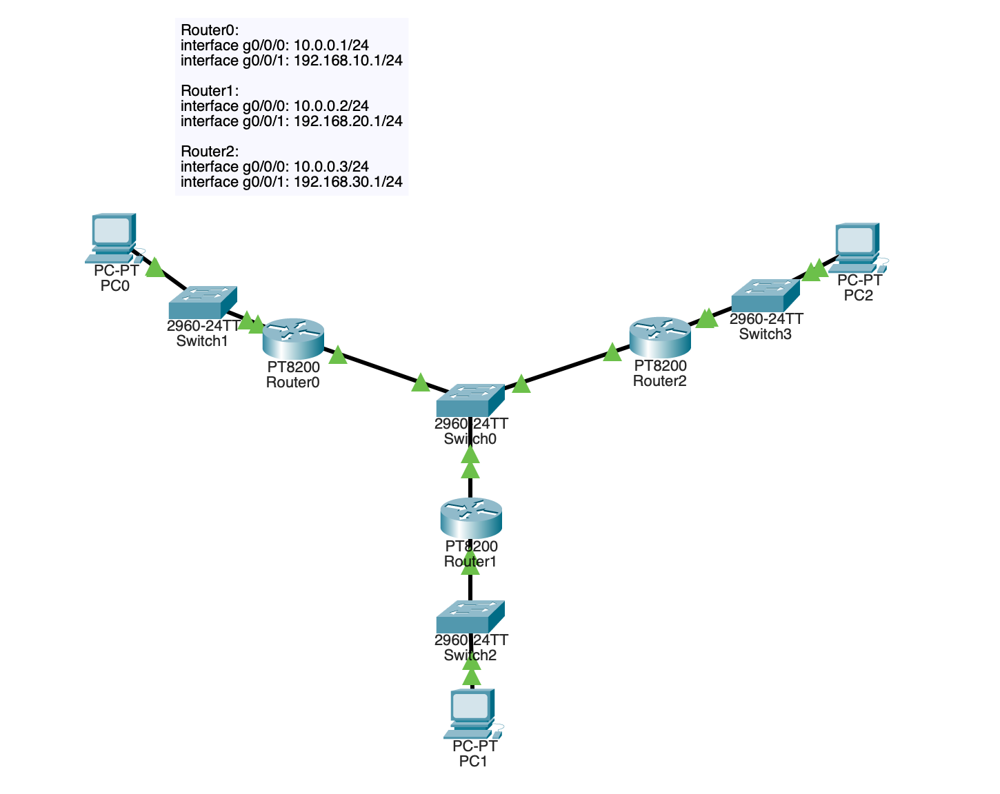
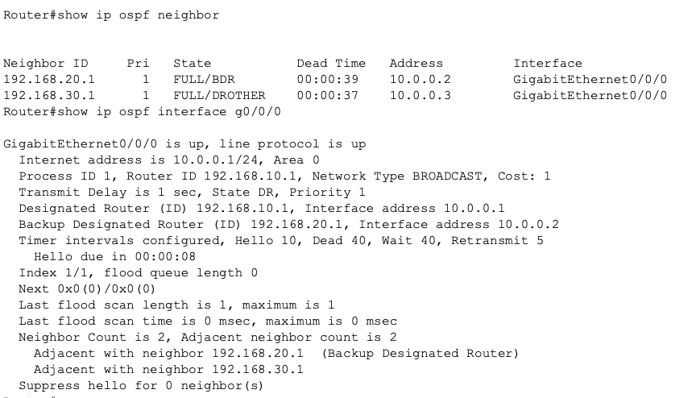
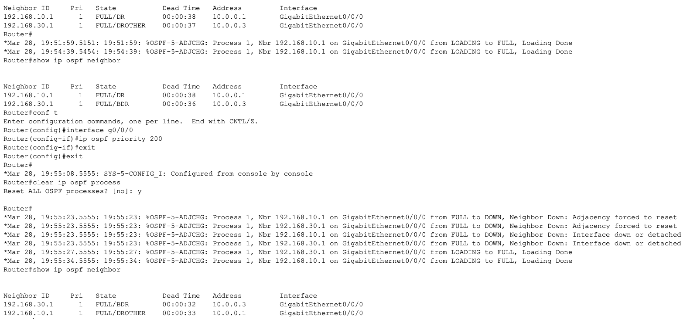
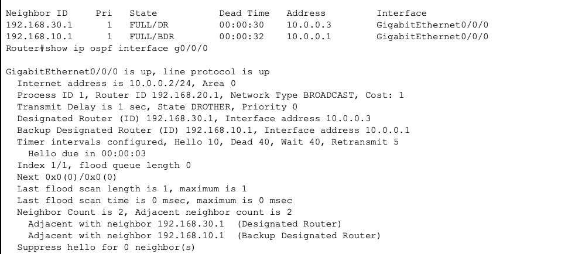
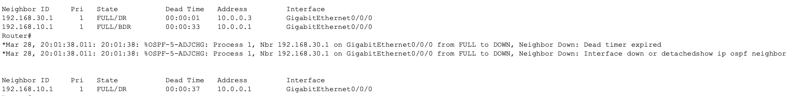

# OSPF DR/BDR Election Lab

## Lab Objective

This lab demonstrates how OSPF elects a Designated Router (DR) and Backup Designated Router (BDR) on broadcast networks, how priority influences the election, and how failover occurs when the DR goes down.

## Topology

Three routers connected through a shared broadcast network (switch). Each router also connects to a local LAN.

## Addressing Scheme

Router0:
g0/0/0 -> 10.0.0.1/24
g0/0/1 -> 192.168.10.1/24

Router1:
g0/0/0 -> 10.0.0.2/24
g0/0/1 -> 192.168.20.1/24

Router2:
g0/0/0 -> 10.0.0.3/24
g0/0/1 -> 192.168.30.1/24

## Initial OSPF Configuration

All routers configured with:

router ospf 1

network 10.0.0.0 0.0.0.255 area 0

network 192.168.xx.0 area 0

## Initial DR/BDR Election Verification

Using:

show ip ospf neighbor

show ip ospf interface g0/0

Initial election shows:

Router0 -> DR
Router1 -> BDR
Router2 -> DROTHER

## Observations

OSPF elected DR based on router ID since priorities were equal.

Default priority = 1.

Router ID selection followed:

Highest interface IP.

## Forcing DR Election

Configured Router1 to become DR:

interface g0/0/0

ip ospf priority 200

Then reset ospf process:

clear ip ospf process

Verification:

## Making Router Ineligible

Configured:

ip ospf priority 0

This prevents DR participation.

Verification:

## DR Failure Simulation

Shutdown DR interface to test BDR promotion.

Result:

BDR became DR automatically.

Verification:

## Key Technical Observations

OSPF reduces adjacency complexity, and makes network more scalable using DR/BDR model.

Election order:

Highest priority

Then highest router ID

Election does not automatically reoccur unless adjacency resets.

Priority 0 prevents DR election.

BDR provides fast failover.

## Troubleshooting Skills Practiced

OSPF neighbor verification

Interface OSPF state analysis

Protocol reset procedures

Election behavior validation

Protocol failure simulation

## Key Commands Used

show ip ospf neighbor

show ip ospf interface

show ip route

clear ip ospf process

## Lessons Learned

DR/BDR architecture reduces routing overhead.

Priority allows control of election.

Router ID also impacts election outcome.

BDR ensures routing continuity.

OSPF election behavior is predictable and engineer-controlled.

## Skills Demonstrated

- OSPF protocol behavior understanding

- Routing protocol tuning

- Network failure testing

- Network verification methodology

- Enterprise routing concepts