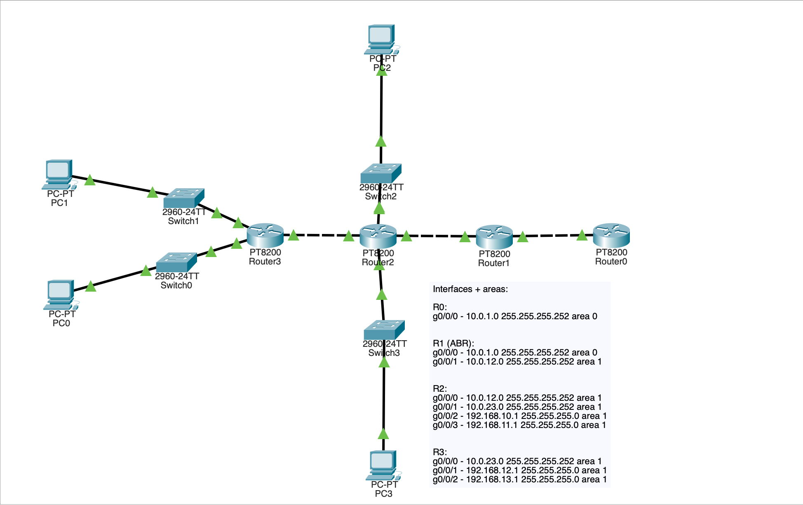
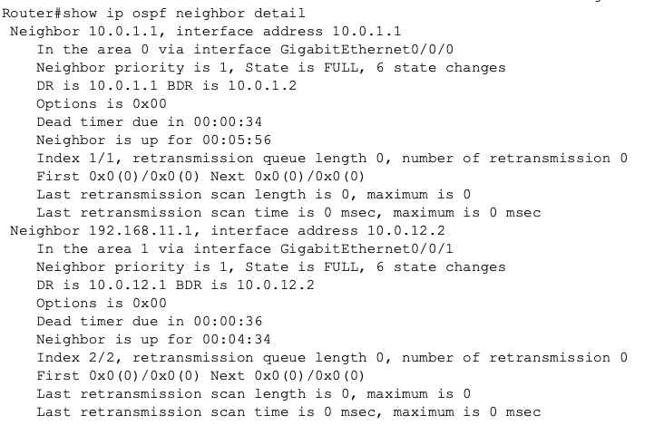
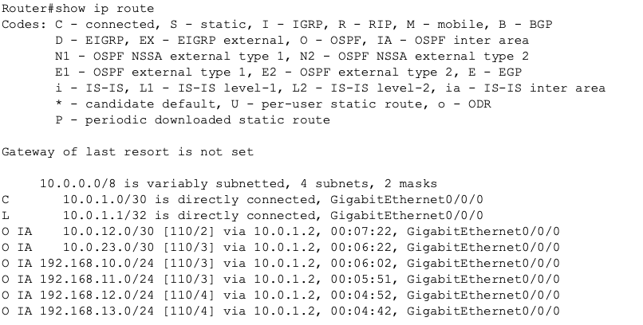
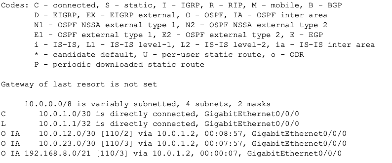
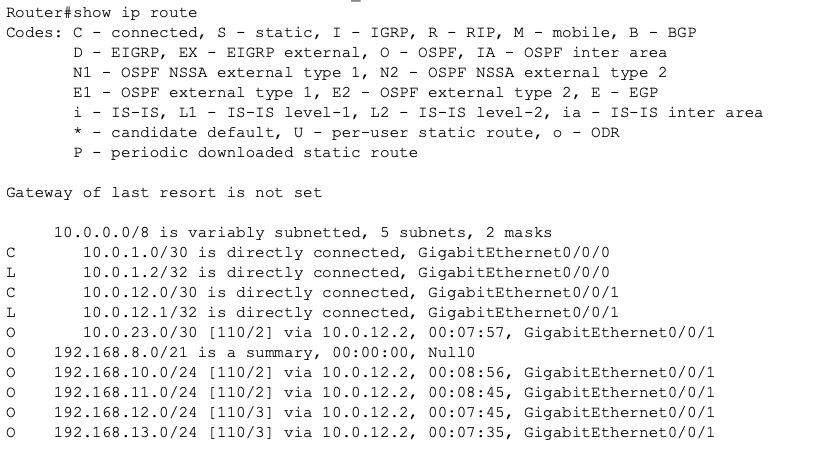

# OSPF Route Summarization Lab

## Objective

This lab demonstrates OSPF route summarization between areas and shows how route aggregation improves routing scalability.

## Key Engineering Concept

OSPF summarization reduces routing table size by summarizing individual routes, and improves network efficiency by advertising grouped network prefixes instead of individual routes.

## Topology

Multi area OSPF design:

Area 1 contains internal networks.

Area 0 serves as the backbone.

R1 operates as the Area Border Router (ABR).

## Addressing Strategy

Transit networks:

R0-R1 -> 10.0.1.0/30  
R1-R2 -> 10.0.12.0/30  
R2-R3 -> 10.0.23.0/30  

This was designed to clearly display which routers are using what interfaces.

LAN networks:

192.168.10.0/24  
192.168.11.0/24  
192.168.12.0/24  
192.168.13.0/24  

Designed to summarize into:

192.168.8.0/21

## Area Group Divide Confirmation

## Before Summarization Routing State

Before summarization the backbone router learns individual routes.

## Summarization Configuration

Configured on ABR:

router ospf 1

area 1 range 192.168.8.0 255.255.248.0

## Post-Summarization Routing State

Backbone router now receives only one summarized route.

## Internal Area Verification

Area 1 routers retain full route detail.

## Key Observations

- OSPF summarization reduces routing complexity.

- Summarization occurs on ABR routers.

- Internal routing detail remains intact.

- Summarization improves scalability.

- Summarization can hide subnet failures.

- Null0 important to counteract subnet failures. 

## Engineering Lessons Learned

- IP addressing must be designed to support summarization.

- Summarization improves routing stability.

- Route summarization is essential in enterprise network design.

- Summarization should be used carefully to avoid routing loops.

## Skills Demonstrated

* Multi-area OSPF design

* Route aggregation

* Routing optimization

* Protocol verification

* Network architecture thinking