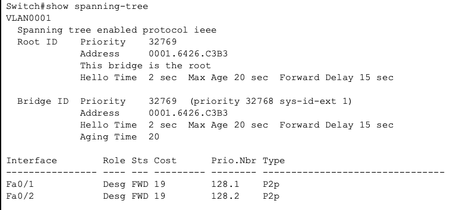
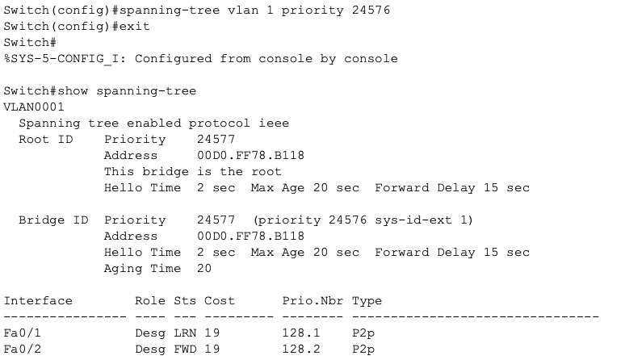
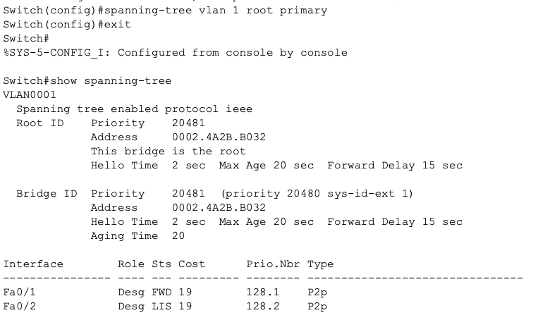
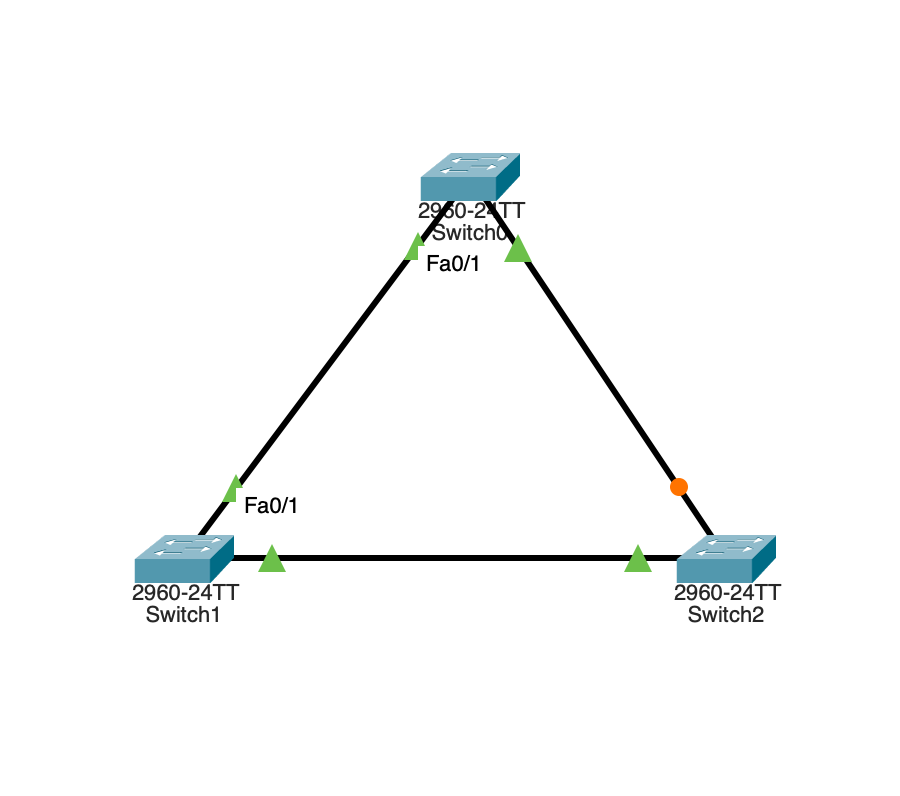
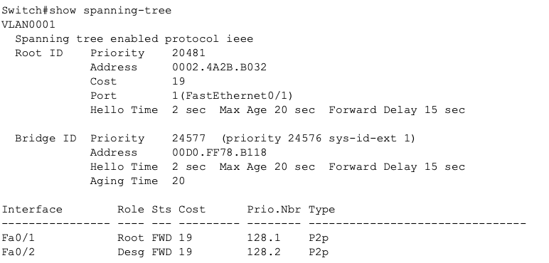

## STP-02 Root Bridge Control Lab
# Objective

This lab demonstrates how STP root bridge selection can be controlled by modifying bridge priority. The goal was to understand how engineers can use different commands to design control Layer 2 topologies rather than relying on default STP behavior.

# Concepts demonstrated:

- Root bridge election
- Bridge priority manipulation
- STP convergence behavior
- Port role changes

# Initial Behavior

Initially, STP selected the root bridge based on lowest Bridge ID (determined by priority + MAC address).

# Verification:

_Image 1: Automatic Root Selection - SW2_

# Root Bridge Engineering 1

Root bridge was manually controlled using:

spanning-tree vlan 1 priority 24576

This forced SW0 to become root.

**Verification:**

_Image 2: SW0 Root Control using Priority Modification_

# Root Bridge Engineering 2

Root bridge was manually controlled again using:

spanning-tree vlan 1 root primary

This command automatically lowers SW1 priority below the current root bridge to guarantee the root election.

This demonstrates how administrative STP commands override manual priority configuration.

**Verification:**

_Image 3: SW1 Root Control using Root Primary Modification_

# STP Topology Changes

After root change:

- Root ports changed
- Blocking ports changed
- Traffic paths changed

This demonstrates how STP topology depends on root placement.

**Verification:**

_Image 4: Topology after Root Configurations_

_Image 5: SW2 Port Changes after Root Primary Modification_

# Key Learning Points

1) STP root selection should be intentional.

2) Core switches should typically be root.

3) Changing priority allows predictable topology design.

4) STP automatically recalculates paths when topology changes.

# Behavior Observed

SW0 was previously configured with priority 24576.

After applying root primary on SW1, its priority was automatically reduced below SW0, causing it to become the new root bridge.

This demonstrates STP priority hierarchy and predictability.

# Skills Demonstrated

- STP verification
- Topology control
- Network design thinking
- Protocol behavior analysis

# Summary

This lab demonstrates how STP behavior can be engineered by controlling bridge priority, allowing predictable Layer 2 topology design.