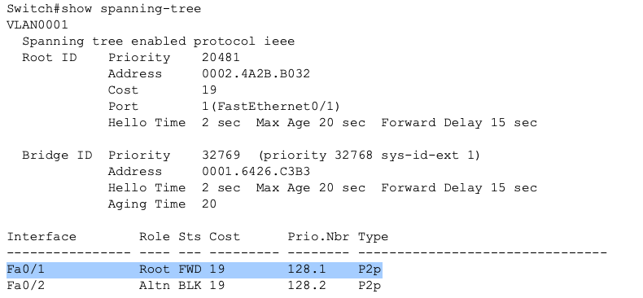
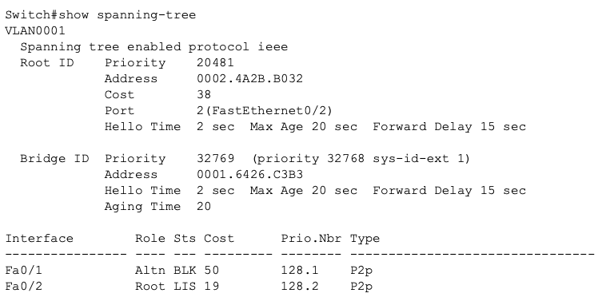
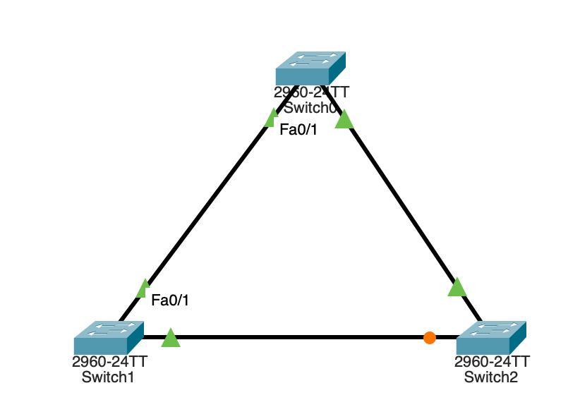

## STP-03 Path Cost Engineering Lab
# Objective

This lab demonstrates how STP path cost affects root port selection as well as network traffic flow. The goal was to understand how engineers can influence Layer 2 traffic paths by manipulating path costs. 

# Concepts demonstrated:

- Path cost influence
- Root port selection
- STP convergence behavior
- Topology engineering

# Initial Behavior

Initially, the switches automatically selected root ports based on lowest cost path to the root bridge.

# Verification:

_Image 1: Original SW2 Port Paths_

# Path Cost Modification

Path cost was manually increased on SW2's interface fa0/1.

interface fa0/1
 spanning-tree vlan 1 cost 50

This caused SW2 to select an alternate path through another switch, due to interface fa0/2 now having a lower cost.

**Verification:**

_Image 2: SW2 Path Cost Modification_

# Topology Impact

After cost change:

- Root port changed
- Blocking port changed
- Traffic path changed

This demonstrated how STP cost directly affects network topology decisions.

**Verification:**

_Image 3: Topology after Cost Configurations_

# Key Learning Points

1) STP selects paths based on lowest cost.

2) Cost can be manually changed to engineer traffic flow.

3) STP recalculates topology automatically based on a timer after cost changes.

4) STP behavior is predictable when properly configured.

# Skills Demonstrated

- STP verification
- Topology engineering
- Redundancy design
- Protocol behavior analysis

# Summary

This lab demonstrated how modifying STP path cost allows network and security engineers to control Layer 2 traffic flow.