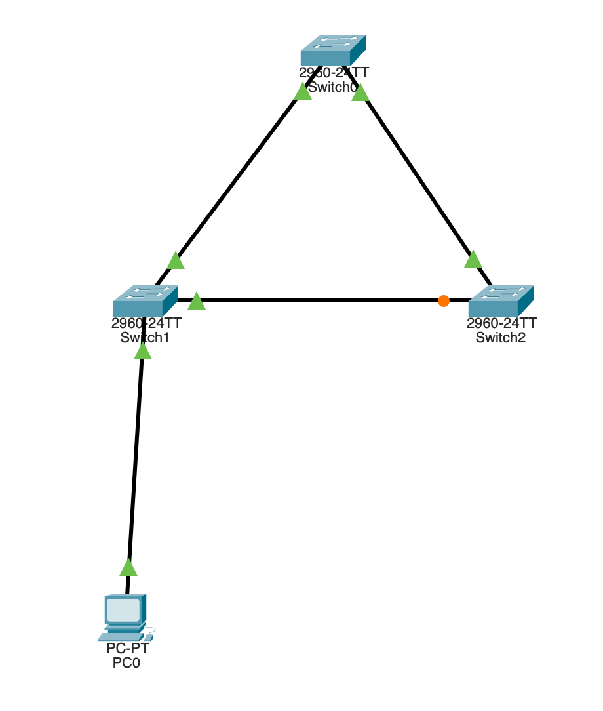
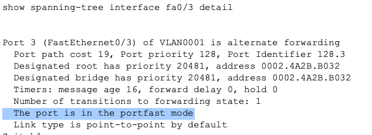
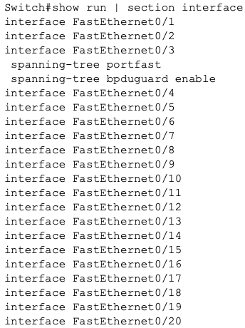
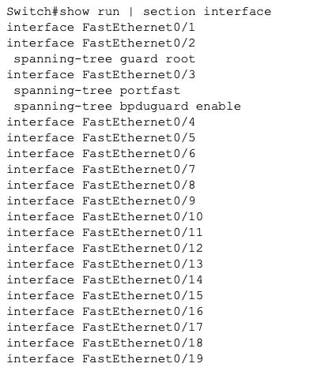

## STP-05 STP Security Features Lab
# Objective

This lab demonstrates how Spanning Tree security features protect Layer 2 network stability. The security measures prevent unauthorized topology changes and accidental network loops. The goal was to understand how STP security features contribute to enterprise network security and availability.

# Concepts demonstrated:

• PortFast configuration
• BPDU Guard protection
• Root Guard protection
• Layer 2 topology security
• Network hardening practices

# Topology

_Image 1: Simple STP Topology_

Three switches connected with redundant paths, as well as one end device to simulate an enterprise access port scenario.

# Security Risk

Layer 2 networks are vulnerable to topology manipulation if STP is not protected. Common risks include:

- Unauthorized switches becoming root bridge
- Accidental loops from unmanaged switches
- Topology instability due to misconfigured devices
- Broadcast storms from incorrect connections
- Attacker interception and redirection of traffic

STP security features help mitigate these risks.

# PortFast

PortFast was enabled on the port connected to the end device, to allow immediate transition to forwarding state without waiting for STP convergence.

**Configuration:**

spanning-tree portfast

**Security relevance:**

PortFast itself improves performance, but **must** be paired with BPDU Guard to prevent misuse. Without BPDU Guard, an attacker could connect a switch and influence STP topology.

**Verification:**

_Image 2: Portfast Configuration Confirmation_

# BPDU Guard

BPDU Guard was enabled to automatically disable ports receiving BPDUs where switches should not exist.

**Configuration:**

spanning-tree bpduguard enable

**Security relevance:**

Prevents rogue switches from:

- Influencing STP elections
- Becoming root bridge
- Creating loops
- Causing topology instability

This protects network availability and prevents DoS scenarios caused by Layer 2 loops.

**Verification:**

_Image 3: DPBU Guard Configuration Confirmation_

# Root Guard

Root Guard was configured on switch uplinks to prevent unauthorized switches from becoming root bridge.

**Configuration:**

spanning-tree guard root

**Security relevance:**

Ensures only the designated core switches can control network topology. Prevents accidental or malicious root bridge takeover, which could redirect traffic or degrade performance.

**Verification:**

_Image 4: Root Guard Configuration Confirmation_

# Key Security Takeaways

Layer 2 networks require protection against topology manipulation.

STP security features protect:

- Network stability
- Traffic flow predictability
- Availability

PortFast improves usability while BPDU Guard protects against misuse.

Root Guard ensures predictable network design.

# Skills Demonstrated

1) STP security configuration
2) Layer 2 security controls
3) Network stability protection
4) Protocol verification
5) Security focused network design

# Summary

This lab demonstrates how STP security features strengthen Layer 2 network resilience by preventing unauthorized topology changes and protecting network availability through proper STP security practices.
