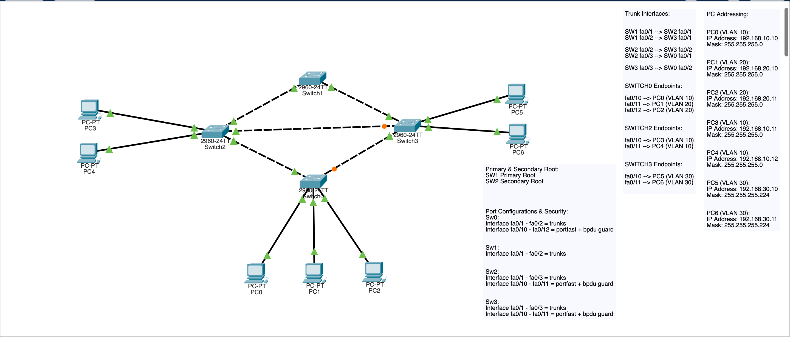
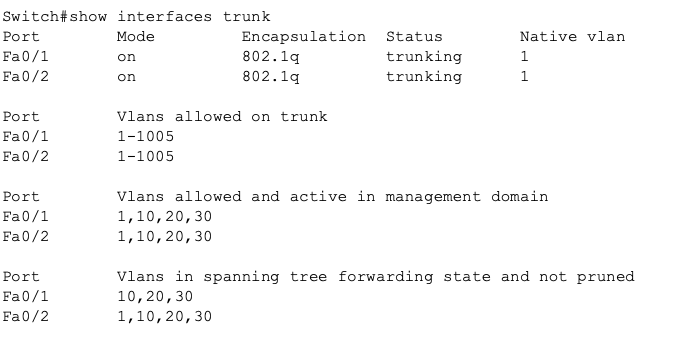
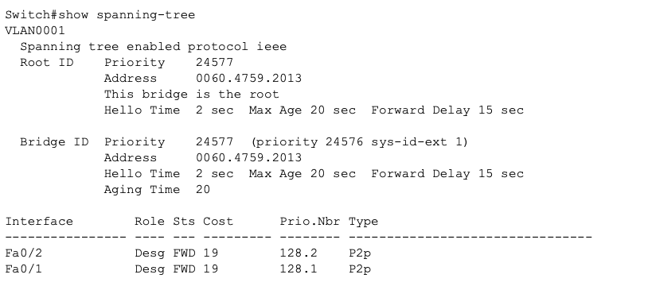
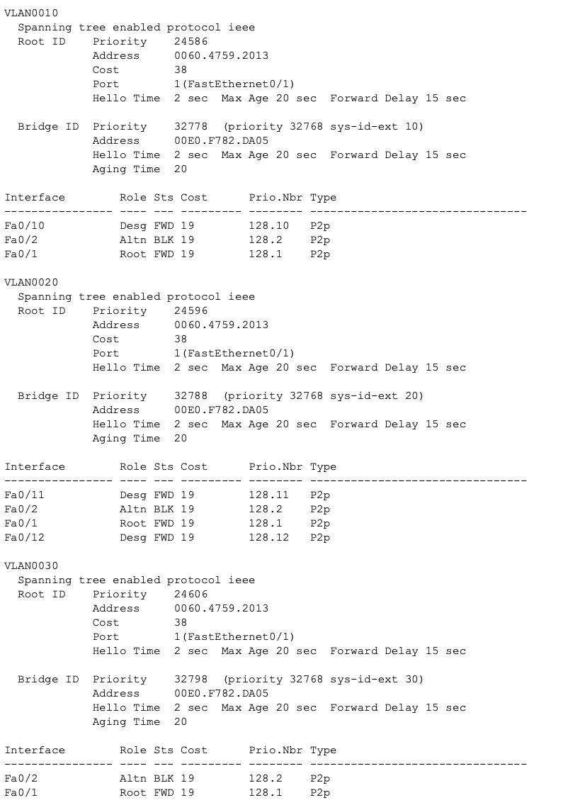
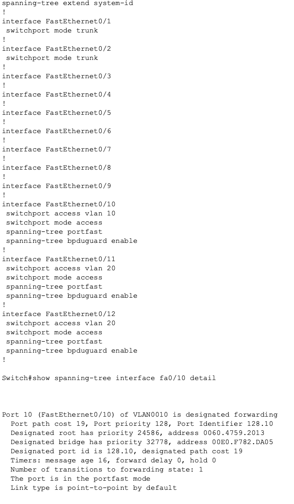
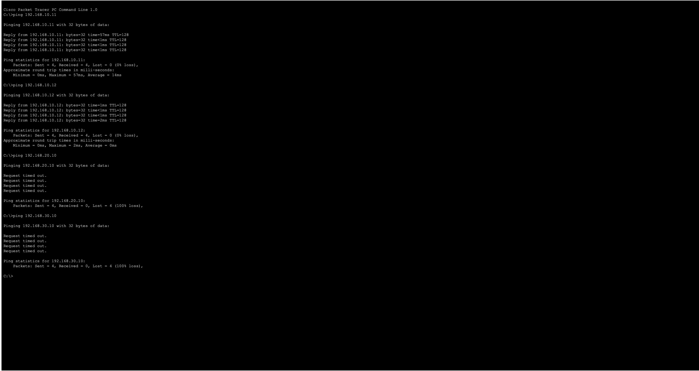
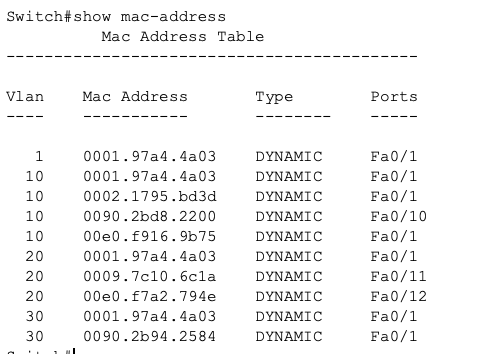

## STP-06 VLAN + STP Architecture Lab

# Objective

The purpose of this lab was to design a small enterprise style Layer 2 architecture combining VLAN segmentation, STP topology control, redundancy, and basic Layer 2 security protections. 

The goal is to move beyond protocol configuration into intentional network design decisions, and prepare for a mini flagship project.

# Concepts demonstrated:

- VLAN segmentation
- STP root placement strategy
- Redundant Layer 2 topology design
- VLAN STP behavior
- Layer 2 security controls
- Basic planning decisions

# Network Design Overview

This topology simulates a simplified enterprise access/core layout:

1) SW1 --> Core switch (Primary root)
2) SW2 --> Distribution (Secondary root)
3) SW3 --> Distribution
4) SW0 --> Access layer

Design goal was predictable traffic flow toward the core while maintaining redundant paths.

# Topology:

_Image 1: STP + VLAN Enterprise Design_

# VLAN Design Strategy

Three VLANs were created based on logical network roles:
VLAN10: USERS
192.168.10.0 /24

VLAN 20: STAFF
192.168.20.0 /24

VLAN 30: SERVERS

192.168.30.0 /27

**Design decision:**

Server VLAN was intentionally given a /27 subnet since server networks generally require fewer hosts, and benefit from tighter address allocation.

# Trunk Architecture

All switch to switch connections were configured as trunks to allow VLAN information distribution and STP redundancy behavior.

**Verification confirmed:**

- VLAN summarization
- Active trunk links
- Forwarding VLANs

_Image 2: Shows Interface Verification_

# STP Root Placement Strategy

SW1 was intentionally configured as primary root to ensure that the core switch controls Layer 2 topology.

**Configuration approach:**

Switch1 : Primary root
Switch2 : Secondary root

**Design reasoning:**

Core switches should control STP decisions because they typically connect to the routing infrastructure and critical resources. (Hence its placement location)

This prevents random root selection and improves traffic predictability.

**Verification:**

_Image 3: Switch 1 Primary Root Verification_

# STP Behavior Observed

STP correctly:

- Elected SW1 as root after configuration
- Assigned root ports on downstream switches
- Blocked redundant links
- Maintained redundancy without loops

Verification showed alternate blocking ports on redundant paths:

_Image 4: Switch0 Port Assignments_

# Access Layer Security Controls

All switch to end device interfaces were configured with:

1) PortFast
2) BPDU Guard

**Configuration applied:**

interface fa0/x
 spanning-tree portfast
 spanning-tree bpduguard enable

**Design reasoning:**

End device ports should transition immediately to forwarding state while preventing unauthorized switches from influencing STP topology.

This protects against:

- Accidental loops
- Rogue switches
- Topology instability

**Verification:**

_Image 5: Port Security Implementation_

# Segmentation Verification

Connectivity testing confirmed:

Same VLAN communication successful
Different VLAN communication blocked

This verifies correct VLAN isolation.

_Image 6: PC0 Ping Testing_

# Traffic Learning Verification

MAC address tables confirmed correct Layer 2 forwarding behavior across trunk links.

_Image 7: Switch0 Mac Address Table_

# Key Design Decisions

- Primary root placement at core for predictable topology

- Secondary root defined for failover stability

- Server VLAN sized smaller to reflect realistic host requirements

- Redundant links maintained while STP prevented loops

- Security controls applied only to edge interfaces

# Skills Demonstrated

- Layer 2 network design thinking
- STP topology engineering
- VLAN segmentation strategy
- Basic network capacity planning
- Layer 2 security configuration
- Verification and operational confirmation

# Key Takeaways

1) STP should be engineered rather than left to automatic election.

2) VLAN segmentation must be combined with STP planning to maintain predictable traffic flow.

3) Layer 2 security features are necessary to maintain topology stability.

4) Design decisions should reflect expected network usage rather than arbitrary configuration.

# Summary

This lab demonstrates the transition from protocol configuration and understanding, to basic network architecture design. This lab combines segmentation, redundancy, STP control, and Layer 2 security practices into a structured topology. 