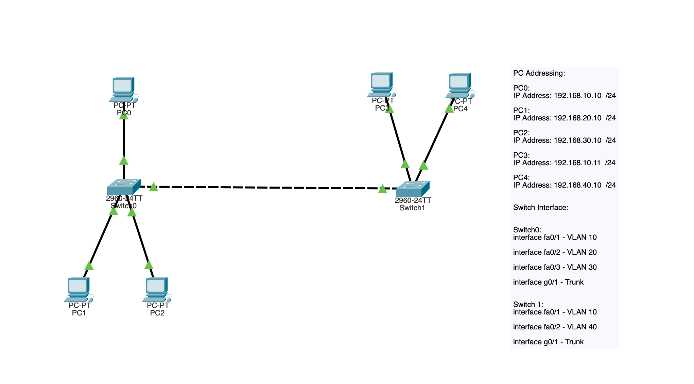
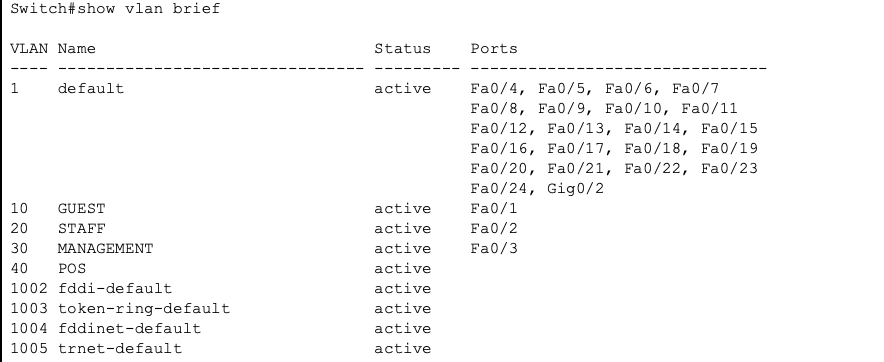
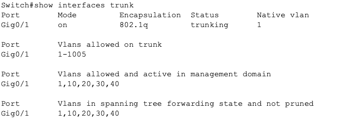
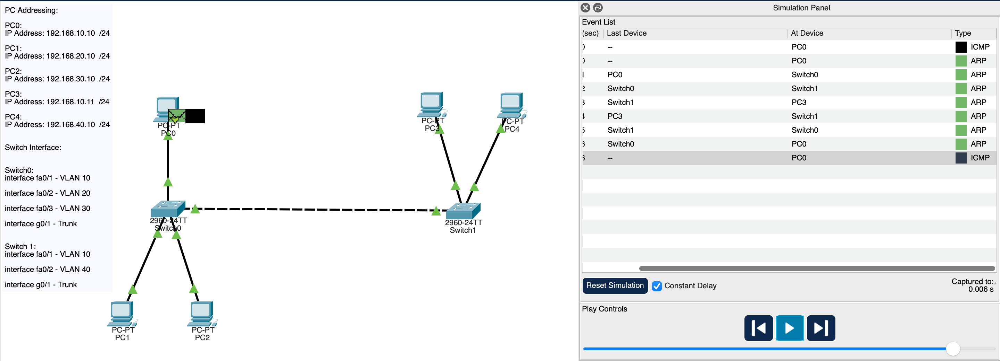
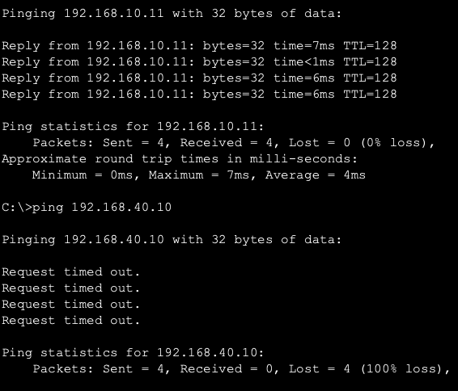

## VLAN Trunking Lab
# Objective

This lab demonstrates how VLAN extension works across multiple switches by using 802.1Q trunking. The goal was to verify that VLAN traffic can traverse switches while maintaining proper segmentation.

# Concepts demonstrated:

• VLAN creation
• Access port configuration
• Trunk configuration
• VLAN propagation
• Connectivity verification

Topology

_Image: VLAN Trunk Topology_

# Network contains:

2 Layer 2 switches
5 hosts
4 VLANs
1 trunk link

# VLAN Design
VLAN:
10 - Guest
20 - Staff
30 - Management
40 - POS

**Port Assignment**

Switch0:

Fa0/1	VLAN 10
Fa0/2	VLAN 20
Fa0/3	VLAN 30
g0/1	Trunk

Switch1:

Fa0/1	VLAN 10
Fa0/2	VLAN 40
g0/1	Trunk

# Verification

**VLAN table verification**

Command:

show vlan brief

**Trunk verification**

Command:

show interfaces trunk

Confirmed:

802.1Q encapsulation
Active trunk
VLANs allowed

**Connectivity testing**

Same VLAN (10) test:

PC0 to PC3
Result: Success

Different VLAN test (10 to 20):

PC0 to PC4
Result: Failure

# Key Learning Points

VLANs do not extend across switches without trunk links.

Trunks allow VLAN traffic to travel between switches using tagging.

Devices in different VLANs still cannot communicate without Layer 3 routing.

# Skills Demonstrated

- VLAN configuration
- Switch trunking
- Network segmentation
- Basic verification workflow