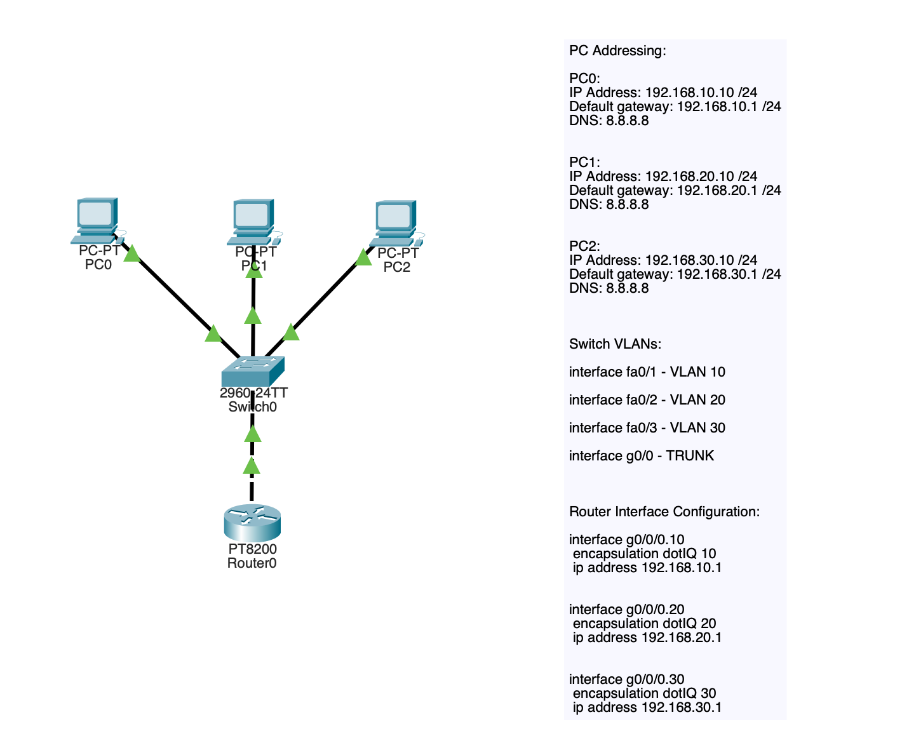
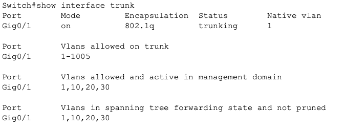
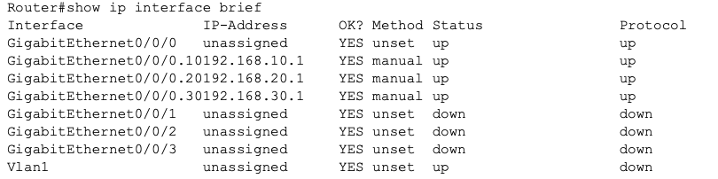
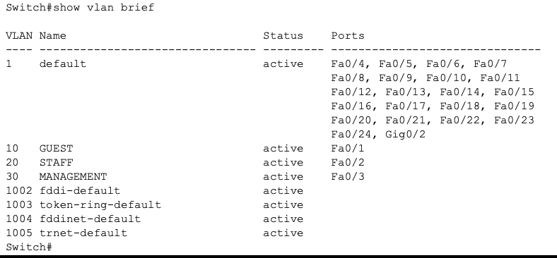
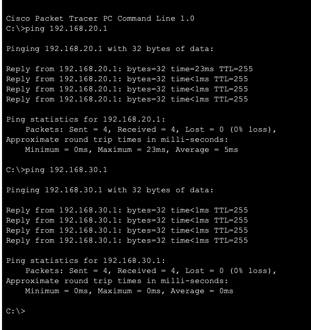

## VLAN 03 — Inter-VLAN Routing (Router-on-a-Stick)
# Objective

The purpose of this lab was to demonstrate how communication between VLANs is achieved using inter VLAN routing. Since VLANs operate at Layer 2, devices in different VLANs cannot communicate without a Layer 3 device. This lab introduces a router configured with subinterfaces to provide gateway services for multiple VLANs.

# Concepts demonstrated:

• VLAN segmentation
• Access vs trunk ports
• 802.1Q tagging
• Router subinterfaces
• Default gateway architecture
• Layer 3 VLAN routing
• Connectivity verification methodology

# Topology

The network consists of:

1 Layer 2 switch
1 router
3 endpoints
3 VLANs

The switch handles segmentation while the router provides routing between VLANs.

# Network Design

**VLAN Structure:**

10 - GUEST	- 192.168.10.0/24
20 - STAFF	- 192.168.20.0/24
30 - MANAGEMENT - 192.168.30.0/24

**Device Addressing**

PC0	- 192.168.10.10	- 192.168.10.1
PC1	- 192.168.20.10	- 192.168.20.1
PC2	- 192.168.30.10	- 192.168.30.1

**Switch Configuration Overview**

The switch was configured to:

- Create VLANs
- Assign access ports
- Create trunk link to router

**Key trunk configuration:**

interface g0/0
 switchport mode trunk

This allows VLAN tagged traffic to reach the router.

**Verification command:**

show interfaces trunk

# Router Configuration Overview

The router was configured with subinterfaces to serve as gateways for each VLAN.

Example:

interface g0/0.10
encapsulation dot1Q 10
ip address 192.168.10.1 255.255.255.0

Each subinterface acts as:

VLAN gateway
Layer 3 routing entry point
Broadcast boundary

**Verification command:**

show ip interface brief

# Verification Process

Verification followed a structured approach:

**Step 1 — VLAN verification**
show vlan brief

Confirmed VLAN assignments.

**Step 2 — Trunk verification**
show interfaces trunk

Confirmed:

802.1Q trunk active
VLANs passing

**Step 3 — Routing verification**
show ip route

Confirmed connected VLAN networks.

**Step 4 — Connectivity testing**

Same VLAN communication confirmed Layer 2 operation.

Inter-VLAN testing confirmed Layer 3 routing:

PC0 → PC1
PC0 → PC2

# Key Learning Points

VLANs isolate broadcast domains but do not provide routing.

Inter VLAN routing allows multiple VLANs to share one physical router interface.

Each VLAN requires:

Gateway
Subinterface
802.1Q encapsulation

Routing occurs after traffic leaves the switch and reaches the router.

# Skills Demonstrated

- Layer 2 switching fundamentals
- Layer 3 routing fundamentals
- VLAN design
- Router subinterfaces
- Verification workflow
- Basic network troubleshooting