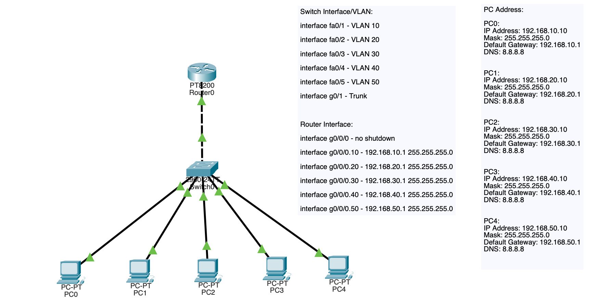
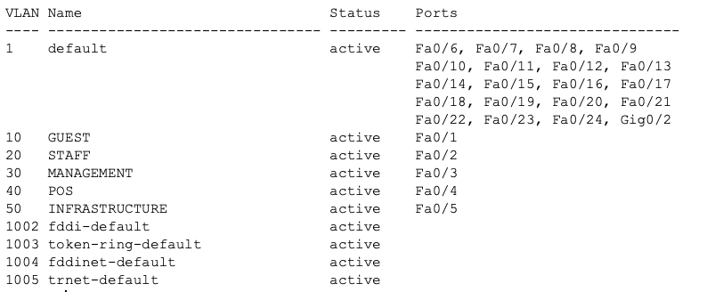
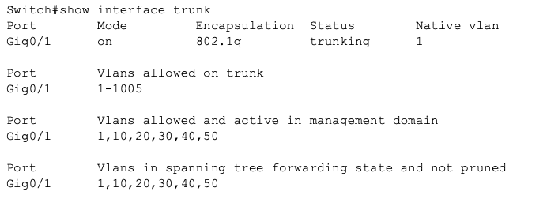
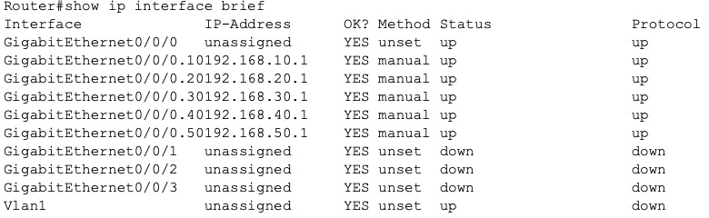
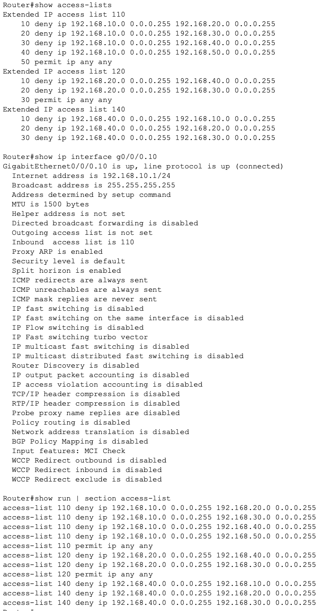
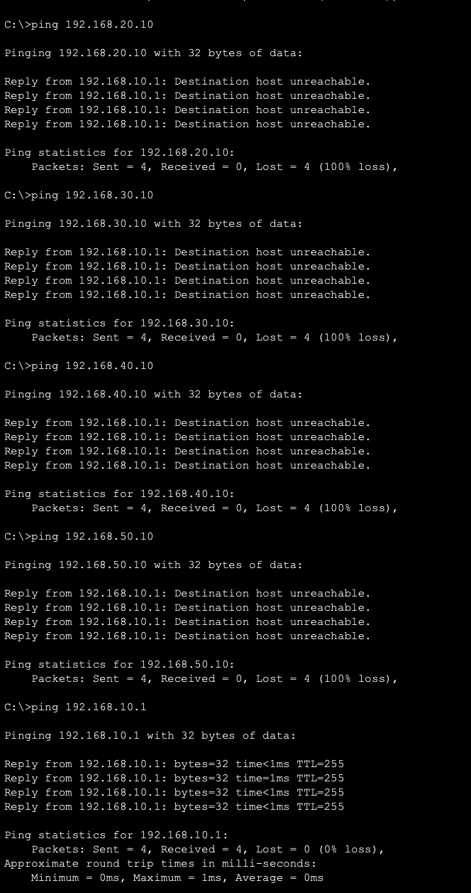

## VLAN-04 Enterprise Segmentation with ACL Enforcement
# Objective

This lab demonstrates enterprise VLAN segmentation combined with Layer 3 security enforcement using router ACLs. The goal was to simulate a realistic business network where departments are separated and communication is controlled according to security policy.

This lab expands on previous VLAN labs by adding security controls.

# Concepts demonstrated:

• VLAN segmentation
• Inter VLAN routing
• ACL policy enforcement
• Network security design
• Verification and troubleshooting methodology

# Scenario

A small business requires network segmentation between different operational groups:

Guest devices must be isolated
POS systems must be protected
Management must retain full access
Staff must have limited access
Infrastructure must remain protected

This lab simulates how a security engineer would implement these controls.

# Topology

**Network consists of:**

1 Router
1 Layer 2 switch
5 endpoints
5 VLANs

The switch handles Layer 2 segmentation while the router performs Layer 3 routing and access control enforcement.

# VLAN Design
VLAN:
10 - GUEST - 192.168.10.0/24
20 - STAFF - 192.168.20.0/24
30 - MANAGEMENT(Admin Devices) - 192.168.30.0/24
40 - POS - 192.168.40.0/24
50 - INFRASTRUCTURE - 192.168.50.0/24

# Architecture Approach

Network design follows a common enterprise model:

Layer 2 switch provides segmentation.

**Router provides:**

- Default gateways
- Inter VLAN routing
- Security enforcement

ACLs simulate firewall behavior.

# Switch Configuration Summary

**Switch configured for:**

- VLAN creation
- Access port assignment
- Trunk link to router

Verification:

# Router Configuration Summary

Router configured with subinterfaces acting as VLAN gateways.

Example:

interface g0/0.10
encapsulation dot1Q 10
ip address 192.168.10.1 255.255.255.0

Verification:

# Security Policy Implemented

ACL rules were created to enforce network restrictions.

1. Guest VLAN blocked from all internal networks.

2. Staff VLAN restricted from POS and management networks.

3. POS VLAN restricted from internal user networks.

4. Management VLAN allowed full access.

This follows the important security principle of:

Least privilege

# ACL Implementation

Example VLAN 10 (GUEST) ACL:

access-list 110 deny ip 192.168.10.0 0.0.0.255 192.168.20.0 0.0.0.255
access-list 110 deny ip 192.168.10.0 0.0.0.255 192.168.30.0 0.0.0.255
access-list 110 deny ip 192.168.10.0 0.0.0.255 192.168.40.0 0.0.0.255
access-list 110 deny ip 192.168.10.0 0.0.0.255 192.168.50.0 0.0.0.255
access-list 110 permit ip any any

interface g0/0.10
ip access-group 110 in

Verification:

# Verification Methodology

Testing followed a structured validation:

1) VLAN verification
show vlan brief

Confirmed correct VLAN assignment.

2) Trunk verification
show interfaces trunk

Confirmed VLAN tagging.

3) Routing verification
show ip interface brief

Confirmed subinterfaces active.

# Security testing

Blocked traffic verified:

Guest -> Staff FAILED
Guest -> POS FAILED
Guest -> Infrastructure FAILED

# Key Learning Outcomes

- VLANs provide segmentation but not security.

- Routing allows VLAN communication.

- ACLs enforce security policy.

- Proper placement of ACLs is critical.

**Network architecture must combine:**

1) Segmentation
2) Routing
3) Security policy

This lab demonstrated how these layers interact.

# Skills Demonstrated

- VLAN configuration
- ACL security design
- Network verification
- Security troubleshooting
- Enterprise segmentation logic