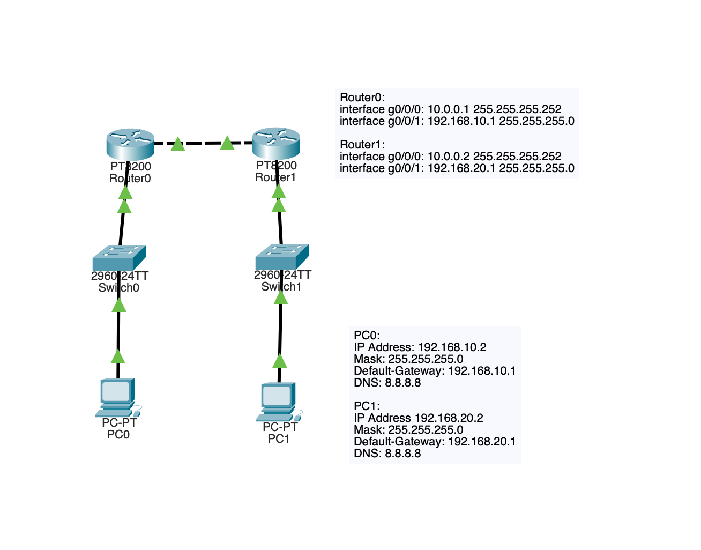
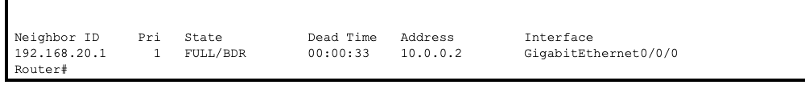
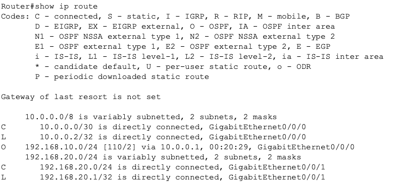
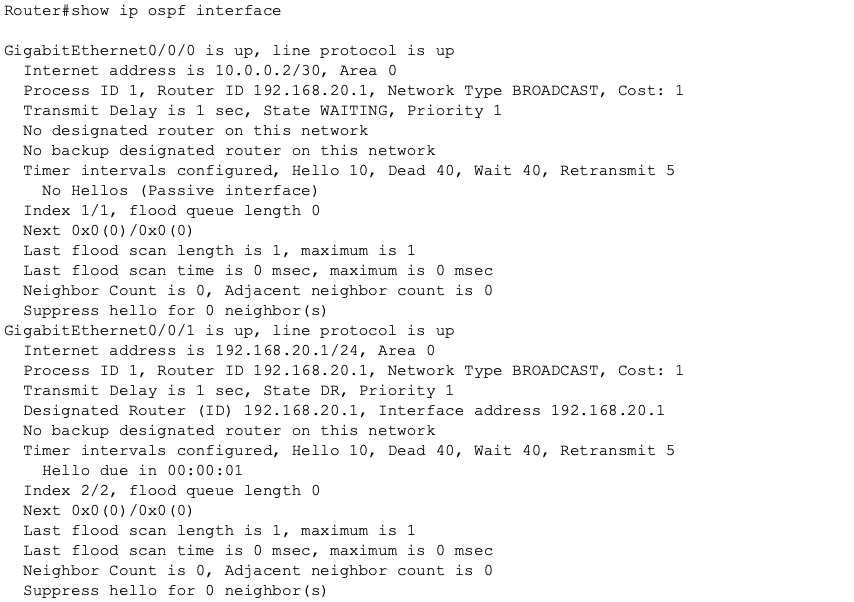

# OSPF Passive Interface Lab

## Objective

My objective was to understand how passive interfaces affect OSPF neighbor formation while still allowing route advertisement.

## Design Goal

Test OSPF behaviors when LAN interfaces or transit interfaces are configured as passive.

Behavior:

No adjacency on LAN interfaces.

Routes still advertised.

## Network Topology

## Configuration Overview

OSPF enabled on all routers.

Transit interfaces remain active for main lab, configured to passive later for additional troubleshooting.

LAN interfaces configured as passive.

## Verification

Neighbor verification:

show ip ospf neighbor

Routing table verification:

show ip route

Interface verification:

show ip ospf interface

## Troubleshooting Experience

Initially routing failed because OSPF network statements did not match router LAN interfaces.

Could not ping PC1 from PC0, or vice versa. 

Correcting the mismatched network statements fixed route advertisement.

This demonstrated that OSPF enables interfaces based on matching networks rather than simply knowing the network exists.

## Lessons Learned

OSPF network statements must match interface IP ranges.

Passive LAN interfaces stop hello packets but still advertise networks.

Transit links must remain active or different subnets cannot communicate.

OSPF adjacency depends on correct interface.

OSPF troubleshooting requires verifying:

Neighbor table  
Routing table  
Interface participation
Router to Router ping

## Skills Practiced

OSPF configuration
Protocol troubleshooting
Network verification
Routing behavior analysis
Infrastructure debugging