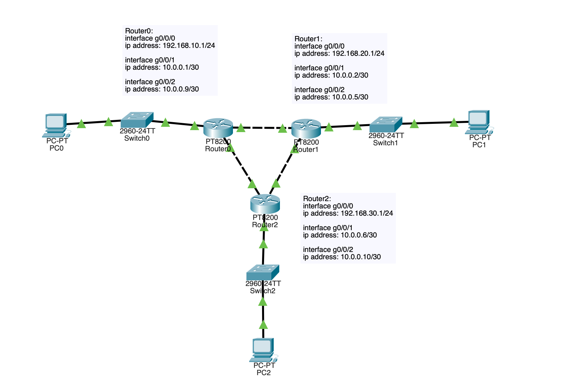
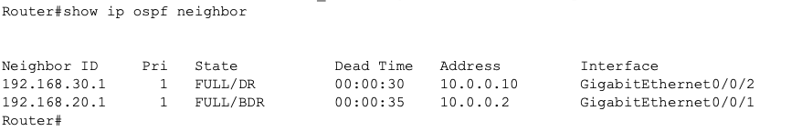
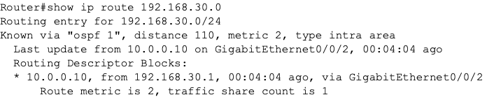
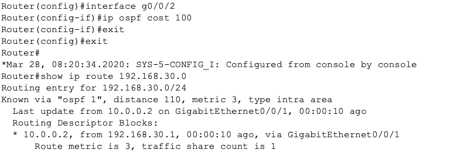

# OSPF Cost Manipulation Lab

## Objective

Understand how OSPF selects its routing paths using cost metrics.

## Design Goal

Test how modifying interface cost changes routing decisions.

Hypothesis:

Increasing interface link cost should cause OSPF to select an alternate path.

## Network Design

Three routers connected in a triangle topology.

Multiple possible paths exist between networks.

OSPF enabled on all routers.

## Topology

## Verification

Neighbor relationships verified:

show ip ospf neighbor

Initial routing path observed:

show ip route

## Cost Manipulation

Increased interface cost on direct route.

OSPF recalculated route due to cost manipulation.

Traffic shifted to alternate path.

## Results

Routing path changed successfully due to cost manipulation.

OSPF automatically adjusted route to selected lowest cost route.

## Lessons Learned

OSPF does not use hop count.

OSPF uses cost. Cumulative cost to be specific.

Costs can be manually adjusted.

Routing decisions can be engineered.

## Traffic Engineering

Initial route used direct, lowest cost path.

After increasing interface cost of the direct path, OSPF recalculated path.

Traffic shifted to alternate route via Router1.

Verification performed using:

show ip route
show ip ospf neighbor
ping testing

## Skills Practiced

Traffic engineering
OSPF analysis
Routing verification
Network design thinking