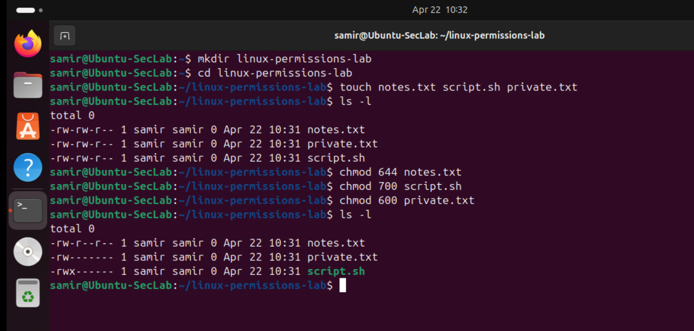
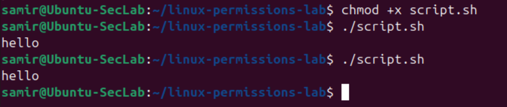

# Linux-01 File Permissions and Access Basics

## Objective

This lab practiced basic Linux file permissions and assessed at how permission settings affect access control.

The goal was to understand how Linux handles read, write, and execute permissions, as well as how different permission levels can be used to make files more open or more restricted depending on their purpose.

## What I Did

I created a small lab folder with three files:

- `notes.txt`
- `script.sh`
- `private.txt`

I then used `chmod` to assign different permission levels to each file:

- `644` for a normal readable text file
- `700` for a script intended only for the owner
- `600` for a private file with restricted access

Simple content was added to the files and script was executed after giving it execute permission.

## Why This Matters

Linux permissions are a basic but important security control.

They help determine:
- Who can read a file
- Who can modify a file
- Who can execute a file

This ties directly into least privilege, because not every file should be readable, writable, or executable by everyone.

## Verification

### Initial and final permission changes

### File content verification

### Script execution after applying execute permission

## Main Takeaways

This lab reinforced a few practical points:

- `644` is useful for normal files that should be readable but not writable by others
- `600` is superior for private files that should stay restricted
- `700` is useful when only the owner should run or modify a script
- Execute permission should only be given when it is actually needed
- Linux file permissions are a practical example of least privilege

## Summary

As my initial Linux lab, I focused on one of the important Linux security basics: file permissions.

Understanding how to read and change permissions is foundational for administration, troubleshooting, and secure system usage.