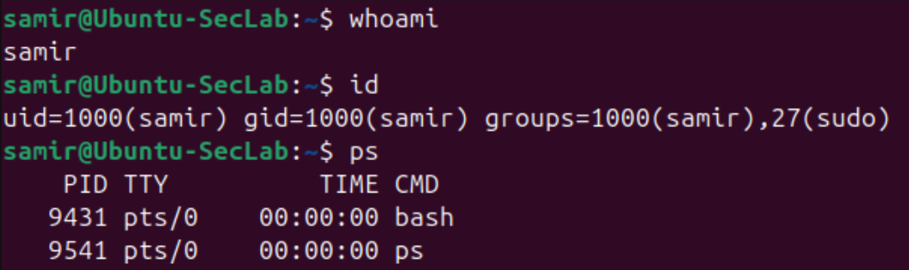
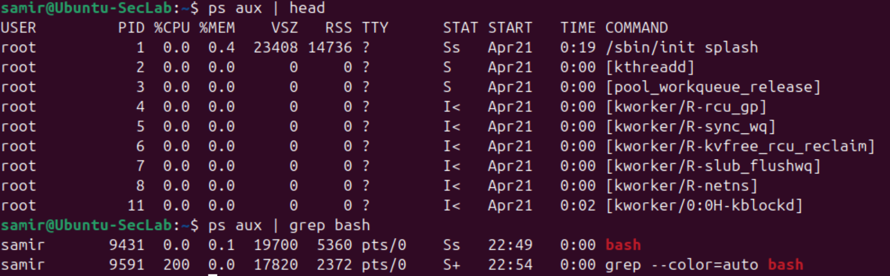
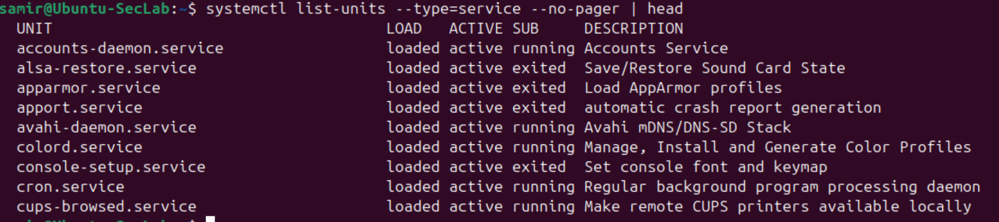
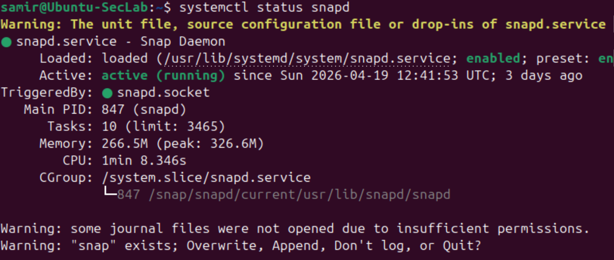
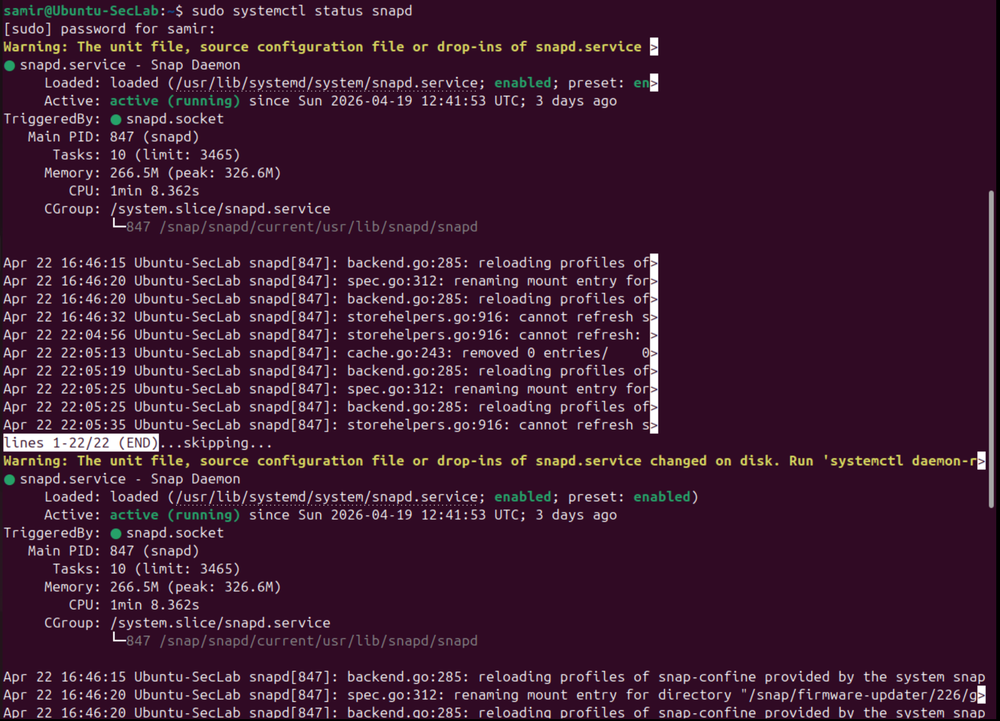
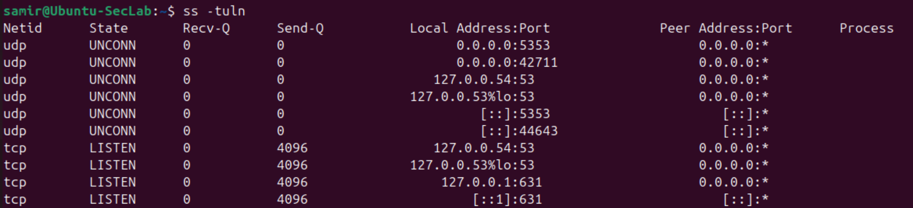

# Linux-02 User, Process, and Service Awareness

## Objective

This lab practiced a few basic Linux commands that help identify several concepts: The current user context, running processes, active services, and listening network sockets.

The goal is to expose myself to operational awareness of what is happening on a Linux system instead of only interacting with files.

## What I Did

In this lab, I used commands to:

- Identify the current user
- Inspect user and group information
- View running processes
- Filter process output
- List active services
- Check the status of a specific service
- View listening network sockets

## Why This Matters

This is useful because Linux security, troubleshooting and administration depend on visibility and understanding.

A system becomes easier to understand and navigate when you identify:

- Who am I logged in as?
- What groups am I part of?
- What processes are running?
- What services are active?
- What ports are listening?

These are basic but important questions for troubleshooting, hardening, and security analysis.

## Verification

### User and identity information

### Process inspection

### Service listing

### Service status as a normal user

### Service status with elevated privileges

### Listening sockets

## Main Takeaways

This lab reinforced a few important ideas:

- `whoami` and `id` quickly show the current user context
- `ps` helps reveal what is running on the system
- `grep` makes process inspection more focused
- `systemctl` helps inspect active services
- `ss -tuln` gives useful visibility into listening ports
- some service and journal information is restricted for non-privileged users, which reinforces how Linux separates access by privilege level. Using sudo can access the full information.

## Summary

This lab introduced basic Linux system awareness beyond file management.

It shows how to inspect user context, processes, services, and network activity from the command line.