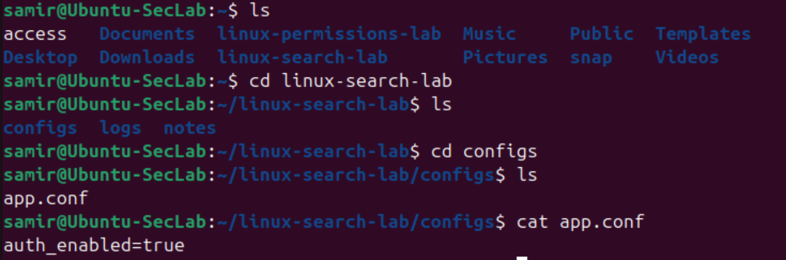
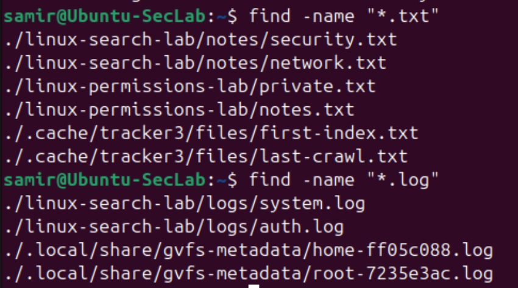
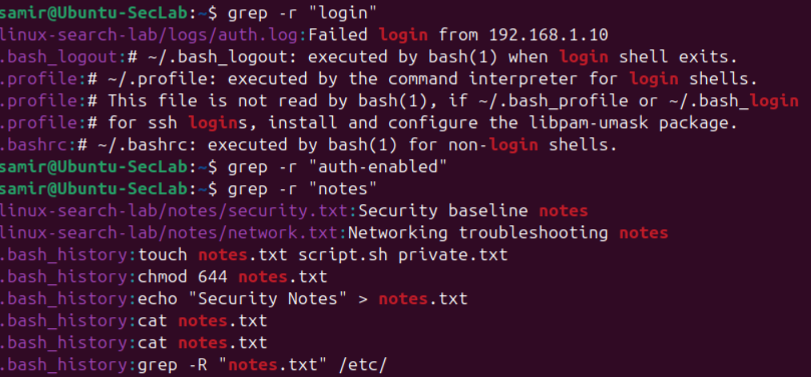

# Linux-03 File Discovery and Content Search Basics

## Objective

This lab practiced basic Linux navigation, file discovery, and content search commands.

The goal is to get more comfortable locating files, exploring directories, inspecting simple file contents, as well as searching through files from the command line.

## What I Did

In this lab, I:

- Created a small directory structure
- Added several text, log, and config files
- Used navigation and listing commands to inspect the directory
- Used `find` to locate files by name and extension
- Used `grep` to search inside files for specific text patterns
- Used `cat` to inspect a simple configuration file

## Why This Matters

This is useful because Linux work often depends on being able to understand practical information such as:

- Where is the file I need?
- Which log contains the event I am looking for?
- Which config file contains a specific setting?
- Where does a keyword appear across multiple files?

These are important skills for administration, troubleshooting, and security analysis.

## Verification

### Navigation and file inspection

### File discovery with `find`

### Content search with `grep`

## Main Takeaways

This lab reinforced a few important ideas:

- `ls`, `cd`, and `cat` build orientation inside the filesystem
- `find` is useful for locating files quickly by name or type
- `grep` is useful for extracting specific information out of logs and configs
- Search results become much more digestible when commands are run from the intended working directory
- `cat` works well for text files, but unknown or non-text files may need other inspection tools

## Summary

This lab improved practical Linux search and discovery skills that are useful for both system administration, troubleshooting, as well as security focused work.