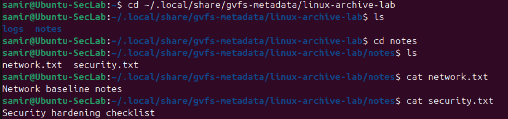
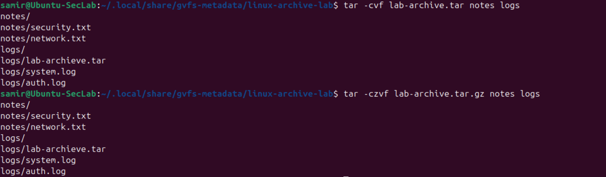
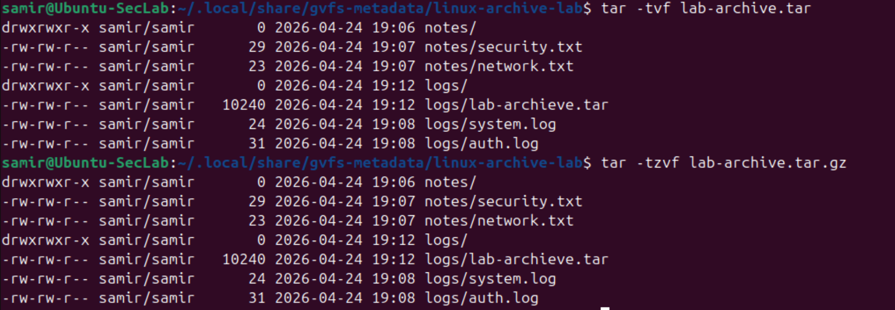
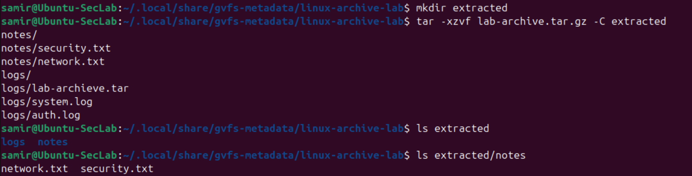

# Linux-04 Archive and Compression Basics

## Objective

This lab practiced creating, compressing, listing, and extracting archives in Linux.

The goal was to understand how files and directories can be packaged together for storage, transfer, backup, or later inspection.

## What I Did

In this lab, I:

- Created a small directory structure with note and log files
- Added simple content to the files
- Created a standard `.tar` archive
- Created a compressed `.tar.gz` archive
- Listed the contents of both archives
- Extracted the compressed archive into a separate directory
- Verified the extracted files

## Why This Matters

Archiving and compression are common Linux tasks.

They are useful for:
- Bundling logs
- Packaging configuration files
- Creating lightweight backups
- Collecting files for transfer or analysis
- Preserving related data in one structured file

These are practical skills that show up often in administration, troubleshooting, and security workflows.

## Verification

### Files before archiving

### Archive creation

### Archive listing and extraction

## Main Takeaways

This lab reinforced a few important ideas:

- `tar` can package multiple directories and files into one archive
- gzip compression makes an archive smaller and easier to move or store
- Archive contents can be listed without extracting them
- Extraction should be verified to make sure the expected files are present
- Archiving is a practical operational skill

## Summary

This lab introduced basic Linux archiving and compression.

It is a useful step because it showed how to package, inspect, and restore small groups of files from the command line.