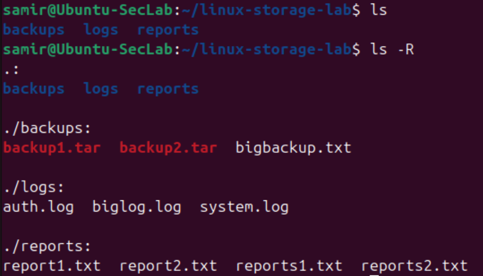
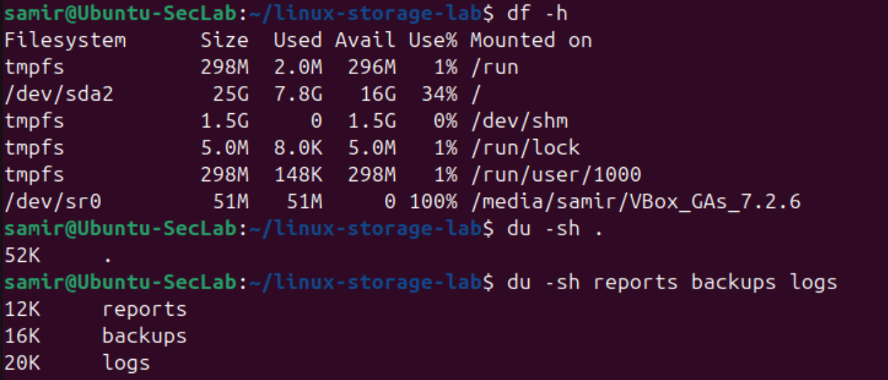
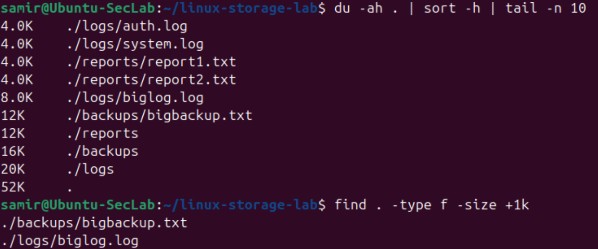

# Linux-05 Disk Usage and Storage Visibility Basics

## Objective

This lab practiced basic Linux storage visibility commands to understand key information such as: filesystem capacity, directory usage, as well as large file discovery.

The goal is to build familiarity with how Linux shows disk usage and how to identify which files or folders are consuming space.

## What I Did

In this lab, I:

- Created a small directory with report, backup, and log files
- Added simple content to the files
- Created larger files to document visible storage differences
- Used `df -h` to visualize filesystem capacity
- Used `du -sh` to measure overall and per directory usage
- Used `du -ah` with sorting to identify the larger files
- Used `find` to locate files above a specific size 

## Why This Matters

Disk usage awareness is important.

Using these commands we can understand questions like:

- How full is the system?
- Which directory is growing?
- Which files are consuming the most space?
- Where should cleanup or investigation begin?

These are common need-to-knows, and they can also matter in security investigations when large files, unexpected logs, or other suspicious data appears.

## Verification

### File and directory structure

### Filesystem capacity and directory usage

### Large file discovery

## Main Takeaways

This lab reinforced important ideas:

- `df -h` shows overall filesystem usage in an easily digestible way
- `du -sh` is useful for comparing directory sizes
- `du -ah` combined with sorting helps identify larger files quickly
- `find` can help locate files above a chosen size threshold
- Storage visibility is a basic practical skill for troubleshooting and security purposes. 

## Summary

This lab introduced basic Linux storage visibility and disk usage inspection.

It was a useful step because it showed how to inspect filesystem capacity, compare directory sizes, and identify larger files from the command line.