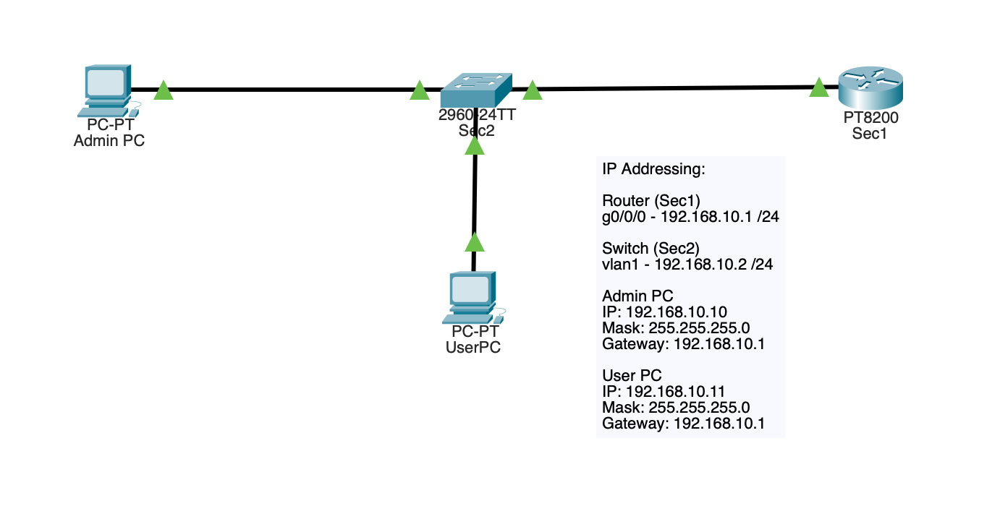
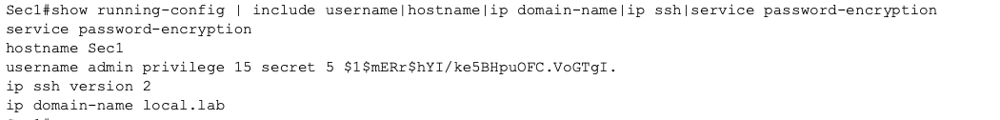
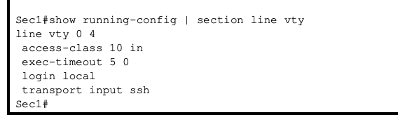
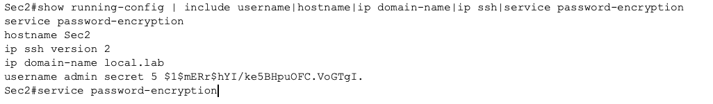
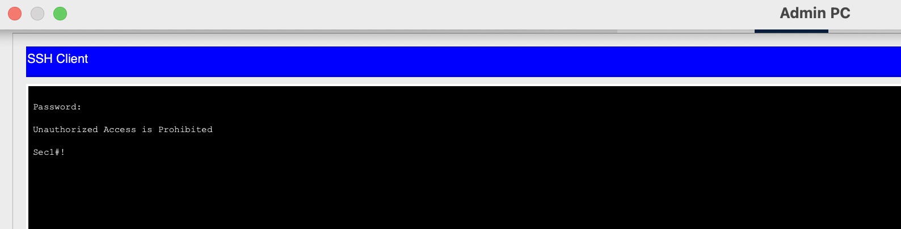
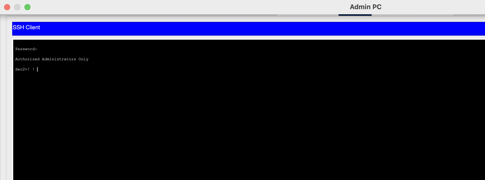

# Security-01 Secure Management Plane with SSH

## Objective

For this lab, I wanted to practice a simple but important Security+ concept: securing the management plane of network devices.

Instead of leaving remote administration open over insecure methods, I configured a router and a switch to use SSH with local authentication, password encryption, and login banners. I also restricted router management access so only the admin PC could connect over the VTY lines.

## Topology

This lab used a small management network with:

- 1 router (`Sec1`)
- 1 switch (`Sec2`)
- 1 admin PC
- 1 user PC

### IP Addressing

- Router `g0/0/0`: `192.168.10.1/24`
- Switch `VLAN 1`: `192.168.10.2/24`
- Admin PC: `192.168.10.10/24`
- User PC: `192.168.10.11/24`

## What I Configured

### Router (`Sec1`)
I configured the router with:

- hostname
- domain name
- local admin user
- RSA keys for SSH
- SSH version 2
- encrypted passwords
- banner message
- VTY lines using `login local`
- `transport input ssh`
- access control on VTY lines with ACL 10

### Switch (`Sec2`)
I configured the switch with:

- hostname
- domain name
- local admin user
- RSA keys for SSH
- SSH version 2
- encrypted passwords
- banner message
- VTY lines using `login local`
- `transport input ssh`

## Configuration Verification

### Router SSH prerequisites and security settings

### Router VTY line configuration and access restriction

### Switch SSH prerequisites and security settings

## Why This Matters

This is a basic concept but important to reiterate and put into practice.

A router or switch should not be managed casually over insecure remote access. SSH is the industry standard choice, rather than Telnet because it protects the management session. The local authentication adds an additional basic access control layer. Restricting VTY access to the admin PC makes the router management plane more controlled.

This was also a good first security lab choice because it took familiar networking environment, and added additional hardening decisions on top of it.

## Key Security Concepts Practiced

- secure remote administration
- SSH instead of insecure legacy access
- local authentication
- password protection
- login banners
- management plane hardening
- access restriction with ACLs

## Verification

I verified the lab with the following evidence:

- topology and addressing layout
- router management configuration
- switch management configuration
- router VTY lines configured for SSH only
- successful SSH login from the admin PC to the router
- successful SSH login from the admin PC to the switch

Packet Tracer would not give me a clean failed Telnet screenshot. For this reason verification was focused on the final secure management state and successful SSH access.

## Access Verification Screenshots

### Successful SSH login to the router from the admin PC

### Successful SSH login to the switch from the admin PC

## Main Takeaways

What stood out: 
I understood the purpose of the commands, however, putting the full management plane logic together was more difficult than assumed. This was useful in itself.

Biggest practical lessons were:

- SSH setup depends on several pieces working together, not one command
- hostname and domain name matter because RSA key generation depends on them
- `login local` and `transport input ssh` are central to secure remote access
- ACL mistakes can easily block legitimate management access if the permitted admin IP is wrong
- small management hardening steps make a noticeable difference in security posture

## Summary

This lab focused on securing device administration in a small network. A router and switch were configured for SSH-based management, used local authentication, encrypted stored passwords, added warning banners, and restricted router VTY access to the admin PC.

I choose this concept as my initial Security+ lab because it introduced practical hardening without the necessity of a large topology, and it reinforced that security is often about getting individual chains of small details correct.