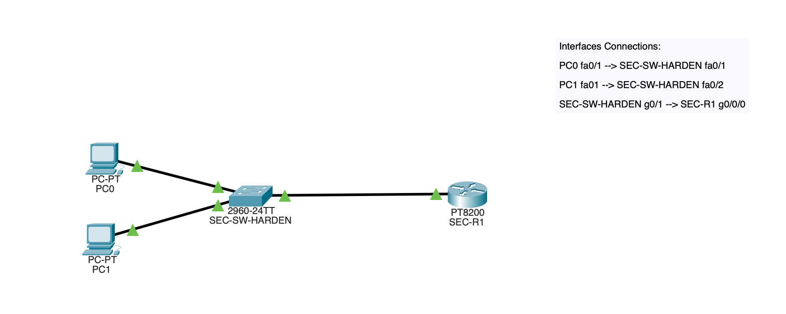
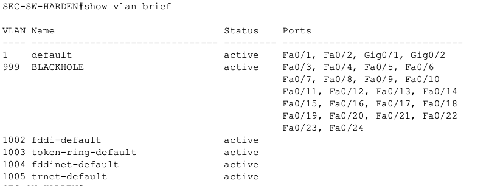
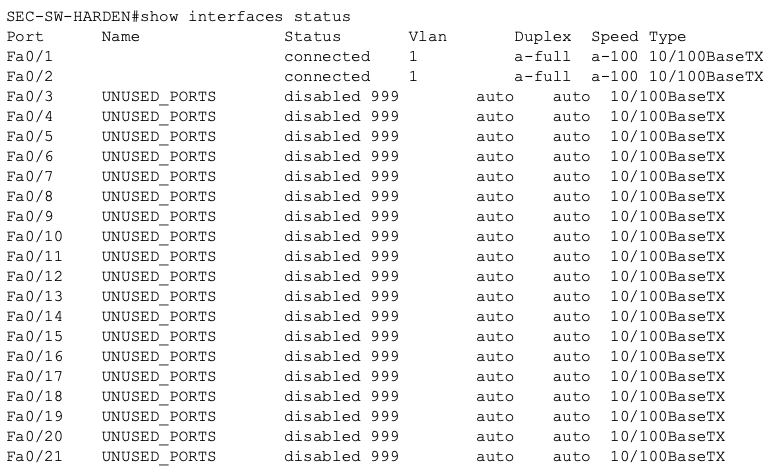
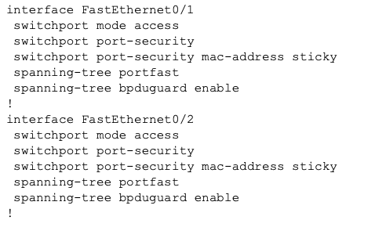
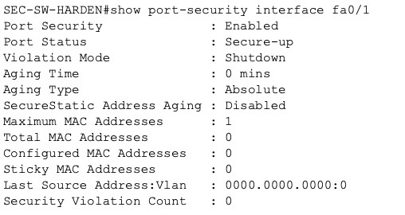
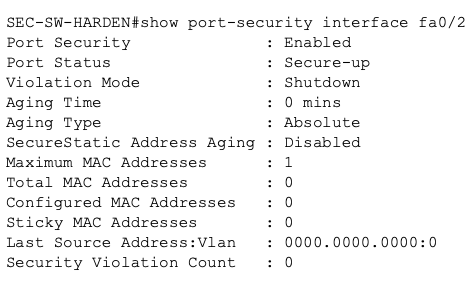

# Security-02 Switch Hardening Baseline

## Objective

This lab practiced basic switch hardening by securing active access ports improving risk regarding unused ports.

The goal was to apply a simple hardening baseline that improves Layer 2 security and better controls which devices can connect to the switch.

## Topology

This lab used:

- 1 switch (`SEC-SW-HARDEN`)
- 1 router (`SEC-R1`)
- 2 user PCs

### Interface Connections

- `PC0 fa0/1` -> `SEC-SW-HARDEN fa0/1`
- `PC1 fa0/1` -> `SEC-SW-HARDEN fa0/2`
- `SEC-SW-HARDEN g0/1` -> `SEC-R1 g0/0/0`

## What I Configured

Four main hardening steps were applied on the switch:

### 1. Blackhole VLAN for unused ports
Created VLAN 999 named `BLACKHOLE` and assigned all unused FastEthernet interfaces to it.

### 2. Shutdown of unused ports
All unused ports were administratively shut down and labeled `UNUSED_PORTS`.

### 3. Port security on active access ports
I enabled port security on `fa0/1` and `fa0/2` to restrict those interfaces to a single learned device.

### 4. Edge-port protections
I enabled:

- `spanning-tree portfast`
- `spanning-tree bpduguard enable`

on both active user ports.

## Why This Matters

This is a simple switch hardening baseline.

Unused switch ports should not remain available in the default VLAN because they provide unnecessary attack surface. Moving them to a blackhole VLAN and shutting them down reduces the risk of unauthorized connections.

Port security helps limit which devices can use a port. PortFast and BPDU Guard help protect access ports from inappropriate Layer 2 behavior and accidental or malicious switch connections.

## Security Controls Practiced

- Access-layer hardening
- Blackhole VLAN design
- Unused port shutdown
- Port security
- Sticky MAC learning
- PortFast on edge ports
- BPDU Guard on host-facing interfaces

## Verification

### VLAN and blackhole port assignment

### Interface status and shutdown unused ports

### Active port hardening configuration

### Port security verification on Fa0/1

### Port security verification on Fa0/2

## Main Takeaways

This lab reinforced a few important hardening ideas:

- Unused ports should not be left open and connected to the default VLAN
- Shutting down unused ports is a simple but effective security control
- Port security adds another layer of control over endpoint connections
- Host facing ports should be treated differently from uplinks and trunks
- Small switch hardening changes can reduce attack surface meaningfully

## Summary

This lab focused on establishing a basic switch hardening baseline.

I secured the active user ports with port security, PortFast, and BPDU Guard, moved all unused ports into a blackhole VLAN and shut them down. Although though the topology was small, the controls practiced reflect real access-layer hardening decisions.