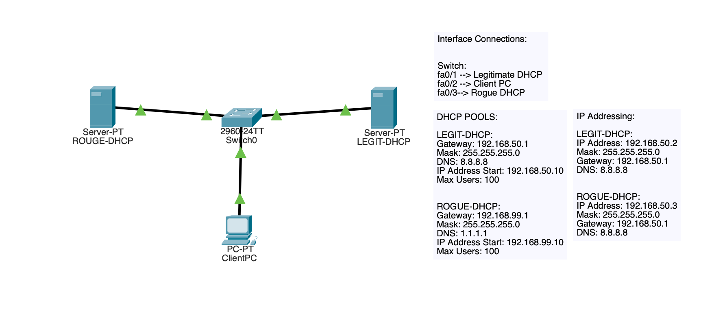
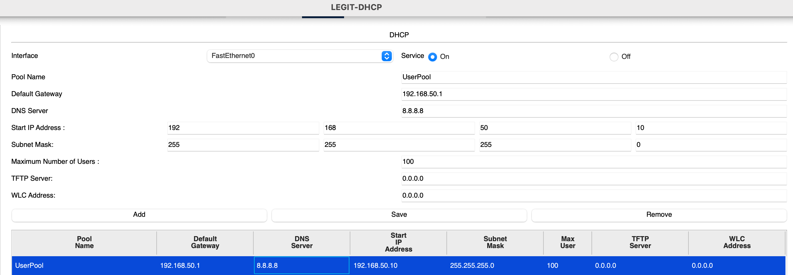
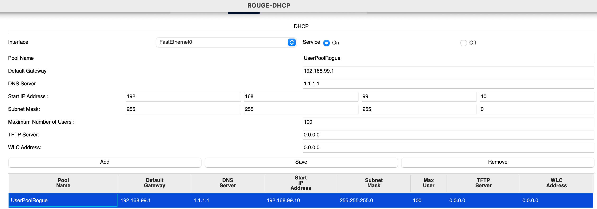
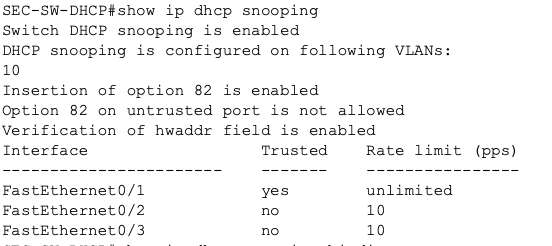
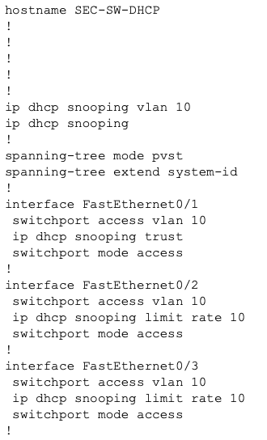
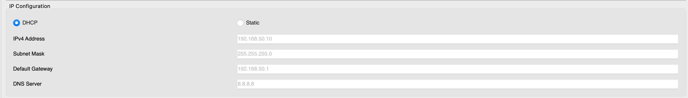
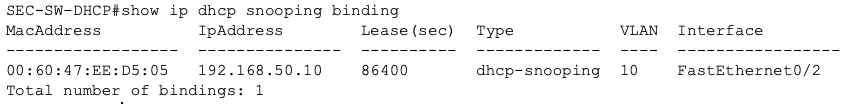

# Security-03 DHCP Snooping Baseline

## Objective

This lab documented a basic switch security control designed to defend against rogue DHCP servers.

The goal was to create a small network with both a legitimate DHCP source and a rogue DHCP source, then configure DHCP snooping so the switch would trust only the correct infrastructure facing port.

## Topology

This lab used:

- 1 switch
- 1 legitimate DHCP server
- 1 rogue DHCP server
- 1 client PC

### Interface Connections

- `fa0/1` --> legitimate DHCP server
- `fa0/2` --> client PC
- `fa0/3` --> rogue DHCP server

## What I Configured

VLAN 10 was configured as the user VLAN and connected all three switch ports to that VLAN.

### Legitimate DHCP source
The legitimate server was configured to provide a valid DHCP pool for the user network:

- network: `192.168.50.0/24`
- default gateway: `192.168.50.1`
- DNS: `8.8.8.8`
- starting address: `192.168.50.10`

### Rogue DHCP source
The rogue server was intentionally configured with incorrect values to simulate a malicious or unauthorized DHCP source:

- gateway: `192.168.99.1`
- DNS: `1.1.1.1`
- starting address: `192.168.99.10`

### DHCP snooping policy
On the switch, I enabled DHCP snooping for VLAN 10 and marked only the legitimate DHCP-facing port as trusted.

- `fa0/1` = trusted
- `fa0/2` = untrusted with rate limit 10
- `fa0/3` = untrusted with rate limit 10

## Why This Matters

A rogue DHCP server can hand out incorrect IP configuration to clients and disrupt normal network operation.

This can lead to:
- Bad gateway assignments
- Incorrect DNS settings
- Traffic redirection
- Denial of service
- Easier man-in-the-middle conditions

DHCP snooping helps prevent this by forcing the switch to accept DHCP server messages only from trusted ports.

## Security Controls Practiced

- Trusted vs untrusted switch ports
- DHCP snooping
- Access layer infrastructure protection
- Rogue DHCP server defense
- Rate limiting on untrusted ports

## Verification

### Legitimate DHCP pool

### Rogue DHCP pool

### DHCP snooping status

### Switch DHCP snooping configuration

### Client DHCP lease result

### DHCP snooping binding table

## Main Takeaways

This lab reinforced important ideas:

- Not every host connected to a switch should be trusted, especially to provide infrastructure services
- DHCP is an important service, however it also becomes an attack surface if left unsecured
- Trusted port security is a practical boundary at Layer 2
- Switch security is not only about port shutdown and STP protections. It is also important to secure behavior such as infrastructure services

## Summary

This lab focused on protecting clients from rogue DHCP behavior in a small switched network.

I built a network with both a legitimate, as well as a rogue DHCP source. I enabled DHCP snooping to ensure that only the trusted DHCP server facing port was allowed to provide leases. The client successfully received the correct lease, which was verified by the `ip dhcp snooping binding` table.