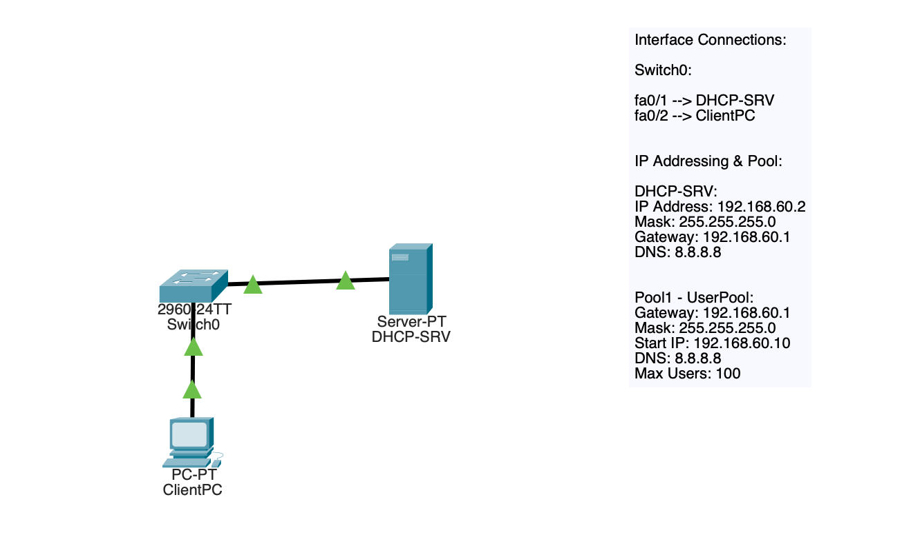
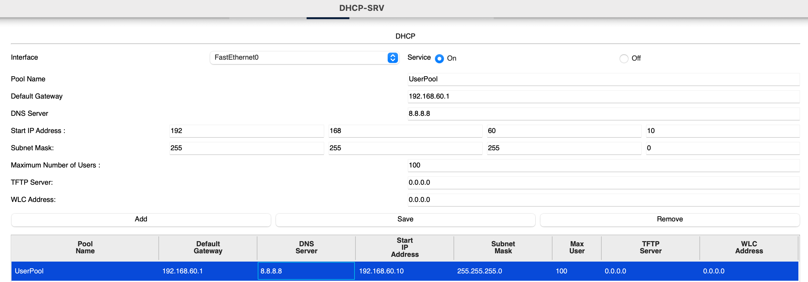
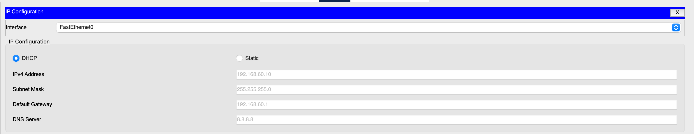
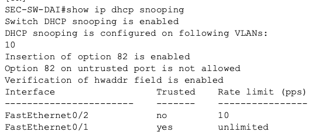
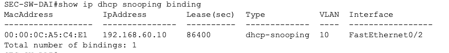
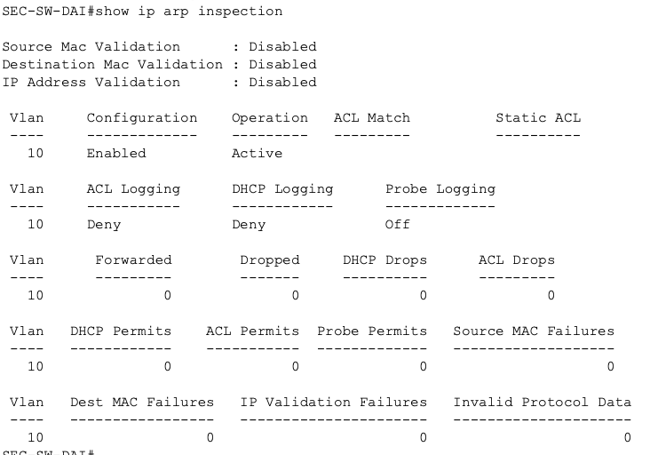
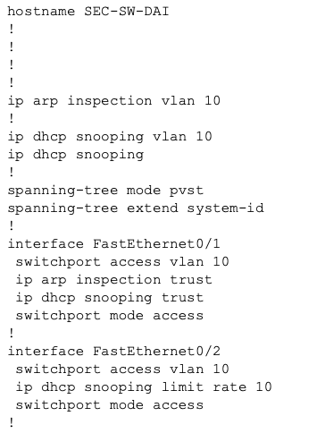

# Security-04 Dynamic ARP Inspection Baseline

## Objective

This lab practiced basic access layer security control specifically designed to help defend against ARP spoofing and other malicious ARP behavior.

The goal was to build a small switched network with a legitimate infrastructure DHCP source, enable DHCP snooping, and then use Dynamic ARP Inspection (DAI) to validate ARP behavior on the user VLAN.

## Topology

This lab used:

- 1 switch
- 1 DHCP server
- 1 client PC

### Interface Connections

- `fa0/1` --> DHCP server
- `fa0/2` --> ClientPC

## What I Configured

VLAN 10 was configured as the user VLAN, both switch ports were connected to that VLAN.

### DHCP source
The DHCP server was configured with:

- IP address: `192.168.60.2`
- Subnet Mask: `255.255.255.0`
- Default Gateway: `192.168.60.1`
- DNS: `8.8.8.8`

It also provided a DHCP pool with:

- Gateway: `192.168.60.1`
- DNS: `8.8.8.8`
- Starting Address: `192.168.60.10`
- Subnet Mask: `255.255.255.0`

### DHCP snooping
DHCP snooping was enabled on the switch for VLAN 10, only the DHCP server facing interface was configured as trusted.

- `fa0/1` = trusted DHCP facing port
- `fa0/2` = untrusted client facing port

### Dynamic ARP Inspection
Dynamic ARP Inspection was enabled for VLAN 10, only the infrastructure facing DHCP port was configured as trusted for ARP inspection as well.

Packet Tracer did not support all interface DAI options, leading me to configure the supported baseline controls only.

## Why This Matters

ARP does not include built in authentication. That means hosts can potentially send falsified ARP information in an effort to mislead other devices about IP to MAC resolution.

Dynamic ARP Inspection reduces this risk by validating ARP behavior with trusted information, more-so when used together with DHCP snooping.

This makes DAI a useful Layer 2 security control for protecting client networks from spoofed ARP activity.

## Security Controls Practiced

- DHCP Snooping
- Trusted vs Untrusted ports
- Dynamic ARP Inspection
- Binding table validation
- Access layer trust boundaries

## Verification

### DHCP pool configuration

### Client DHCP lease result

### DHCP snooping status

### DHCP snooping binding table

### Dynamic ARP Inspection status

### Switch running configuration

## Main Takeaways

This lab reinforced important ideas:

- Layer 2 security controls work better when layered.
- DHCP snooping provides trusted binding information that DAI can refer to
- Not every switch port should be trusted
- Infrastructure facing ports and client facing ports should be configured differently

## Summary

This lab focused on building a Dynamic ARP Inspection baseline in a small switched network.

I configured a DHCP server, enabled DHCP snooping, built a valid binding entry for the client, and enabled DAI on the user VLAN. Packet Tracer had some feature limitations, however the lab still demonstrated core security logic behind DHCP snooping and Dynamic ARP Inspection.