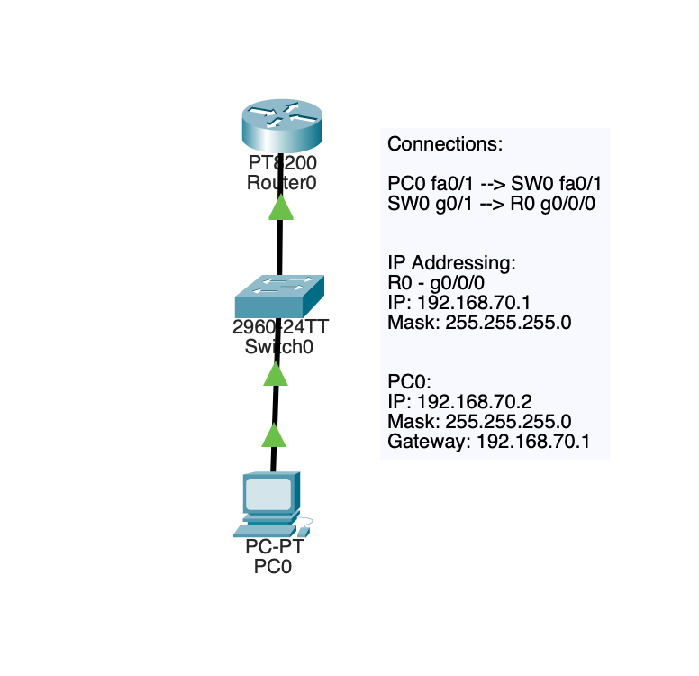
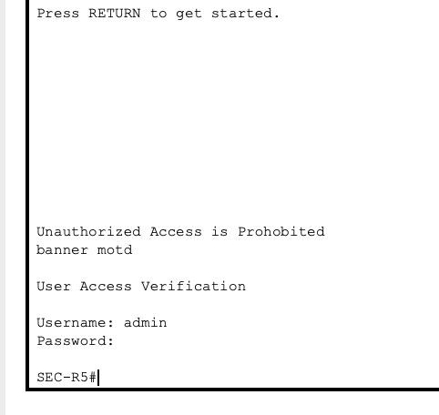
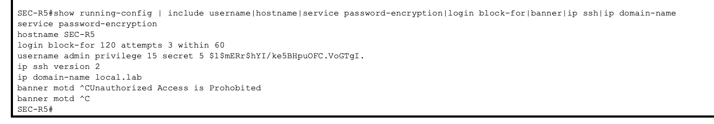
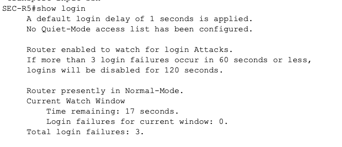
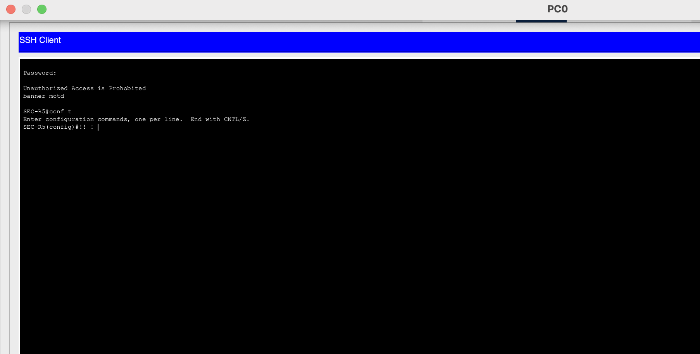
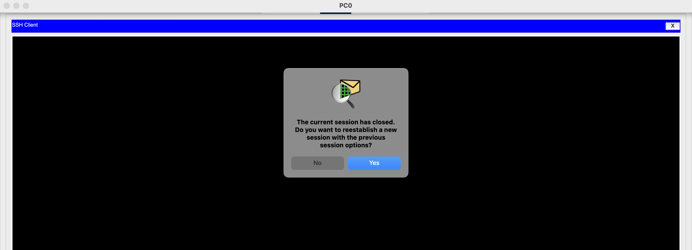

# Security-05 Router Login Protection and Session Hardening

## Objective

This lab practiced basic router login protection and management session hardening.

The goal is to move beyond simple remote access configuration. This lab applies additional controls that protect administrative access. This includes; local authentication, login blocking behavior, session timeout configurations, warning banners, and SSH only remote management.

## Topology

This lab used:

- 1 router
- 1 switch
- 1 admin PC

### Connections

- `PC0 fa0/1` --> `SW0 fa0/1`
- `SW0 g0/1` --> `R0 g0/0/0`

### IP Addressing

- `R0 g0/0/0` --> `192.168.70.1/24`
- `PC0` --> `192.168.70.2/24`
- Default Gateway --> `192.168.70.1`

## What I Configured

Router was configured with:

- Local admin user with privilege 15
- Password encryption
- SSH domain name and SSH version 2
- Login blocking policy with `login block-for 120 attempts 3 within 60`
- Warning banner
- `login local` on management lines
- `exec-timeout 5 0` on VTY lines
- `transport input ssh` on VTY lines

Packet Tracer does not support `login delay 3`. Only controls that were actually accepted and verified got documented.

## Why This Matters

Administrative access is one of the most important attack surfaces on a network device.

If router login is left weakly protected attackers are able:
- Use bruteforce/dictionary attacks
- Gain prolonged management access
- Change configurations
- DoS attack
- Mask themselves and changes

This lab focused on the addition of simple yet realistic protections that improve the security of administrative access.

## Security Controls Practiced

- Local authentication
- Privileged admin account
- Password encryption
- Login blocking after repeated failures
- Management session timeout
- SSH only remote management
- Warning banner for administrative access

## Verification

### Main hardening configuration

### VTY line hardening

### Login behavior tracking

### Successful administrative access

### Session closure / lockout behavior

## Main Takeaways

This lab reinforced a few important ideas:

- Secure administration is more nuanced than just enabling SSH
- Login protection should include authentication and session controls
- Repeated failed logins should be monitored, tracked, and restricted
- Warning banners and timeouts are small add-ons that strengthen management baseline

## Summary

This lab focused on hardening the security posture of a router and administrative access in a small network.

I configured local authentication, password protection, SSH only VTY access, a warning banner, session timeout controls, and a login block policy for repeated failures. This lab demonstrated how management access should be actively protected and secured.