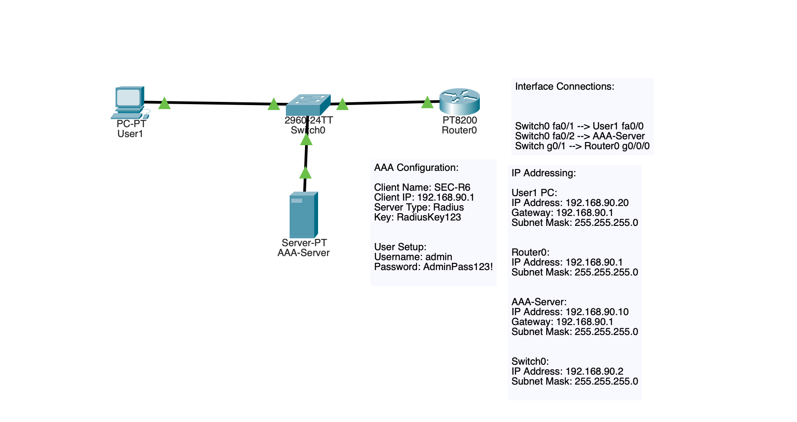
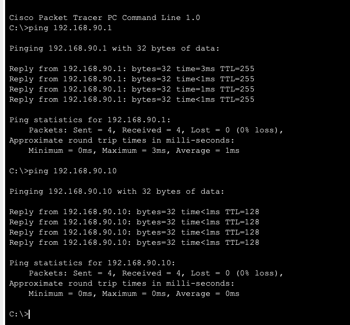
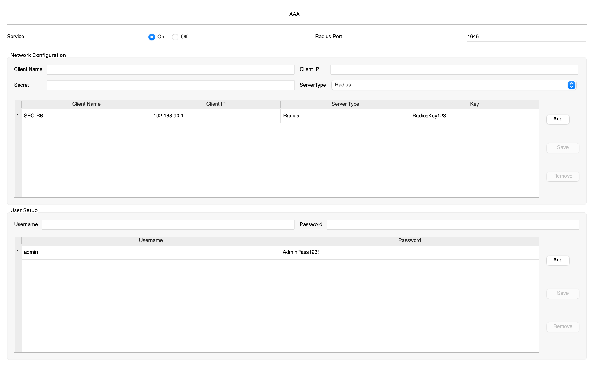
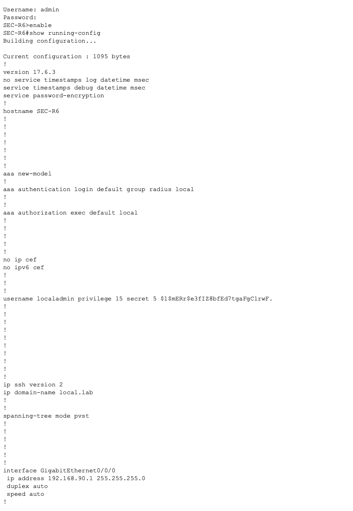
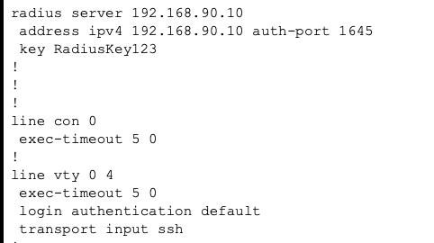
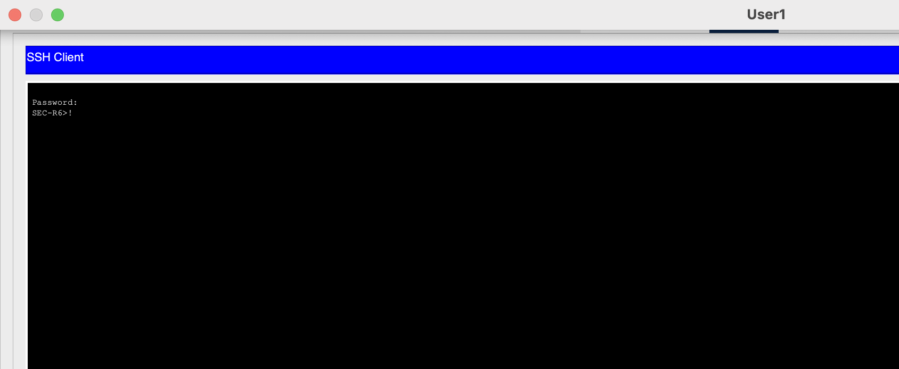
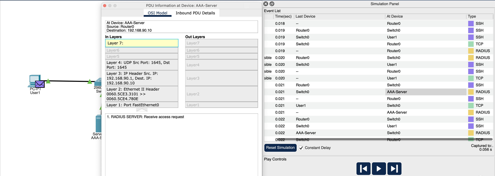
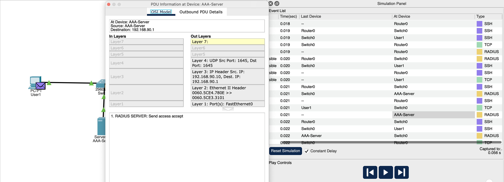

# Security-06 Centralized AAA Authentication with RADIUS

## Objective

This lab was centered around a centralized administrative authentication server using AAA and RADIUS.

The goal is to move beyond router authentication and demonstrate how a network device can use a centralized AAA server to validate administrative SSH login attempts.

## Topology

This lab used:

- 1 router (`SEC-R6`)
- 1 switch
- 1 admin/user PC
- 1 AAA/RADIUS server

### Interface Connections

- `Switch0 fa0/1` -> `User1 fa0/0`
- `Switch0 fa0/2` -> `AAA-Server`
- `Switch0 g0/1` -> `Router0 g0/0/0`

### IP Addressing

- Router: `192.168.90.1/24`
- Switch: `192.168.90.2/24`
- AAA Server: `192.168.90.10/24`
- User/Admin PC: `192.168.90.20/24`
- Default gateway: `192.168.90.1`

## What I Configured

### Router

On the router, I configured:

- A hostname
- A local-login fallback user
- SSH version 2
- Password encryption
- AAA new model
- RADIUS authentication
- SSH only VTY access
- VTY login using default AAA authentication method

### AAA/RADIUS Server

The AAA server was configured with:

- RADIUS service
- Router added as a RADIUS client
- Shared secret key
- Administrative user account

### Authentication Flow

The admin PC initiated an SSH connection to the router.

The router sent a RADIUS authentication request to the AAA server. The AAA server accepted the credentials and then returned an access accept response. This allowed the SSH login to succeed.

This can be verified in the simulation mode images below.

## Why This Matters

Centralized AAA is important. It allows for better network scale, and is a valuable security addition because administrative access should not always depend only on local accounts configured separately on each device.

Using a centralized AAA service helps with:

- Consistent authentication
- Easier account management for enterprises
- Centralized identity control
- Stronger administrative access control
- Fallback planning if the AAA server is unavailable

## Security Concepts Practiced

- AAA
- Centralized authentication
- RADIUS
- Local fallback authentication
- Administrative access based on SSH
- Management plane security
- Identity based access control

## Verification

### Connectivity to router and AAA server

### AAA/RADIUS server configuration

### Router AAA and RADIUS configuration

### Router VTY and RADIUS server configuration

### Successful SSH login using AAA credentials

### RADIUS access request in simulation mode

### RADIUS access accept in simulation mode

## Main Takeaways

This lab reinforced a few important ideas:

- Centralized authentication is much more scalable than managing local users
- RADIUS allows a router to validate login attempts against a centralized AAA server
- Local authentication can provide a fallback if centralized authentication is unavailable
- SSH protects management sessions, meanwhile AAA can control the identity check

## Summary

This lab focused on centralized administrative authentication using AAA and RADIUS. A router was configured to use a centralized RADIUS server for SSH login authentication.

I created the AAA server client and user configuration, verified network connectivity using ping, and confirmed the authentication flow through Packet Tracer simulation mode. The SSH login was successful. 